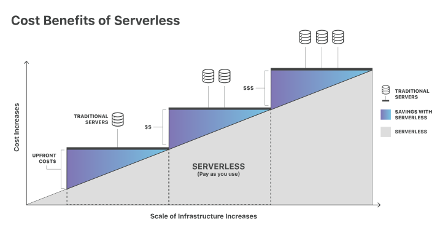
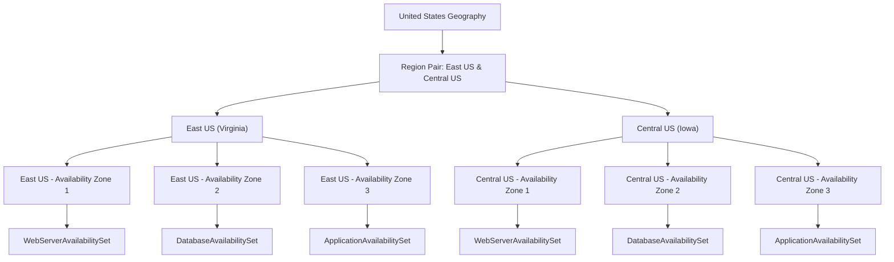
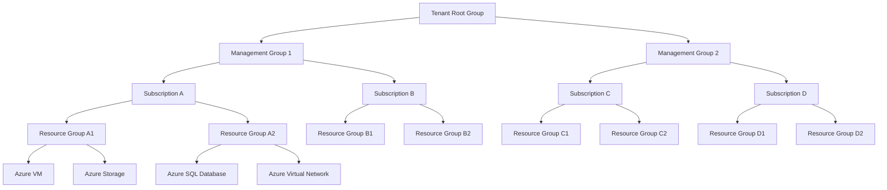

# Describe cloud concepts (25–30%)

## Describe cloud computing

### Define cloud computing

Cloud Computing er leveransen av datatjenester over internett for å tilby innovasjon raskere, fleksible ressurser og kostnadseffektiv skalerbarhet. Tjenestene inkluderer blant annet:
- Servere
- Datalagring
- Databaser
- Nettverk
- Programvare
- Analyse
- Etterretning

Vanligvis betaler du kun for skytjenester du bruker, noe som reduserer driftskostnader, optimaliserer infrastruktur og gir mulighet for dynamisk skalering når behovene endrer seg.

Skytjenester er on-demand tilgang til maskin- og programvare ressurser over internett med en per bruk prising. Det kan være fysiske eller virtuelle servere, data lagring, nettverks kapabiliteter, utvikler programvareverktøy, programvare, analytiske plattformer basert på AI og mye mer.
#### Fordeler med Cloud Computing

1. _Kostnad_ – Ved å flytte bedriften til skyen kan du optimalisere IT kostnadene. Du vil eliminere kapitalutgifter til innkjøp av hardware og software, utgifter til oppsett og driftskostnader på lokalt datasenter.
2. _Hastighet_ – De fleste prosesseringtjenestene tilbyr selvbetjentingsportaler som gir rask tilgang til skalerbare ressurser. Innen få minutter og med bare noen få museklikk, kan du klargjøre nye ressurser. Dette reduserer behovet for detaljert kapasitetplanlegging.
3. _Global scale_ – En fordel med Cloud Computing tjenester er muligheten for å dynamisk skalere tjenestene  opp og ned etter behovet slik at du alltid har riktig mengde tjenester. Tjenestene kan for eksempel være datakraft, lagring og båndbredde fra riktig geografisk lokasjon.
4. _Produksjon_ – Lokale datasentre krever tradisjonelt tidskrevende oppsett, konfigurasjon og drift av maskinvare og programvare. Cloud Computing fjerner disse behovene og kostnadene, slik at IT-teamet kan fokusere  på innovasjonen i stedet for vedlikehold.
5. _Pålitelighet_ – Skytjenester gjør backup, katastrofegjenoppretting og kontinuitet enklere og billigere da data kan bli speilet til flere redundante steder på skyetilbyderens nettverk.
6. _Sikkerhet_ – Mange skyetilbydere tilbyr en vidt spekter av sikkerhetsregler, teknologier og kontroller som vil styrke ditt sikkerhets-ståsted generelt. Dette hjelper deg å beskytte data, applikasjoner og infrastruktur fra potensielle trusler.
#### Tilgang

Ressursene leveres etter behov, uten forhåndsoppsett.
#### Prismodeller

Normalt betaler du kun for bruken av tjenesten, også kalt "Pay-as-you-go", som er uten bindingstid.
- _Pay-as-you-go_ – Du betaler kun for det du bruker, uten bindingstid.
- _Reserved Instances_ – Forutsigbar pris over tid, med mulighet til å reservere ressurser for ett eller tre år til lavere kostnad.
- _Azure Savings Plan_ – Oppnå rabatter ved å forplikte deg til en viss mengde bruk over tid.
- _Gratis tjenester_ – Noen tjenester er gratis opp til et visst nivå, men med begrenset kapasitet.
#### Virtualisering

Virtualisering er en teknologi som muliggjør opprettelsen av virtuelle miljøer fra en enkel maskin.

Virtualisering er prosessen av å opprette en representasjon av maskinvare, slik som servere, lagring, nettverk eller andre fysiske maskiner. Det støtter flere kopier av virtuelle maskiner (VM) kjørende på en fysisk maskin der hver har sitt eget operativsystem og tjenester. Dette optimaliserer bruken av maskinvare, øker fleksibiliteten og muliggjør å dele ressurser mellom flere organisasjoner eller kunder.

Fordelene ved å dele ressursene på en fysisk maskin
1. _Bedre bruk av ressurser_ –  Unngår maskiner som ikke er i bruk eller har ledig kapasitet
2. _Kostnadsutnyttelse_ – Bedrifter kan spare penger på maskinvare, strøm og vedlikehold (OPEX - løpende kostnader) ved å ha en mindre maskinpark
3. _Fleksibilitet_ – En eller flere VM-er kan enkelt bli tilpasset ved installasjon, flyttet eller skalert ved endret behov.
4. _Sikkerhet_ – Virtualisering isolerer programvaren eller systemene fra hverandre. Har en av dem et problem vil det ikke påvirke de andre.
5. _Gjenoppretting_ – Skulle noe gå gale er det enkelt å ta en kopi eller tilbakestille en virtuell maskin. Dette gjør at bedrifter kan fort komme opp å kjøre igjen etter en hendelse.

Virtualisering er ikke ensbetydende med servervirtualisering; man kan for eksempel virtualisere nettverk, der virtuelle nettverk opererer uavhengig på en delt fysisk infrastruktur. Dette gir fleksibilitet og optimaliserer ressursbruk i skyløsninger.
#### Automatisering
Automatisering er bruken av teknologi med redusert menneskelig assistanse. Automatisering akselerere prosesser, skalere miljøer og bygger automatiske arbeidsflyter. Det finnes mange typer automatisering, inkludert IT automatisering.

Automatisering i skyen bruker programvare til å konfigurere, distribuere, klargjøre og administrere ressurser og infrastruktur. Målet med skyautomatisering er å redusere behovet for menneskelig innblanding i disse prosessene slik at de er raskere, mer effektive og mindre utsatt for feil.
### Describe the shared responsibility model
Det er viktig å skjønne den delte ansvarsmodellen når man vurderer en offentlig skytjeneste. Hvilke sikkerhetsoppgaver har skyleverandøren og hvilket ansvar har kunden. Ansvarsfordelingen varierer avhengig av hvilken skymodell man bruker - enten det er  SaaS, PaaS, IaaS eller et lokalt datasenter.

Uansett hvilken modell du bruker så eier du informasjonen og identitetene. Du vil være ansvarlig for å beskytte disse, sammen med lokale ressurser og de komponentene du kontrollerer. Hvilke komponenter du har kontroll over avhenger av servicetypen.

Uavhengig av type distribusjon, så vil du ha ansvaret for
- _Data_ – Informasjonen
- _Endepunkter_
- _Kontoer_
- _Adgangskontroll_
### Define cloud models, including public, private, and hybrid
Det finnes flere typer skytjenester. Forskjellige skymodeller og tjenester har utviklet seg for å kunne tilby den rette løsningen for ulike behov.
For å finne den beste løsning for ditt behov må du ta stilling til hvilken skyplattform tjenestene dine skal kjøre på. Det finnes tre forskjellige typer skyplattformer:
- Offentlig sky – Tjenester tilgjengelig for flere brukere, driftet av en skyleverandør.
- Privat sky – Infrastruktur dedikert til en organisasjon.
- Hybrid sky – Kombinasjon av offentlig og privat sky for fleksibilitet.
#### Offentlig sky
Offentlig sky består av skytjenester som eies og drives av en tredjeparts skyleverandør. Tjenestene inkluderer ressurser for databehandling, som servere og lagring via internett. Microsoft Azure er et eksempel på en offentlig sky, der maskinvare, programvare og infrastruktur eies og administreres av Microsoft. Offentlige skytjenester gir tilgang til fleksible og skalerbare ressurser, slik at bedrifter kan tilpasse kapasiteten etter behov.
#### Privat sky
Privat sky består av skytjenester som brukes eksklusivt av en bedrift eller organisasjon. Tjenestene og infrastrukturen er enten driftet internt eller av en tredjeparts leverandør, og de opererer på et privat nettverk for økt kontroll og sikkerhet.
#### Hybrid sky
En hybrid sky kombinerer fordelene med offentlige og private skyer, bundet sammen med teknologi som muliggjør deling av data og programvare. Dette gir bedrifter økt fleksibilitet, slik at de kan tilpasse løsninger og velge hvordan de vil implementere tjenester.
### Identify appropriate use cases for each cloud model
Skybasert databehandling tilbyr ulike distribusjonsmodeller som dekker ulike forretningsbehov. De tre primære modellene er offentlig sky, privat sky og hybrid sky – hver med sine særpregede egenskaper, fordeler og bruksområder. Valget av skymodell avhenger av en rekke faktorer, inkludert bedriftens krav, sikkerhetsbehov og IT-kompetanse. _Offentlig_ sky tilbyr kostnadseffektiv skalerbarhet, _privat_ sky gir utvidet kontroll, og _hybrid_ sky balanserer fordelene fra begge.
#### Offentlig sky
Offentlig sky er standardmodellen for skybasert databehandling, der dataressurser leveres over internett av en tredjeparts skyleverandør.
- Ressursene, inkludert datakraft, lagring og nettverk, er delt mellom flere kunder (Multi-tenancy).
- Modellen tilbyr skalerbarhet, kosteffektivitet og fleksibilitet, siden bedrifter kun betaler for faktisk bruk.
- Skyleverandøren håndterer infrastrukturen,  slik at kundene slipper å bruke egne ressurser på dette.
- Ideell for bedrifter som ønsker å distribuere applikasjoner raskt, uten å investere i fysisk maskinvare.

Offentlig sky brukes ofte til
- SaaS-løsninger som epost, CRM-systemer og samarbeidsverktøy
- Applikasjoner med høye krav til skalerbarhet, som e-handel eller strømming av innhold
- Startups og små bedrifter som ønsker lavere investeringskostnader ved å bruke skyresursser on-demand

Potensielle utfordringer med offentlig sky inkluderer
- _Sikkerhet og personvern_ – Data lagres hos tredjeparts leverandør, og sikkerheten avhenger av skyleverandørens tiltak (f.eks kryptering og tilgangskontroll)
- _Regulatoriske krav_ – Noen bransjer har strengere krav til datalagring, spesielt med hensyn til GDPR og compliance
#### Privat sky
En privat sky er et dedikert skymiljø for en enkelt bedrift eller organisasjon. Det tilbyr utvidet sikkerhet og tilpasninger i forhold til en offentlig sky.
- Privat sky er utviklet for bedrifter med strenge sikkerhets-, compliance- eller regulatoriske krav.
- Løsningen kan enten være i et lokalt datasenter, eller hos en tredjeparts leverandør.
- Det krever IT-personell for administrasjon og vedlikehold av infrastrukturen, slik at bedriften har full kontroll over ressursene. Dette gjør at man kan implementere egne sikkerhetstiltak.
- Systemer kan skreddersys etter bedriftens behov, noe som ikke alltid er mulig i offentlig sky
- Privat sky er særlig egnet for bransjer med høye krav til datasikkerhet og compliance, som finans, helsevesen og offentlig forvaltning
- Kostnadene blir mer forutsigbare da det er mulig å planlegge investeringer i infrastruktur

Mulige utfordringer er
- Kostnadene er høye siden anskaffelse, drift og vedlikehold av infrastruktur krever store investeringer
- Det er komplekse løsninger som krever dedikerte IT-team for administrasjon, oppdateringer og sikkerhetsarbeid

Typiske bruksområder er
- _Bank og finans_ – Næringene har sensitive kundedata og strenge compliance-krav
- _Helsevesen_ – Har høye regulatoriske krav for pasientdata (GDPR)
- _Forskningsmiljøer_ – Sikre sensitive data og kan gi dedikert datakraft
#### Hybrid sky
En hybrid sky er en kombinasjon av offentlig sky og en privat sky eller lokal infrastruktur. Modellen lar organisasjoner optimalisere sine IT-miljøer ved å nyttegjøre seg av fordelene til begge modellene.
- Oppgaver og data kan fordeles mellom miljøene for økt fleksibilitet. Dette gir mulighet for å optimalisere ytelse og kostnader ved å bruke rett miljø for rett arbeidsoppgave
- Kritiske applikasjoner og sensitive data kan bli værende på den private infrastrukturen og mindre sensitive oppgaver kan dra nytte av fordelene til offentlig sky.
- IT-personellet må administrere og integrere begge miljøer for en sømløs og effektiv drift
- Gunstig for organisasjoner som trenger både sikkerhet og skalerbarhet, som bedrifter med sesongbasert arbeidsbelastning eller de som gradvis migrerer til skyen. Dette gir kostnadsoptimalisering, siden bedrifter kan bruke offentlig sky for skalerbarhet, mens de beholder sensitive data privat

Utfordringer med hybrid sky
- Krever avansert administrasjon og integrasjon mellom de ulike miljøene
- Datakommunikasjon mellom offentlig og privat sky kan være en utfordring, spesielt med forsinkelse (latency) og sikkerhet.

Typiske bruksområder
- Bedrifter med strenge krav til datalagring, men som ønsker skalerbarhet
- Organisasjoner med sesongbaserte arbeidsbelastninger, der behovene svinger
- Virksomheter som gradvis migrerer til skyen, uten å gå helt over til offentlig sky
### Describe the consumption-based model
En forbruksbasert prismodell er en tjeneste- og betalingsmodell der kundene betaler basert på ressursforbruk. Forbruket er basert på målbare enheter, slik som antall kall til et _application program interface_ (API) eller forbruk av lagring. Leverandøren måler kundens forbruk og fakturerer dem deretter for de forbrukte tjenestene.
- Forbruksbasert prising, også kalt _pay-as-you-go_ betaling, er relativt nytt innen data, men er en vanlig tilnærming innen mange tradisjonelle næringer. For eksempel innen strøm der kundene blir fakturert basert på forbruk.
- Modellen er vanlig i skytjenester, der tjenestene er varer som gjør det mulig å raskt rulle ut arbeidsoppgaver, og skalere dem opp og ned etter behov.
- PaaS og IaaS bruker ofte forbruksbasert prising for å oppnå kostandsfordeler og optimalisere fortjeneste.
- Forbruksbasert prising erstatter ofte  abonnementbasert løsninger, hvor kunder betaler en fast sum for ubegrenset tilgang til tjenester.

([What is a consumption-based pricing model? | Definition from TechTarget](https://www.techtarget.com/searchcloudcomputing/definition/consumption-based-pricing-model))
### Compare cloud pricing models
Skybaserte tjenester benytter ulike prismodeller for å tilpasse seg bedrifters behov. Noen modeller gir forutsigbare kostander, mens andre gir fleksibilitet basert på faktisk bruk. Denne sammenligningen viser de mest brukte prismodellene og deres fordeler, slik at organisasjoner kan velge den beste tilnærmingen for sin virksomhet.
Forbruksbasert prising registrerer og fakturerer tjeneste- og produktbruk basert på en eller flere måleenheter. De spesifikke faktorene som måles kan variere fra produkt til produkt og fra leverandør til leverandør. Ofte beregnes kostnadene basert på tid brukt, ressurser forbrukt og antall aktive brukere.
Fordeler med forbruksbasert prising inkluderer:
- _Kostandseffektivitet_ – Kundene betaler kun for faktisk forbruk
- _Skalerbarhet_ – Bedrifter kan justere ressursbruken basert på behov
- _Reduserte startkostnader_ – Lav terskel for nye selskaper eller prosjekter

Utfordringer kan være:
- _Uforutsigbare kostnader_ – Pris kan variere betydelig avhengig av bruk
- _Kompleks fakturering_ – Spesielt i hybridmodller kan fakturaen være vanskelig å forstå

De vanligste prismodellene blant leverandører er
-  _Pay-as-you-go_ – Selv om forbruksbasert prising ofte omtales som en pay-as-you-go modell, kan dette også referere til en prismodell der kundene kun betaler pr måleenhet, basert på faktisk forbruk. Betalingen blir gjort etterskuddsvis, når antallet enheter er beregnet.
- _Tiered_ – Prisingen er basert på en trinnvis struktur etter en spesifisert nivåbruk, slik som antallet av brukere eller hvor mye data som er brukt. Kunder som overstiger et nivå blir normalt satt opp til neste nivå. Det laveste trinnet kan ofte være gratis.
- _Volume_ – Prisingen er basert på en volumbasert måleenhet, slik som API kall eller mengde data brukt. Enhetene er gruppert etter betalingstrinn som innholder trinnvis høyere skala. Ved økt forbruk vil prisen pr enhet falle, noe som vil gi kunden en grunn til å bruke flere enheter.
- _Overage_ – Tjenesten er selges i pakker som spesifiserer en maksimal inkludert bruk, for eksempel totalt antall gigabytes i en data plan. Hvis kunden overstiger den inkluderte mengden, påføres en tilleggsbetaling for overskredne enheter..
- _Hybrid_ – Leverandørene kombinerer forbruksbasert og abonnementsbasert prising for å tilby en mer fleksibel prismodell. Denne modellen har økt i popularitet med SaaS modellen da den løser utfordringer med enkeltstående prismodeller – men den kan føre til økt faktureringskompleksitet.
### Describe serverless
Serverløs databehandling er en metode for å levere backend-tjenester basert på faktisk forbruk. Servere brukes fortsatt, men en bedrift som får backend-tjenester fra en serverløs leverandør, faktureres basert på forbruk i stedet for en fast mengde båndbredde eller et bestemt antall servere.
Serverløs databehandling fokuserer på backend-tjenester – funksjoner som kjører i bakgrunnen, som databaser og API-er. Frontend, som er det brukeren ser og interagerer med, kobles til disse tjenestene via serverløse prosesser.

Fordeler med serverløs databehandling:
- _Fleksibilitet_ – Automatisk skalering tilpasser tjenesten til behovet
- _Kostandseffektivitet_ – Kunden betaler kun for ressursene de faktisk bruker
- _Redusert driftshåndtering_ – Leverandøren administrerer infrastruktur, slik at utviklere kan fokusere på kode

Andre fakta som er verdt å vite om serverløs databehandling:
- Serverløs databehandling leverer backend-tjenester basert på faktisk forbruk, ofte gjennom en pay-as-you-go prismodell.
- Kundene blir fakturert basert på forbrukt kapasitet og behøver ikke å reservere eller betale for en fast mengde med båndbredde eller et antall servere, fordi tjenestene skaleres automatisk.
- Leverandører av serverløse tjenester lar brukerne skrive og distribuere kode uten bekymring for den underliggende infrastrukturen.

[What is serverless computing? | Serverless definition | Cloudflare](https://www.cloudflare.com/learning/serverless/what-is-serverless/)
## Describe the benefits of using cloud services
Skytjenester gir organisasjoner økt fleksibilitet, effektivitet og strategisk verdi ved å tilby IT-infrastruktur og applikasjoner over internett, i stedet for lokal å installasjon og vedlikehold.

Denne modellen reduserer behovet for egne servere, gir enkel tilgang fra hvor som helst, og automatiserer vedlikehold og oppdateringer, slik at bedrifter kan fokusere på kjernevirksomheten.

Fordelene med skytjenester er omfattende og kan deles inn i tre hovedkategorier:
- _Fleksibilitet_ – Brukerne kan skalere tjenestene til sitt behov, tilpasse applikasjoner og få tilgang til tjenestene fra hvor som helst med internett-tilgang
- _Effektivitet_ – Bedriftsbrukere kan raskt distribuere applikasjoner uten å bekymre seg for drift av underliggende infrastruktur, samtidig som at kostnadene tilpasses faktisk bruk
- _Strategisk verdi_ – Skytjenester gir bedrifter en konkurransefordel ved å tilby tilgang til innovativ teknologi og mulighet for rask tilpassing til markedstrender

[What Are the Benefits of Cloud Computing? | IBM](https://www.ibm.com/think/topics/cloud-computing-benefits)
### Describe the benefits of high availability and scalability in the cloud
Skydatabehandling gir bedrifter muligheten til å sikre høy tilgjengelighet (HA) og skalerbarhet, to essensielle egenskaper som ivaretar ytelse og pålitelighet under krevende forhold. Disse egenskapene gjør det mulig for organisasjoner å minimere nedetid, håndtere økende effektivt og sikre stabil drift i dynamsike miljøer.
#### High availability (HA)
Høy tilgjengelighet (HA) sikrer minimal nedetid for applikasjoner og tjenester, selv ved uforutsette problemer. Skyleverandører benytter redundant infrastruktur, failover-mekanismer og automatiske gjenopprettningsløsninger for å sikre kontinuerlig drift. Bedrifter som er avhengige av forretningskritiske applikasjoner drar nytte av høy tilgjengelighet (HA) ved å minimere avbrudd og opprettholde kontinuerlig tilgang.
#### Scalability
Skalerbarhet refererer til evnen til å håndtere en økende arbeidsbelastning effektivt. Dette oppnås vanligvis på to måter:
- Scaling Up (Vertical Scaling) – Øker kapasiteten på en eksisterende maskin ved å legge til mer RAM eller prosesseringskraft
- Scaling Out (Horizontal Scaling) – Øk kapasiteten ved å legge til flere maskiner for å fordele arbeidsmengden
#### Elasticity
Elastisitet refererer til skyens evne til automatisk skalering av ressurser basert på etterspørsel. Dette inkluderer autoskalering, hvor ressurser dynamisk utvides eller reduseres for å optimalisere ytelse, samtidig som kostander minimaliseres.
Elastisitet gir bedrifter økt effektivitet ved å tilpasse ressursbruken til faktiske behov. Dette sikrer kostnadseffektiv drift, spesielt ved varierende arbeidsbelastning.
#### Agility
Skymiljøer lar bedrifter raskt distribuere applikasjoner og tjenester. Denne smidigheten sikrer at organisasjoner kan tilpasse seg markedsendringer, utvikle nye funksjoner og reagere raskt på kundebehov, med minimal forsinkelse.
Skybaserte løsninger, som CI/CD-pipelines, muliggjør kontinuerlig utvikling, testing og implementering, noe som gir bedrifter et konkurransefortrinn og økt innovasjonstakt.
#### Disaster Recovery (DR)
Katastrofegjenopprettingsstrategier hjelper organisasjoner å gjenoppta normal drift etter tjenesteutfall. Slike strategier sikrer redundans og tilgjengelighet, og inneholder ofte følgende elementer:
- _Backup_ – Regelmessig lagring av kopier av kritisk data for å sikre rask gjenoppretting
- _Data Replication_ – Duplikater av data lagres på flere lokasjoner for å redusere risikoen for tap
- _Geo-Distribution_ – Lagring av data i flere datasentere spredt over geografiske områder, noe som sikrer redundans, høy tilgjengelighet og rask respons.

Moderne DR-løsninger benytter ofte automatiserte mekanismer, slik at gjenopprettingen skjer hurtig og effektivt, uten behov for manuell handling. Dette gir bedre beskyttelse mot uforutsette hendelser som systemfeil, strømbrudd eller cyberangrep.
#### Managed Services
En av nøkkelfordelene til skydatabehandling er at skyleverandøren håndterer mange aspekter til infrastruktur- og applikasjonsadministrasjon. Organisasjoner trenger ikke å bekymre seg for vedlikehold av maskinvare, oppdatering av programvare og opprettholde høy oppetid, noe som lar dem fokusere på kjernevirksomheten.

Administrerte tjenester inkluderer ofte automatiserte oppdateringer, sikkerhetsforbedringer og innebygd skalerbarhet, noe som sikrer effektiv drift og redusert administrasjon.
Typiske eksempler inkluderer
- _Databaser_
- _Nettverksovervåkning_
- _Identitetsadministrasjon_
- _Sikkerhetsløsninger_
#### Global Accessibility
Skytjenester gir brukere global tilgang til applikasjoner, uavhengig av geografisk plassering. Dette muliggjør sømløst samarbeid og forbedrer brukeropplevelsen, uansett hvor brukeren befinner seg.
Ved hjelp av geo-distribusjon, der data lagres i flere datasentere over hele verden, sikrer skytjenester raskere responstid, lavere ventetid og optimal ytelse, selv for brukere som befinner seg langt fra hovedserverne.

[AZ-900: Describe the Benefits of High Availability and Scalability in the Cloud -](https://idodata.com/2025/03/17/az-900-describe-the-benefits-of-high-availability-and-scalability-in-the-cloud/)
### Describe the benefits of reliability and predictability in the cloud
Pålitelighet og forutsigbarhet gjør det mulig for bedrifter å satse på en stabil og pålitelig tjenesteleveranse til kundene sine. Disse egenskapene sikrer at applikasjoner forblir funksjonelle, data forblir intakt og at uventede feil håndteres effektivt.
Denne stabiliteten gir bedrifter trygghet i drift og bidrar til høy oppetid, noe som er avgjørende for forretningskritiske systemer.
#### Reliability in Azure
Pålitelighet refererer til Azures evne til å gjenopprette etter feil, som datatap, nedetid eller sikkerhetshendelser forårsaket av ransomware angrep. Skyleverandøren leverer robuste feiltoleranse- og katastrofegjenopprettelsemekanismer, slik at bedrifter kan fortsette operasjoner selv ved uventede hendelser.
- _Feiltoleranse (Fault tolerance)_ – Systemet har innebygd redundans, slik at de kan fortsette å fungere selv om en komponent svikter
- _Katastrofegjenoppretting (Disaster Recovery)_ – Fokuserer på å gjenopprette systemer etter større fil eller hendelser, ofte ved hjelp av sikkerhetskopiering og geo-distribuerte løsninger.
- _Azure Availability Zones_ – Sikrer at tjenester forblir operative selv ved regionale feil, ved å distribuere på tvers av fysiske datasentre.
- _Azure Site Recovery_ – Gir rask gjenoppretting av tjenester ved katastrofer, og sikrer at systemene kan returnere til normal drift.
#### Predictability in Azure
Forutsigbarhet sikrer at bedrifter kan anta og planlegge for skyinfrastrukturens ytelse. En høyt tilgjengelig arkitektur er nødvendig for pålitelige operasjoner, stabil oppetid og god ytelse for kritiske applikasjoner.
Azure benytter automatiserte skaleringsmekanismer og prediktive analyser for å sikre at ressurser allokeres optimalt, noe som gir bedrifter bedre kontroll over ytelse og kostnader.

Azure tilbyr forskjellige funksjoner som øker feiltoleransen på systemer og sikrer forutsigbar ytelse:
- _Azure Storage and Databases_ – Datareplikering på tvers av availability zones (som distribuerer tjenester på tvers av flere bygninger) og regioner (på tvers av geografiske lokasjoner) øker feiltoleransen.
- _Managed Disks_ – Disse blir automatisk distribuert over flere forskjellige lagringsenheter, og reduserer risikoen for maskinvare feil.
- _Virtual Machines (VMs) og Fault Domains_ – Virtuelle maskiner kan bli plassert på tvers av flere fault domains, dette sikrer at hvis en maskinvarefeil skjer så er det begrenset til en mindre del av VM-ene
- _Application Resiliency_ – Bedrifter må designe applikasjoner med motstandsdyktighet i tankene, slik at hvis en enhet svikter, flyttes tilkoblinger automatisk til en annen enhet for å opprettholde kontinuitet.

[AZ-900: Describe the Benefits of Reliability and Predictability in the Cloud -](https://idodata.com/2025/03/19/az-900-describe-the-benefits-of-reliability-and-predictability-in-the-cloud/)
### Describe the benefits of security and governance in the cloud
Sikkerhet og styring er grunnleggende elementer i vellykket skystrategi. Azure tilbyr robust sikkerhetstiltak og omfattende styringsrammeverk som hjelper deg med å beskytte dine data, håndtere risikoer og sikre etterlevelse av industri og nasjonale standarder.
Azure sikrer den fysiske infrastrukturen, inkludert datasentre og maskinvare. Ansvar for operativsystemer, applikasjoner og data kan være delt mellom Azure og kunden, avhengig av tjenestemodellen
#### Core principles of Security
Når du sikrer dine data, så må tre nøkkelprinsipper (CIA) ivaretas:

- _Konfidensialitet (Confidentiality)_ – Sikre at kun autoriserte brukere og systemer har tilgang til dine data
- _Integritet (Integrity)_ – Opprettholder nøyaktigheten og påliteligheten til dataene
- _Tilgjengelighet (Availability)_ – Garantere at data og systemer er tilgjengelige når de behøves

Azure tilbyr en rekke verktøy for å styrke sikkerhet og styring, inkludert Azure Policy og Microsoft Purview, som hjelper organisasjoner med overholdelse av regelverk og sikkerhetsstandarder.
#### Key components of cloud security
Azure tilbyr et omfattende sett med verktøy og tjenester som støtter sikkerhet på tvers av flere lag:
- _Identity and Access Management (IAM)_ – Azure bruker tjenester som _Microsoft Entra ID_ for å autentisere brukere og enheter. Det støtter også integrasjon med tredjepartskontoer som Facebook og Google for et bredere autentiseringsvalg
- _Threat Protection_ – Azure identifiserer trusler og svakheter, samt tilbyr avanserte verktøy for å oppdage, forhindre og respondere på hendelser. _Microsoft Defender for Cloud_ gir ekstra beskyttelse mot cybertrusler ved å overvåke sikkerhetsstatusen til ressursene dine og gi innsikt i potensielle sårbarheter
- _Information Protection_ – Sensitive data er beskyttet og klassifisert gjennom tilgangskontroll og krypteringsteknologier, noe som sikrer at bare autoriserte individer har tilgang til kritisk informasjon. _Microsoft Purview Information Protection_.
- _Insider risk management_ – Tilgang gis basert på brukerbehov, noe som reduserer risikoen for uautorisert tilgang eller misbruk av sensitiv informasjon. _Microsoft Purview Insider Risk Management_.
#### Governance and Compliance Management
Styring og etterlevelsesstyring involverer overvåkning og sikring at sikkerhetspolicyer, prosesser og best practices er konsekvent fulgt opp på tvers av skymiljøet. _Microsoft Purview Governance and Compliance Management_.
- _Governance_ – Styring, refererer til prosesser og retningslinjer som sikrer at organisasjoner administrerer sine IT-ressurser effektivt og i samsvar med beste praksis. Azure Policy hjelper med å håndheve styringsregler
- _Compliance  Management_ – Azure hjelper organisasjoner med regulatoriske krav, enten de er industrispesifikke, slik som helsevesen eller finans eller nasjonale reguleringer, slik som GDPR eller HIPAA. Microsoft Purview gir verktøy for datastyring og samsvar.

[AZ-900: Describe the benefits of security and governance in the cloud -](https://idodata.com/2025/04/29/az-900-describe-the-benefits-of-security-and-governance-in-the-cloud/)
### Describe the benefits of manageability in the cloud
En av fordelene med å bruke Azure er muligheten for å administrere skyressurser fra hvor som helst. Azure håndterer de underliggende tjenestene og infrastrukturen, men brukerne får tilgang til kraftige verktøy for  administrasjon av applikasjoner, data og sikkerhetsinnstillinger på en effektiv måte.
#### Tools for managing Azure resources
Azure tilbyr forskjellige verktøy for å hjelpe brukere administrere miljøet sitt effektivt:
- _Azure Portal_ – Et webbasert grensesnitt som gir en brukervennlig måte å administrere og overvåke Azure-tjenester. Det støtter dashboards, varsler og integrerte verktøy for distribusjon og diagnose.
- _Azure Cloud Shell_ – Et shell-miljø tilgjengelig gjennom en nettleser som inkluderer verktøy som:
	- _Azure CLI_ – Et kommandolinjeverktøy for å automatisere administrasjon av Azure ressurser
	- _Azure PowerShell_ – Et skriptmiljø for å automatisere og administrere oppgaver på tvers av Azure tjenester
- _Azure Arc_ – Gir brukere tilgang til å administrere lokale- og multi-sky ressurser som om de var normale Azure-ressurser
- _Azure Automation_ – Et verktøy for automatisering av administrative oppgaver, som konfigurasjonstyring, oppdatering av virtuelle maskiner og ressursoptimalisering
- _Azure Mobile App_ – Gir muligheten for administrasjon mobile enheter, slik at brukere kan håndtere skyinfrastruktur på farten
#### Extending management with Azure Arc
Azure Arc utvider Azure-administrasjon til lokale og multi-sky miljøer, slik at organisasjoner kan administrere på tvers av ulike plattformer fra en sentralisert plattform.
Med Azure Arc kan du administrere virtuelle maskiner, Kubernetes-klynger og databaser som kjører utenfor Azure, som om de var opprinnelige Azure-ressurser. Dette gir en konsistent administrasjonsopplevelse, uavhengig av hvor ressursen befinner seg.
Azure Arc integreres med Azure Policy for styring og Microsoft Defender for Cloud for sikkerhet, noe som sikrer kontinuerlig overvåkning og etterlevelse av sikkerhetsstandarder på tvers av hybrid og mulitsky miljøer.

[AZ-900: Describe the benefits of manageability in the cloud -](https://idodata.com/2025/04/30/az-900-describe-the-benefits-of-manageability-in-the-cloud/)
## Describe cloud service types
Skyen kan distribueres på tre måter: Offentlig, Privat og Hybrid. Disse løsningene har forskjellige tjenestemodeller, der de tre viktigste er:
- _Infrastructure as a Service (IaaS)_ – Leverer virtualisering av fysiske miljøer, slik at brukere administrerer servere, lagring og nettverk uten å eie maskinvaren
	- _Azure Virtual Machines_ – lar brukere kjøre Windows eller Linux i skyen uten å administrere den fysiske infrastrukturen
- _Platform as a Service (PaaS)_ – Tilbyr utviklings- og distribusjonplattformer, slik at utviklere kan bygge, teste og distribuere applikasjoner uten å håndtere den underliggende infrastrukturen
	- _Azure App Service_ – Lar utviklere raskt bygge og distribuere web- og mobilapplikasjoner uten å administrere servere
- _Software as a Service (SaaS)_ – Leverer applikasjoner over internett, slik at brukere kan få tilgang til programvare uten å installere eller vedlikeholde lokalt
	- _Microsoft 365_ – Gir tilgang til verktøy som Word, Excel og Outlook direkte fra skyen

Begrepet _as-a-Service_ refererer til en tjenestemodell levert av en tredjepart over internett. Disse modellen kalles ofte _cloud computing stack_, fordi de bygger på hverandre og gir økende nivåer av administrasjon og brukervennlighet.

[Types of Cloud Computing | GeeksforGeeks](https://www.geeksforgeeks.org/types-of-cloud/)
[PaaS vs IaaS vs SaaS: What's the difference? | Google Cloud](https://cloud.google.com/learn/paas-vs-iaas-vs-saas)
[Types of Cloud Computing - Definition | Microsoft Azure](https://azure.microsoft.com/en-us/resources/cloud-computing-dictionary/types-of-cloud-computing/?msockid=12d99f7d53386c9a18e48e8e52cd6d40)
### Describe infrastructure as a service (IaaS)
IaaS er den enkleste kategorien av skytjenester og lar deg leie en skalerbar og virtualisert IT-infrastruktur fra en skyleverandør. Dette inkluderer servere, lagring, datakraft og nettverk, som er tilgjengelig over internett.

Brukeren har full kontroll over infrastrukturen slik at de kan tilpasse og administrere virtuelle maskiner, lagring og nettverk. Leverandøren håndterer drift av den underliggende infrastrukturen, noe som reduserer administrasjonskostnader og kompleksitet.

Skyleverandøren fakturerer for tjenestene blant annet etter pay-as-you-metoden, der du betaler kun for ressursene du bruker, noe som gir kostnadseffektivitet og fleksibilitet.

Eksempler på IaaS-tjenester inkluderer Azure Virtual Machines, AWS EC2 og Google Compute Engine, som gir skalerbare løsninger for bedrifter i alle størrelser.
### Describe platform as a service (PaaS)
PaaS tilbyr alle nødvendige verktøy, inkludert maskinvare og programvareressurser, for å utvikle applikasjoner direkte i skyen.

Ressursene administreres av skyleverandøren, slik at kundene slipper å håndtere den underliggende infrastrukturen. Dette gir utviklere frihet til å fokusere på applikasjonsutvikling, uten å bekymre seg for servere, lagring eller nettverk.

Kunden trenger bare tilgang til komponentene for å starte utvikling av applikasjoner, noe som gir PaaS til en effektiv og skalerbar løsning.

Eksempler på PaaS-tjenester inkluderer Azure App Service, Google App Engine og AWS Elastic Beanstalk, som gir utviklere en fleksibel plattform for rask utvikling og distribusjon av applikasjoner.
### Describe software as a service (SaaS)
SaaS tilbyr programvare over internett via en abonnementsmodell, noe som gir brukere enkel tilgang til applikasjoner uten behov for lokal installasjon.

Brukere slipper å installere, vedlikeholde eller oppdatere programvare lokalt, da leverandøren håndterer dette automatisk. Dette sikrer at applikasjonene alltid er oppdaterte og tilgjengelige.

SaaS-applikasjoner kan brukes fra enhver enhet med internett-tilgang, noe som gir fleksibilitet og tilgjengelighet for både enkeltpersoner og bedrifter.

Eksempler på SaaS-tjenester inkluderer Microsoft 365, Google Workspace og Salesforce, som gir effektive løsninger for produktivitet, samarbeid og forretningsstyring.
### Identify appropriate use cases for each cloud service (IaaS, PaaS, and SaaS)
Å forstå bruksområdene til hver tjenestemodell – Infrastructure as a Service (IaaS), Platform as a Service (PaaS) og Software as a Service (SaaS), hjelper bedrifter med å velge den mest effektive løsningen for sine behov basert på kontrollbehov, operasjonsønsker og utviklerbehov.
- IaaS gir full kontroll over infrastrukturen, slik at bedrifter kan administrere server, lagring og nettverk uten å eie maskinvaren
- PaaS forenkler applikasjonsutviklingen, ved å tilby en plattform der utviklere kan bygge, teste og distribuere applikasjoner uten å håndtere den underliggende infrastrukturen
- SaaS gir enkel tilgang til programvare, der brukere kan benytte applikasjoner direkte over internett uten behov for lokal installasjon eller vedlikehold

Ved å velge riktig tjenestemodell kan bedrifter optimalisere drift, redusere kostnader og forbedre fleksibilitet i sine skybaserte løsninger.
#### Infrastructure as a Service (IaaS)
IaaS gir fleksibilitet og kontroll over virtualiserte ressurser i skyen, uten å måtte håndtere fysisk maskinvare. Dette gjør det til en ideell løsning for organisasjoner som ønsker skalerbarhet og kostnadseffektivitet.

Eksempler på brukstilfeller inkluderer:
- _SQL Server på en Azure Virtual Machine_ – Lar organisasjoner kjøre en kjent database i skyen med full administrativ tilgang.
- _Migrering fra fysiske server til virtuelle maskiner_ – Bedrifter kan flytte fra lokal infrastruktur til skalerbare, skybaserte løsninger.

IaaS er ideelt når du selv ønsker å håndtere operativsystem, databaser og applikasjoner samtidig som at du outsourcer maskinvareansvaret til en skyleverandør.

#### Platform as a Service (PaaS)
PaaS forenkler applikasjonsutvikling ved å ta bort behovet for administrasjon av den underliggende infrastrukturen. Dette gir utviklere frihet til å fokusere på utvikling og distribusjon, uten å bekymre seg for servere, lagring og nettverk.

Eksempler på brukstilfeller inkluderer:
- _Managed Database Services_ – Bruk av tjenester som Azure SQL Managed Instance for skalerbarhet, uten å måtte håndtere de underliggende virtuelle maskinene
- _IoT Hub_ – Muliggjør sanntidskommunikasjon mellom IoT-applikasjoner og enheter
- _Azure Container Instances_ – Kjør konteinere i skyen uten å måtte administrere servere eller klynger
- _App Services_ – Kjør web- eller mobilapplikasjoner med innebygd skalering, lastbalansering og integrasjon med DevOps-arbeidsflyter

PaaS gir verdi ved å automatisere infrastrukturhåndtering, slik at utviklere kan fokusere på innovasjon og rask distribusjon av applikasjoner.
#### Software as a Service (SaaS)
SaaS leverer programvare over internett via en abonnementsmodell, der skyleverandøren håndterer infrastruktur og drift. Dette tar bort behovet for lokal installasjon, vedlikehold og oppdateringer, noe som gir brukerne enkel tilgang til applikasjoner.

Eksempler på brukstilfeller inkluderer:
- _Epost og kontorapplikasjoner_ – Løsninger som Gmail, Office 365 og Dropbox gir produktivitet- og samarbeidsverktøy uten infrastrukturadministrasjon
- _IoT Central_ – En ende-til-ende løsning som kobler sammen, overvåker og administrerer IoT ressurser
- _DevOps-tjenester_ – Skyverktøy som gjør at utviklermiljø kan planlegge, bygge, test og distribuere applikasjoner mer effektivt

SaaS er ideelt når rask distribusjon og minimal konfigurasjon er ønsket, slik at brukerne kan fokusere utelukkende  på bruk av applikasjonen uten å bekymre seg for drift og vedlikehold.

[AZ-900: Identify Appropriate Use Cases for Each Cloud Service Type (IaaS, PaaS, SaaS) -](https://idodata.com/2025/05/02/az-900-identify-appropriate-use-cases-for-each-cloud-service-type-iaas-paas-saas/)
# Describe Azure architecture and services (35–40%)
Azure er en global skyplattform som tilbyr et bredt spekter av tjenester for databehandling, lagring, nettverk og sikkerhet. Microsoft har utviklet en robust arkitektur som sikrer høy tilgjengelighet, feiltoleranse og katastrofegjenoppretting ved å fordele infrastrukturen globalt.
## Describe the core architectural components of Azure
Nøkkelkonseptene i Azure-arkitekturen inkluderer:
- _Azure-datasentre_ – Fysiske anlegg som huser Azure-infrastrukturen
- _Azure Global Network_ – Microsofts nettverksinfrastruktur forbinder datasentere med høyhastighets fiber, noe som gir lav ventetid og høy tilgjengelighet
- _Tilgjengelighetssoner_ – Sikrer at tjenester forblir operative selv ved feil i et datasenter
- _Regional redundans_ – Distribusjon av ressurser på tvers av geografiske områder for å minske risiko
- _Compute-tjenester_ – Virtuelle maskiner, containere og serverløse løsninger som Azure Virtual Machines, Azure Kubernetes Service og Azure Functions.
- _Lagringstjenester_ – Skalerbare lagringsløsninger som Azure Blob Storage, Azure Files og Azure Disk Storage
- _Nettverkstjenester_ – Azure Virtual Network, Azure Load Balancer og Azure ExpressRoute, som sikrer tilkobling og ytelse
- _Sikkerhet og identitet_ – Microsoft Entra ID, Azure Policy og Microsoft Defender for Cloud, som beskytter data og ressurser
- _Azure Resource Groups_ – En viktig del av administrasjonen av Azure-ressurser, som hjelper organisering og kostnadskontroll

Ved å forstå disse konseptene kan organisasjoner optimalisere sine skybaserte løsninger, forbedre pålitelighet og ytelse, og sikre kontinuerlig drift selv under uforutsette hendelser.

[Global Network](https://azure.microsoft.com/en-us/explore/global-infrastructure/global-network/)
[Describe Azure architecture and services | Microsoft Press Store](https://www.microsoftpressstore.com/articles/article.aspx?p=3150381)
### Describe Azure regions, region pairs, and sovereign regions
Azure består av datasentre over hele verden, koblet sammen med høyhastighetsfiber for optimal ytelse og tilgjengelighet. Microsoft har definert grenser, kalt _geographies_, hvor datasenterne er plassert. Disse grensene samsvarer ofte med landegrenser, slik at Microsoft kan overholde nasjonale reguleringer for data-behandling og sikre at kundedata håndteres i samsvar med lokale lover.

Det er mange _geographies_ i Azure. For eksempel:
- United States geography
- Canada geography
- UK geography

Hver _geography_ deles i minst to _regioner_ som normalt ligger hundrevis av mil unna hverandre. For eksempel _geography_-en United States har mange regioner: Central US (Iowa), East US (Virginia), West US (California) og South Central (Texas). I tillegg finnes det isolerte regioner dedikert til offentlige data, grunnet strengere regulatoriske krav.

Innenfor hver _geography_ har Microsoft en annen logisk deling kalt _regional pair_. Hver _regional pair_ inneholder to regioner innen samme _geography_ og er designet for å gir redundans, optimal oppetid og minimalt tjenesteavbrudd under oppdateringer. Når Microsoft oppdaterer Azure-plattformen, oppdateres en regionen først. Når den første oppdateringen er ferdig, oppdateres den andre regionen i paret. Dette sikrer at kunder ikke blir påvirket av oppdateringer, så lenge de har distribuert ressursene redundant innenfor et _region pair_.

For å oppfylle strenge nasjonale regulatoriske krav, der policies i en offentlig sky ikke er tilstrekkelig, finnes _sovereign cloud_. Disse skyene er adskilte fra offentlige skyer og har egne datasentere og regioner med forsterkede sikkerhetstiltak. Eksempler inkluderer:
- _Azure Government_ – Egne datasentre for USA Departement of Defense (DoD) og offentlige organisasjoner
- _Azure China_ – Operert av Shanghai Blue Cloud Technology, med begrenset funksjonalitet sammenlignet med andre Azure-regioner.

Brukerne av Azure Government inkluderer føderale departementer, kommuner og offentlige institusjoner med krav til etterlevelse av foreskrifter. Det er noen ulikheter fra den offentlige skyen, som egen portal-inngang og spesifikke domeneendringer, men funksjonaliteten er stort sett den samme.

Azure China er en separat region med spesielle krav og mangler enkelte Azure-funksjoner, inkludert Azure OpenAI. Den blir driftet av et kinesisk selskap, Shanghai Blue Cloud Technology, som opererer under strenge kinesiske reguleringer.

[Liste over region pairs](https://bit.ly/az900-regionpairs)
### Describe availability zones
At _regions_ sikrer tilgjengelighet med adskilte datasentere mot uforutsette hendelser er en ting, men det er også viktig at data og applikasjoner fortsatt er tilgjengelig når hendelser skjer i en bygning i en region. Microsofts løsning på dette er _availability zones_.

Det er minst tre _availability zones_ i hver _region_. Hver _availability zone_ har isolerte vannforsyninger, kjølesystem, nettverk og elektrisitet fra de andre sonene. Ved å distribuere ressurser til to eller flere _availability zones_ kan du oppnå høy tilgjengelighet i tilfeller der det er problemer i sone.

Sonene er konstruert for å tilby utvidet tilgjengelighet for infrastruktur, men ikke alle tjenester støtter _availability zones_! Et eksempel på en tjeneste som ikke støtter dette er _App Service Certificates_, en SSL-sertifikat tjeneste, som ikke vil gi mening å ha i en _availability zone_ siden det ikke er en infrastruktur komponent.

Ved å distribuere en tjeneste til to eller flere _avilability zones_ sikres det maksimal tilgjengelighet for ressursen. Microsoft garanterer 99.99 prosent oppetid for Azure VM når de er distribuert til to eller flere _availability zones_.

Det finnes to hovedkategorier av tjenester som støtter _availability zones_:
- _Zonal services_ – Tjenester slik som VM-er, managed disks brukt i en VM og en offentlig IP adresse brukt i en VM. For å oppnå høy tilgjengelighet må det eksplisitt distribueres _zonal services_ til to eller flere soner. Opprettes en VM som blir distribuert til _availability zone_, vil Azure automatisk distribuere managed disk(s) og offentlige IP adresser (hvis det er konfigurert) til den samme sonen.
- _Zone-redundant services_ – Eksempler på slike tjenester inkluderer Azure Virtual Machines, redundant lagring (ZRS), Azure SQL Database og Azure Kubernetes Service (AKS).
  For å benytte _availability zones_ med disse tjenestene må du spesifisere _zone redundant_ valget når tjenesten opprettes. For lagring heter funksjonen _ZRS_, eller _Zone-redundant storage_. Azure vil håndtere automatisk replikeringen av dataene til flere _availability zones_.

Ikke alle _availability zones_ er tilgjengelig alle regioner. Det er ikke alle tjenester som er tilgjengelig for _availability zone_ selv om regionen har _avilability zones_.
Selv om _availability zones_ gir høy tilgjengelighet og høyere toleranse for feil, er det ikke sikkert at det vil gi full katastrofegjennoppretting. I et scenario der det har oppstått brann i et datasenter som har en sone, vil det hjelpe da _availability zones_ er i samme region. Ved en stor naturkatastrofe, som for eksempel en tornado, er det ikke sikkert at _availability zones_ vil være tilstrekkelig for katastrofegjenoppretting.

_Availability zones_ er ikke det samme som _availability sets_!
- _Availability sets_ lar deg opprette to eller flere VM-er i ulike serverskap i et datasenter. 99.95% SLA.
- En _availability zone_ lar deg distribuere VM-er til flere fysiske bygninger i en region. 99.99% SLA.

### Describe Azure datacenters
Microsoft har bygd fysiske datasentere i hver region som huser den fysiske maskinvaren til Azure-brukerne. Datasenterne, som har serverskap med fysiske datamaskiner, er klimakontrollerte, har isolerte strømleveranser og strømgeneratorer ved utfall.

Hver region har egen nettverksinfrastruktur som er designet for lav ventetid, noe som gjør at tjenester du har i en region vil ha et stabilt og raskt nettverk mellom hverandre.
Nettverkstrafikk mellom datasenterne går over Microsofts egne fibernettverk, enten eid eller leaset. Dette gjelder også for trafikk som går mellom regioner.
Microsoft garanterer en Tur-retur-tid (Round-trip time (RTT) på 2 millisekunder eller mindre mellom regioner. Denne høyhastighetsforbindelsen sikrer minimalt forsinkelse og optimal ytelse for distribuerte applikasjoner.

For å sikre data i Azure fra katastrofer og feil i en region er kunder oppfordret til å replikere data til flere regioner. Skulle for eksempel South Central US regionen bli slått ut av en tornado vil dataene være trygge hvis dataene er replikert til regionen North-Central US som ikke er påvirket av tornadoen. Dette muliggjøres av Azure Global Network, som gir høyhastighetsforbindelser mellom regionene.
### Describe Azure resources and resource groups
Det å opprette en ressurs i Azure er ganske enkelt, men de fleste Azure-tjenestene består av mange ressurser. For eksempel, hvis du oppretter en virtuell maskin, opprettes det et virtuelt nettverk, et nettverksadapter, en IP adresse, en disk og mange andre ressurser. VM-er er ikke unike her. En enkel Azure distribusjon vil typisk bestå av mange Azure-ressurser, noen har du eksplisitt laget og andre er indirekte opprettet av Azure.

Kompleksiteten stiger hvis du jobber med enterprise-level applikasjoner, disse kan ha komplekse rader av Azure-tjenester eller applikasjoner med flere lag kompleksitet spredd over flere Azure-regioner.

For å løse dette problemet benytter man _resource groups_. En ressursgruppe er en logisk konteiner for Azure-ressurser. Ved å opprette en Azure-ressurs som er assosiert med en applikasjon i en enkelt ressursgruppe kan du administrere og distribuere alle ressursene som en enhet.

Å organisere Azure-ressurser i ressursgrupper har mange fordeler:
- Du kan benytte tjenesten Azure Resource Manager (ARM) maler. En ARM mal er distribusjoner av typisk for en ressursgruppe
- Du kan distribuere til flere ressursgrupper, men dette øker kompleksiteten til ARM malen.

En annen fordel med ressursgrupper er muligheten for å navngi den med et gjenkjennelig navn så du kan se alle ressursen for en spesiell applikasjon ved et øyekast. Det kan være vanskelig å skille hvilke ressurser som tilhører hvilken applikasjon hvis du ikke gjøre dette, da automatisk opprettede ressurser av Azure har ugjenkjennelige navn.

Automatisk opprettede ressurs uten ressursgruppe

Tilhørende ressurser fra første bilde organisert i en ressursgruppe.

I tillegg til å kunne organisere ressurser tilhørende en spesiell applikasjon i en ressursgruppe er det også mulig å legge til ressurser fra:
- Flere regioner
- Flere Azure subscriptions

En annen fordel med bruk av ressursgrupper er at det er mulig å se kostnader for alle ressursene. Setter man for eksempel opp ressursgrupper for hver avdeling i en bedrift kan man skille ut utgiftene som den enkelte avdeling har for Azure-bruken, noe som vil gjøre rapporteringen mye enklere.

Viktige ting å huske om ressursgrupper:
- En ressurs kan kun tilhøre en ressursgruppe.
- Hvis du har VM-en "Server01", kan den kun være i en ressursgruppe, ikke både "IT-ressurser" og "HR-ressurser".
- Flytting av ressurser mellom grupper og subscriptions er mulig, men må gjøres varsomt.
- Sletting av en ressursgruppe vil automatisk slette alle ressurser i den.

Det er mulig å opprette en ARM-mal fra eksisterende ressurser via Azure-portalen ved å klikke på "Automation Script". Dette kan være nyttig hvis du ønsker å gjenbruke eller flytte ressurser til et annet subscription.

ARM-maler kan skrives i JSON-syntaks, eller i Bicep, som er Microsofts mer lesbare alternativ. Tredjepartsverktøy som Terraform kan også brukes for plattformuavhengig infrastrukturadministrasjon.
### Describe subscriptions
Når du oppretter en konto for Azure vil du automatisk få en _Azure subscription_. Alle ressurser du oppretter vil være innenfor dette _subscription_.
Du kan opprette flere _subscriptions_ som er tilknyttet Azure kontoen. Fordelene med å opprette flere _subscriptions_ er logiske grupperinger av ressurser, eller for rapportering av ressurser tilknyttet en gruppe av personer som en bedriftsavdeling.

Hver _subscription_ har tildelte grenser, også kalt _quotas_. For eksempel så kan du ha 250 lagringskontoer pr region i et _subscription_, opp til 25000 VM-er pr region og opp til 980 ressursgrupper  på tvers av alle regioner.
Har du en god begrunnelse, er det mulig å øke disse grensene i enkelte scenarioer ved å kontakte Microsoft Support. Noen grenser er ikke mulig endre.

_Azure invoices_ er tilgjengelig for et _subscription_ i Azure-portalen. Her kan du se gjeldene faktura og historikk, samt overvåke kostnadsfordeling mellom tjenester. Ved å opprette flere _subscriptions_, kan du separere kostnader eller håndtere ressursbegrensninger dersom en grense nærmer seg i et _subscription_.

For bedre kontroll over kostnader, tilbyr Azure _Cost Management_, hvor du kan sette budsjetter, analysere forbruk og optimalisere utgifter på tvers av _subscriptions_.

Det finnes flere typer _Azure subscriptions_:
- _Free Trial_ – Tilbyr gratis tilgang til ressurser for en begrenset periode. Kun en prøveperiode er tilgjengelig pr Azure-konto, og det er ikke mulig å opprette en ny konto når prøveperioden er over
- _Pay-as-you-go_ – Du betaler kun for ressurser du bruker i Azure, ingen forskuddsbetaling, og du kan si opp avtalen når som helst
- _Azure for Students_ – Et spesielt _subscription_ designet for å utforske Azures tjenester. Det gir gratis Azure-kreditt og tilgang til mange tjenester gratis i 12 måneder

Avhengig av din Azure-konto, kan du ha tilgang til flere typer _subscriptions_ med ulike betalingsmodeller.

Hver _subscription_ er assosiert med et unikt global nummer kalt _subscription ID_. Du kan gi hver _subscription_ du oppretter et beskrivende navn for å raskt identifisere det, men Azure vil alltid bruke _subscription ID_ for å identifisere et _subscription_. Er du i kontakt med Microsoft angående din Azure-konto vil de ofte spørre om _subscription ID_.

For enklere administrasjon av flere _subscriptions_, kan du benytte _Management Groups_, som lar deg gruppere _subscriptions_, tildele policyer og håndtere tilgang på et høyt nivå i organisasjonen.

[Azure subscription limits](https://bit.ly/az900-sublimits)
### Describe management groups
_Management groups_ er en effektiv måte å administrere policyer og tilgangskontroll for Azure-ressurser. De fungerer som et hierarki for organisering, og kan kun inneholde _subscriptions_ og andre _management groups_.

Ved å organisere _subscriptions_ med _management groups_, får du bedre kontroll over hvem som har tilgang til hvilke ressurser. Du kan også styre konfigurasjonen av ressursene som opprettes i disse _subscriptions_, samt bruke Azure Policy og RBAC (_Role-Based Access Control_) for å håndheve sikkerhet og samsvar på et høyere nivå.

Når du har opprettet en _management group_, kan du flytte andre _subscriptions_ inn i den. Hvis du har flere _management groups_, kan disse også grupperes hierarkisk.

Det er noen begrensninger:
- Du kan ha opptil 10 000 _management groups_.
- Et _management group_ hierarki kan ha maksimalt 6 nivåer.
- Et _management group_ eller _subscription_ kan kun ha en forelder (ikke flere overordnede nivåer).
- Policyer og RBAC-regler som settes på et _management group_, arves av alle underliggende _subscriptions_.
### Describe the hierarchy of resource groups, subscriptions, and management groups
Hierarkiet i Azure starter fra _Tenant Root Group_, som er det øverste nivået. Etter denne kan du ha flere _management groups_, som lar deg organisere subscriptions for enklere policyhåndtering og tilgangsstyring.
- _Management groups_ kan inneholde en eller flere _subscriptions_ eller andre _management groups_.
- _Subscriptions_ fungerer som logiske containere for ressurser, med egne kostnader og _quotas_.
- _Resource groups_ opprettes innenfor et _subscription_ og inneholder Azure-ressurser som VM-er, databaser, nettverk osv.

Viktige prinsipper i hierarkiet:
- Ressurser kan kun eksistere i en _resource group_.
- _Subscriptions_ kan kun tilhøre en _management group_ om gangen.
- _Management groups_ kan inneholde andre _management groups_ for fleksibel organisering.

## Describe Azure compute and networking services
_Azure compute_ tilbyr den infrastrukturen du trenger for å kjøre applikasjoner i skyen. Den gir skalerbar tilgang til datakraft i skyen, slik at du kan justere kapasitet etter behov.
Du kan containerisere applikasjoner, distribuere Windows og Linux maskiner, og dra fordel av fleksible migreringsvalg for VM-er til Azure. Med utvidet støtte for hybride miljøer, kan du kombinere lokale og skybaserte løsninger for optimal fleksibilitet.
_Azure compute_ inkluderer også identitetsløsninger, slik at du oppnår administrert endepunktbeskyttelse og Active Directory-integrasjon. Dette sikrer tilgang til lokale og skybaserte apper.

_Azure Networking_ gir infrastrukturen du trenger for å koble sammen, beskytte og optimalisere skyressurser. Den tilbyr skalerbar nettverkskapasitet, sikker kommunikasjon og høy tilgjengelighet på tvers av lokale og skybaserte miljøer.
du kan opprette virtuelle nettverk, etablere sikker tilkobling mellom lokale og skybaserte systemer, og dra nytte av lastbalansering og innholdslevering for optimal ytelse. Azure har også nettverkssikkerhetstjenester, som beskytter data og applikasjoner mot trusler og uautorisert tilgang.
_Azure Networking_ lar deg tilpasse nettverksoppsettet, enten du driver intern applikasjonskommunikasjon, hybride skyløsninger, eller global distribusjon av tjenester.

[Azure networking documentation | Microsoft Learn](https://learn.microsoft.com/en-us/azure/networking/)
[Azure Virtual Network – Virtual Private Cloud | Microsoft Azure](https://azure.microsoft.com/en-us/products/virtual-network/)
### Compare compute types, including containers, virtual machines, and functions

Databehandling (_Compute_) er avgjørende for å organisere, analysere og behandle data og ressurser. Den gir nødvendig kapasitet for å drive applikasjoner og å drive applikasjoner og håndtere informasjonsflyt enten i lokal miljøer, hybride systemer eller skyløsninger.

Azure har tre hovedkategorier for _compute_:
- Containers – For applikasjoner som krever fleksibel og isolert kjøring i en mikroservice-arkitektur
- Virtual Machines – Gir full kontroll over operativsystem og infrastruktur, enten i skyen eller i et hybrid miljø
- Functions – En serverløs modell der koden kjøres automatisk som respons på hendelser, uten behov for å administrere underliggende servere

#### Containers
En _Container_ pakker en applikasjon og alle avhengigheter til et enkelt _image_, slik at den kan kjøre uavhengig av underliggende system.
_Imaget_ kan sees på som en komprimert versjon av applikasjonen, som inneholder alt den trenger for å fungere i ulike driftsmiljøer.

For å kjøre en _container_ må en maskin ha et _runtime_-miljø, for eksempel _Docker_ installert. _Runtime_-miljøet lar _containers_ kjøres på alle operativsystemer. Dette sikrer at applikasjoner kan kjøre uavhengig av hverandre, og gir bedre ressursstyring. Isolasjonen øker sikkerhet og stabilitet, da _containeren_ ikke kan nå andre systemer og data brukt av andre _containers_, hvis dette ikke er eksplisitt tillatt av utvikleren.

Oppsummert muliggjør _Containers_ enkel flytting av applikasjoner mellom miljøer, samtidig som isolasjon, funksjonalitet og ytelse opprettholdes.

Azure har primært to måter å kjøre _containers_ på:
- _Virtuell maskin med Docker runtime_ – Du installerer _Docker_ i en VM og administrerer _containere_ manuelt
- _Administrerte tjenester_ – Du kan bruke _Azure Container Instances (ACI)_ eller _Azure Kubernetes Services (AKS)_

_ACI_ er en lettvektstjeneste for å kjøre enkle, isolerte containere uten behov for kompleks administrasjon.

_AKS_ er en administrert _Kubernetes_-løsning,  ideell for store applikasjoner som krever skalering og containerorkestrering. Ved å benytte AKS betaler du kun for CPU og minnebruk når applikasjonen kjører, uten å måtte administrere underliggende maskiner.

For begge tjenestene er det viktig å planlegge godt på forhånd! Verken _ACI_ eller _AKS_ lar deg gjøre store konfigurasjonsendringer etter distribusjon, så det er viktig å designe container-miljøet riktig fra start.

Azure tilbyr også containerbaserte serverløse tjenester, som:
- _Azure Container Apps_ – En mikrotjeneste-plattform som kjører containere uten behov for _Kubernetes_-orkestrering
- _Azure Functions med containere_ – Lar deg kjøre containere på en serverløs plattform, ideelt for event-drevne applikasjoner
#### Virtual Machines
VM-er gir tilpassede virtuelle maskiner, som inkluderer et operativsystem, CPU, minne, lagring og flere ressurser. De gir en høy grad av fleksibilitet og kontroll, slik at brukere kan tilpasse og administrere virtualisert maskinvare og programvare etter behov.

VM-er passer godt for applikasjoner som krever:
- Spesifikk konfigurasjon av operativsystemer
- Isolerte miljøer for sikker kjøring av tjenester
- _Legacy_-programvare som ikke er skyoptimalisert

I Azure kan VM-er brukes til både enkle og komplekse arbeidsbelastninger, og kan skaleres med _Azure Virtual Machine Sets_ for automatisk håndtering av flere VM-er. Det finnes ulike VM-serier, tilpasset beregningskraft, minneintensive applikasjoner, lagring og GPU-baserte arbeidsbelastninger.

Legacy refererer til eldre eller tradisjonelle IT-systemer og applikasjoner som ikke er designet for skyen.
#### Functions
_Functions_ kommer i kategorien for _serverless computing_, som lar deg kjøre individuell kode uten å administrere underliggende servere. Modellen tilbyr en _pay-per-execution_-prismodell, noe som gjør den kosteffektiv for små, hendelsesdrevne oppgaver.

_Functions_ skaleres automatisk basert på behov, slik at du kun betaler for ressurser som brukes. _Azure Functions_ er ideelle når oppgavene er uforutsigbare eller har varierende belastning, som for eksempel:
- _Automatiske datahendelser_ – For eksempel filer lastet opp til _Azure Blob Storage_
- _API-håndtering_ – Funksjoner som aktiveres som svar på HTTP-forespørsler
- _Integrasjon med Azure-tjenester_ – For eksempel databaser, meldingskøer og IoT

_Azure Functions_ støtter flere programmeringsspråk, inkludert C#, JavaScript, Python og PowerShell, noe som gjør dme fleksible for ulike utviklingsbehov.

[AZ-900 Series 2.7: Comparison of Compute Types | by CyberSecRealm | Medium](https://medium.com/@cybersecrealm/comparison-of-compute-types-79a92f657a68)
[Compare compute types, including container instances, virtual machines (VMs), and functions - Learn The Content](https://learnthecontent.com/exam/azure/az-900-microsoft-azure-fundamentals/s/compare-compute-types-including-container-instances-virtual-machines-vms-and-functions)
[Containers vs. virtual machines | Microsoft Learn](https://learn.microsoft.com/en-us/virtualization/windowscontainers/about/containers-vs-vm)
[What is Compute | HPE](https://www.hpe.com/us/en/what-is/compute.html#:~:text=Compute%20is%20essential%20for%20organizing,%20processing,%20and%20retrieving,enables%20vital%20operations%20by%20supplying%20information%20and%20applications).
### Describe virtual machine options, including Azure virtual machines, Azure Virtual Machine Scale Sets, availability sets, and Azure Virtual Desktop
_Azure Virtual Machines_ tilbyr on-demand, skalerbare datakraft med valget av enten Windows- eller Linux-operativsystemer. VM-ene kan tilpasses et bredt spekter av løsninger, inkludert hosting av applikasjoner, utviklings- og testmiljø og utvidelse av datasenter-infrastruktur.

Som en _Infrastructure as a Service (IaaS)-løsning_ gir _Azure VMs_ full kontroll over operativsystemet, konfigurasjon og ressurser. For eksempel kan en bedrift bruke _Azure VM_ for å hoste en applikasjon som krever Windows Server, og installere nødvendige tjenester slik de ville ha gjort i et lokalt miljø.

For mer effektiv administrasjon og skalering finnes også:
- _Azure Virtual Machine Scale Sets_ – Automatisk skalering av VM-er basert på belastning
- _Availability Sets_ – Øker pålitelighet og feiltoleranse ved å spre VM-er over flere fysiske noder
- _Azure Virtual Desktop_ – Gir en virtualisert desktop-løsning til større bedrifter som trenger en VDI-løsning med skalerbarhet for fjernarbeid og sikker applikasjonstilgang

[Describe VM options, including Azure Virtual Machines, Azure Virtual Machine Scale Sets,availability sets, and Azure Virtual Desktop - Learn The Content](https://learnthecontent.com/exam/azure/az-900-microsoft-azure-fundamentals/s/Describe-VM-options-including-Azure-Virtual-Machines-Azure-Virtual-Machine-Scale-Setsavailability-sets-and-Azure-Virtual-Desktop)
[Azure Virtual Machine Scale Sets overview - Azure Virtual Machine Scale Sets | Microsoft Learn](https://learn.microsoft.com/en-us/azure/virtual-machine-scale-sets/overview)
### Describe the resources required for virtual machines
_Azure Virtual Machines_ er en av flere typer on-demand, skalerbare databehandlingsressurser som Azure leverer. Du velger en virtuell maskin når du trenger mer kontroll over datamiljøet enn hva de andre tjenestene tilbyr.
En Azure VM gir deg fleksibiliteten til virtualisering uten å måtte anskaffe og drifte den fysisk maskinvaren som kjører den. Du må fortsatt administrere operativsystemet, konfigurere innstillinger og utføre patching og installere programvaren den skal kjøre.

En Azure VM kan brukes på mange måter:
- _Development and Test_ – Azure VM-er tilbyr en rask og enkel måte å opprette en maskin med en spesifikk konfigurasjon som er krevd for å kode og teste en applikasjon
- _Applications in the cloud_ – Ved varierende behov for en applikasjon gir det økonomiske fornuft å kjøre den på en Azure VM. Du betaler kun for bruk og kan slå av maskinen når du ikke behøver tilgangen.
- _Extended datacenter_ – VM-er i _Azure virtual network_ kan enkelt tilknyttes bedriftens nettverk.

Ressursene som kreves for en virtuell maskin er:
- _Compute ressurser_
	- _CPU_
	- _Minne (RAM)_
	- _VM størrelse_ – Azure klassifiserer VM-er i forskjellige serier og størrelser som indikerer hvor mye kraft (CPU), minne og lagring kapasitet VM-en har.  For eksempel så er _Dv4_-serien tilpasset generelt bruk, mens _Ev4_-serien er optimalisert for minne-intensive applikasjoner. VM-størrelsen påvirker kostnadene, så det er viktig å velge riktig balanse mellom CPU, RAM og lagring.
- _Lagrings ressurser_
	- _Disk storage_ – VM-er krever lagringsplass for operativsystemet, applikasjoner og data. I Azure har du valg som _Azure Blob storage_ for objektlagring, _Managed disks_ for forenklet diskadministrasjon og _Ultra Disks_  for høykapasitets og lav ventetid oppgaver.
	- _Disk perfomacne_ – Du har flere valg mellom forskjellige disktyper; _Standard HDD, Standard SSD, Premium SSD og Ultra Disks_. Valget avgjør ytelsen på VM-en. En Premium SSD velges ofte for I/O intensive applikasjoner.
- _Nettverks ressurser_
	- _Virtual Network (VNet)_
		- VNet lar Azure ressurser, som VM-er, kommunisere med hverandre, over internett og lokale nettverk. VNet må subnett må konfigureres for å sikre kommunikasjon og sikkerhet
	- _IP adresser_
		- VM-er kan ha en offentlig IP adresse for internettilgang og en privat adresse for intern nettverks trafikk. Man kan velge mellom dynamisk eller statisk tildeling av IP adressen. Her vil blant annet behov og pris være avgjørende faktorer for valget.
	- _Network Security Groups (NSGs)_
		- _NSG_ brukes til å definere sikkerhetsregler for nettverk som tillater eller blokkerer trafikk til eller fra VM-er eller subnett. Korrekt oppsett av NSG er viktig for å unngå uønsket trafikk.
- _Andre valg_
	- _Operativsystem_ – VM-er kan kjøre forskjellige operativsystem, som Windows, Linux og andre, avhengig av oppgavene som skal løses. Valg av riktig operativsystem er viktig for kompatibilitet og ytelse.
	- _Skalerbarhet_ – Det er viktig å forstå skaleringsvalgene, slik som _Azure Virtual Machine Scale Sets_ for å håndtere ytelse og tilgjengelighet med varierende oppgavelast.
	- _High Availability_ – For kritiske oppgaver kan _High Availability_ konfigurasjon med bruk av _Availability Sets Zones_ sikre minimal nedetid
	- _Management Tools_ – Verktøy som _Azure Auto-Manage_, _Azure Monitor_ og _Azure Automation_ kan hjelpe VM forenkle administrasjon, forbedre ytelse og automatisere rutineoppgaver.
	- _Backup og gjenoppretting_ – _Azure Backup_ kan brukes for databeskyttelse og gjenoppretting av VM-er
	- _Licensing_ – Å sikre riktig lisensiering for programvare brukt i virtuelle maskiner er avgjørende både fra et juridisk og økonomisk perspektiv.

[Overview of virtual machines in Azure - Azure Virtual Machines | Microsoft Learn](https://learn.microsoft.com/en-us/azure/virtual-machines/overview)
[Describe resources required for virtual machines - Learn The Content](https://learnthecontent.com/exam/azure/az-900-microsoft-azure-fundamentals/s/describe-resources-required-for-virtual-machines)
### Describe application hosting options, including web apps, containers, and virtual machines
Applikasjonshosting er en viktig del av skytjenester. Det gir bedrifter mulighet til å distribuere og administrere sine applikasjoner fleksibelt og skalerbart. Azure tilbyr flere hostingløsninger, inkludert _web apps, containers og virtuelle maskiner_ for å dekke ulike behov, enten det gjelder fullt administrerte plattformtjenester (PaaS), infrastruktur-tjenester (IaaS) eller containerbaserte løsninger.

> **Oppsummering**: Azure tilbyr en rekke løsninger for applikasjons hosting. _Web Apps forenkler webapplikasjonshosting gjennom en PaaS-modell. _Containere_ gir fleksibilitet og skalerbarhet for containerbaserte applikasjoner.  Virtuelle maskiner gir full kontroll og tilpassing av miljøet for spesifikke oppgaver.

Ved å forstå de tilgjengelige løsningene i Azure kan du t velinformerte valg og dra nytte av skyens kraft for effektiv applikasjonshosting.

#### Web Apps
_Azure Web Apps_ gir en _Platform as a Service (PaaS)_ for hosting av webapplikasjoner.
Nøkkelegenskapene inkluderer
- _Forenklet distribusjon_ – _Web Apps_ lar bedrifter distribuere webapplikasjoner uten behov for å håndtere infrastruktur eller serverkonfigurasjoner
- _Skalering og Auto-skalering_ – _Web Apps_ har innebygde skaleringsmekanismer, som lar bedrifter automatisk justere ressurser basert på etterspørsel
- _Administrerte miljø_ – _Azure Web Apps_ tilbyr et fullstendig administrert runtime-miljø, med automatisk oppdateringer, sikkerhets oppdateringer og kontinuerlig overvåkning

_Azure Web Apps_ passer spesielt godt for:
- Webapplikasjoner som krever høy tilgjengelighet og enkel skalering
- API-er og backend-tjenester som integreres i databaser og skyressurser
- Bedrifter som vil redusere driftskostnader ved å bruke en PaaS-modell

#### Containers
_Azure Containsers_ gir en lettvekt og portabel hosting-alternativ for applikasjoner pakket i en container. Containere gjør det enklere å pakke, distribuere og skalere applikasjoner, samtidig som de gir smidig ressursbruk og fleksibilitet.

Nøkkelegenskapene til _Azure Containers_ er:
- _Containerization_ – Containere lar applikasjoner pakkes med alle nødvendige avhengigheter, noe som sikrer forutsigbar (konsekvent) distribusjon på tvers av miljøer
- _Portability and Flexibility_ – Containere kan flyttes uten endringer i kode eller konfigurasjon, og fungerer på tvers av skyløsninger og lokale miljøer. Dette forebygger låsing til en leverandør og gir bedrifter frihet til å kjøre applikasjoner hvor som helst
- _Scalability and Resource Efficiency_ – Containers gir smidig skalering og effektiv ressursbruk, med mulighet for å skalere enkelt-containere eller bruke _Azure Kubernetes Service (AKS)_ for automatisert orkestrering og administrasjon.

Azure tilbyr flere tjenester for å håndtere containere:
- _Azure Container Instances (ACI)_ – En serverløs containerplattform for rask og enkel kjøring av isolerte containere
- _Azure Kubernetes Services (AKS)_ – En administrert Kubernetes-løsning for orkestrering av store container-miljøer
- _Azure App Service med containere_ – Støtter containerbasert hosting av webapplikasjoner, kombinert med PaaS-fordeler

Eksempler på bruksområder
- Mikrotjenester-arkitektur – Containere brukes til å bygge modulære og skalerbare applikasjoner
- Skalering av webapplikasjoner – Automatisk skalering av applikasjoner basert på ressursbehov
- CI/CD-prosesser – Containere muliggjør kontinuerlig integrasjon og distribusjon av kode
#### Application Hosting Options
Valget av applikasjonshosting avhenger av hvilke krav bedriften og applikasjonen har.
Azure tilbyr ulike teknologier for hosting, hver med unike fordeler og bruksområder:
- _Web Apps_ – Ideelt for hosting av webapplikasjoner, innholdsstyringssystemer (CMS) og kunderettet websider som krever en enkel distribusjon og skalerbarhet
- _Containers_ – Passer til mikrotjenestebasert arkitekturer, modernisering av eksisterende applikasjoner eller sikring av forutsigbar adferd på tvers av miljøer
- _Virtual Machines_ – Passer der oppgavene krever full kontroll, legacy programvare eller komplekse konfigurasjoner som enterprise ressurs planning (ERP) systemer eller databaser

Azure tilbyr skreddersydde løsninger for hver av disse teknologiene, inkludert _Azure Web Apps, Azure Container Instances (ACI) og Azure Virtual Machines_, slik at du kan velge den beste hostingmodellen for dine behov.

[Exploring Application Hosting Options in Azure: Web Apps, Containers, and Virtual Machines - Ben Paxton](https://www.benpaxton.com/2023/07/31/exploring-application-hosting-options-in-azure-web-apps-containers-and-virtual-machines/)
[Describe application hosting options, including the Web Apps feature of Azure App Service,containers, and virtual machines - Learn The Content](https://learnthecontent.com/exam/azure/az-900-microsoft-azure-fundamentals/s/Describe-application-hosting-options-including-the-Web-Apps-feature-of-Azure-App-Servicecontainers-and-virtual-machines)
[Hosting applications on Azure | Microsoft Learn](https://learn.microsoft.com/en-us/azure/developer/intro/hosting-apps-on-azure)
### Describe virtual networking, including the purpose of Azure virtual networks, Azure virtual subnets, peering, Azure DNS, Azure VPN Gateway, and ExpressRoute
Et virtuelt nettverk ligner på et tradisjonelt nettverk brukt i lokale datasentere, men gir ekstra funksjonalitet som skalerbarhet, høy tilgjengelighet og isolasjon. Virtuelle nettverk utgjør en grunnleggende del av skynettverksinfrastrukturen, og gir sikker, privat og fleksibel tilkobling for applikasjoner og tjenester i Azure.

Microsoft tilbyr flere nettverkstjenester som sikrer optimal kommunikasjon mellom ressurser i skyen, inkludert private nettverk (VNets), sikker VPN-kommunikasjon og private høyhastighetslinjer med ExpressRoute. Disse tjenestene gjør det mulig å bygge pålitelige, skalerbare og sikre nettverksmiljøer, enten via internett eller dedikerte private forbindelser.
#### Azure virtual networks
_Azure Virtual Networks (VNet)_ er en grunnleggende  funksjon i Azure, som gir et isolert og privat nettverksmiljø for Azure-ressurser. Et VNet gjør det mulig for virtuelle maskiner (VM-er), applikasjoner og andre tjenester å kommunisere med hverandre, internett og ditt lokale nettverk.

VNets leverer en rekke nettverkstjenester, inkludert private IP adresser, DNS konfigurasjon, sikkerhetspolicyer og routing. Dette gir samme funksjonalitet som et tradisjonelt nettverk, men med skalerbarheten og fleksibiliteten til skyen.
I tillegg kan _VNet Peering_ brukes for å koble sammen flere virtuelle nettverk, noe som muliggjør effektiv, sømløs kommunikasjon mellom ressurser i forskjellige _VNets_.

Grunnleggende scenarioer for hva du kan oppnå med virtuelle nettverk inkluderer:
- _Kommunikasjon med internett_ – Azure-ressurser kan kommunisere utgående med internett ved hjelp av offentlige IP adresser, NAT Gateways og lastbalansering
- _Kommuniksasjon mellom Azure-ressurer_ – VNets gjør det mulig for tjenester som VM-er, App Service Environments, Azure Kubernetes Service (AKS) og andre Azure-ressurser å kommunisere privat og sikkert
- _Kommunikasjon med lokale ressurser_ –  VNets muliggjør hybride skytilkoblinger, slik at bedrifter kan integrere Azure med sitt lokale datanettverk, via VPN Gateway eller ExpressRoute
- _Filtrering av nettverkstrafikk_ – Ved bruk av _Network Security Groups (NSG)_ og _Application Security Groups (ASG)_ kan du kontrollere og beskytte nettverkstrafikk mellom Azure-ressurser
- _Routing av nettverkstrafikk_ – Azure støtter automatisk routing, men brukere kan også konfigurere egendefinerte rutetabeller eller bruke _Border Gateway Protocol (BGP)_ for bedre kontroll
- _Integrasjon med Azure-tjenester_ – Mange Azure-tjenester kan integreres med VNets, enten via _service endpoints_ eller _Private Link_, for sikker og privat tilgang til ressurser.
#### Azure virtual subnets
_Subnets_ spiller en kritisk rolle i _Azure Virtual Network (VNet)_ da de muliggjør segmentering av nettverk i ett eller flere subnett. Dette lar organisasjoner strukturere og administrere nettverksressursene mer effektivt, samtidig som det forbedrer sikkerhet og trafikkkontroll.
Eksempler på subnett-segmentering:
- _DMZ-subnett_ – Webservere plasseres i et demilitarisert nettverk (DMZ) for å gi begrenset offentlig tilgang til eksterne brukere
- _Backend-subnett_ – Databaseservere holdes i et lukket subnett, der kun autoriserte applikasjoner og tjenester har tilgang.

_Azure Subnets_ gir også kontroll over IP-adressetildeling, ruting og sikkerhetspolicyer, noe som gjør dem til en kjernekomponent i moderne nettverksstruktur i skyen.
#### VNet Peering
_VNet Peering_ er en mekanisme for å koble sammen to eller flere virtuelle nettverk i Azure, slik at ressurser i forskjellige _VNets_ kan kommunisere direkte via Microsoft private nettverksinfrastruktur.

_Peering_ gir lav ventetid og høy båndbredde, samtidig som det eliminerer behovet for en gateway, noe som forbedrer ytelsen. Dette er spesielt nyttig i komplekse nettverksarkitekturer, der ressursene i forskjellige _VNets_ trenger rask og sikker kommunikasjon.

Azure støtter følgende typer _peering_:
- _Virtual network peering_ – Kobler virtuelle nettverk sammen innenfor samme Azure-region
- _Global virtual network peering_ –  Kobler virtuelle nettverk sammen på tvers av Azure-regioner, noe som gir global tilkobling

Fordelene med bruk av _peering_, enten det er lokalt eller globalt inkluderer:
- Lav forsinkelse og høy båndbredde mellom forskjellige VNets
- Mulighet for å ressurser i et VNet til å kommunisere med andre ressurser i et annet VNet uten behov for ekstra infrastruktur
- Sømløs dataoverføring mellom virtuelle nettverk på tvers av _Azure subscriptions, Entra tenants, distribusjons-modeller og Azure regioner_
- Støtter _peering_ av nettverk opprettet i Azure Resource Manager (ARM)
- Ingen nedetid for ressurser før eller etter opprettelsen av _peering_'
- _Subnet peering_ gir fleksibilitet ved å velge spesifikke subnett for _peering_ i stedet for hele adresseområdet i et VNet

Annen viktig informasjon om _peering_:
- Et VNet kan _peeres_ med opptil 500 andre VNets, og med _Azure Virtual Network Manager_ kan dette økes til 1000 VNets
- Med _Service Chaining_ er det mulig å dirigere trafikk fra ett virtuelt nettverk til en nettverksenhet eller gateway i et peered nettverk ved hjelp av _User-Defined routes (UDR)_.
- Ved hjelp av _Gateway Transit_ kan et VNet bruke en _VPN Gateway_ eller _ExpressRoute Gateway_ fra et _peered_ VNet for å tilkobling til et lokalt nettverk
#### Azure DNS
_Azure DNS_ er systemet som gjør navneoppslag på tjenester til Azure-resssurser. _Azure DNS_ lar deg hoste og administrere DNS-domener innenfor Azure. Denne tjenesten sikrer at henvendelser blir pekt til riktig ressurs, som webservere, VM-er eller andre Azure-tjenester.

Ved å benytte Azures globale nettverk av DNS servere, får du høy tilgjengelighet og raske responstider for domenehenvendelser. _Azure DNS_ er en plattformtjeneste (PaaS), noe som betyr at du ikke trenger å administrere DNS-servere selv.

Viktige funksjoner i _Azure DNS_:
- _Støtte for offentlige og private DNS-soner_ – Offentlige soner brukes for eksterne domener, mens private soner gir interne DNS-oppslag for Azure-ressurser
- _Integrasjon med Azure-tjenester_ – _Azure DNS_ kan brukes med _VNet, Private Link_ og andre nettverksløsninger
- _Automatisk skalering og høy tilgjengelighet_ – _Azure DNS_ er bygget på Microsofts globale infrastruktur, noe som sikrer pålitelig og rask DNS-resolvering
- _Begrensning_ – _Azure DNS_ støtter ikke DNS-resolvering for eksterne domener, kun domener hostet i Azure.
#### Azure VPN Gateway
_Azure VPN Gateway_ gir sikker fjernaksess til VNets ved å etablere krypterte forbindelser mellom Azure og lokale nettverk. Denne tjenesten bruker industristandardprotokoller som IPsec og SSL for å sikre trafikk på tvers av VNets.

Det benyttes to typer VPN-forbindelser:
- _Site-to-Site (S2S) VPN_ – Lar hele lokale nettverk koble seg sikkert til Azure via en VPN Gateway
- _Point-to-Site (P2S) VPN_ – Gir individuelle enheter (som PC-er og mobile enheter) sikker tilgang til Azure over VPN

For å benytte _Azure VPN Gateway_, må du opprette en dedikert gateway-subnett i VNet, som fungerer som inngangspunkt for VPN-trafikk.
#### ExpressRoute
_Azure ExpressRoute_ er en tjeneste som muliggjør private, dedikerte forbindelser mellom Azure-datasentre og lokal infrastruktur eller co-location-miljøer. _ExpressRoute_ omgår internett og bruker Microsofts globale nettverk, noe som gir en pålitelig, høyhastighets forbindelse med lav ventetid.

_ExpressRoute_ brukes av større bedrifter som krever en sikker, privat og dedikert tilkobling til skytjenester for kritiske applikasjoner og data.

Viktige funksjoner i _ExpressRoute_:
- _Flere tilkoblingsmodeller_ – Punkt til punkt Ethernet, Any-to-Any (IP VPN) og co-location
- _Dynamisk ruting via BGP_ – Muliggjør automatisk nettverksadministrasjon og optimal ruting
- _ExpressRoute Global Reach_ – Lar bedrifter koble sammen flere lokale nettverk via Microsoft backbone
- _Høy tilgjengelighet og redundans_ – _ExpressRoute_ tilbyr innebygd redundans via flere tilkoblingspunkt

[What is Azure Virtual Network? | Microsoft Learn](https://learn.microsoft.com/en-us/azure/virtual-network/virtual-networks-overview)
[Azure Virtual Network peering | Microsoft Learn](https://learn.microsoft.com/en-us/azure/virtual-network/virtual-network-peering-overview)
[Describe virtual networking, including the purpose of Azure Virtual Networks, Azure virtual subnets, peering, Azure DNS, Azure VPN Gateway, and Azure ExpressRoute - Learn The Content](https://learnthecontent.com/exam/azure/az-900-microsoft-azure-fundamentals/s/describe-virtual-networking-including-the-purpose-of-azure-virtual-networks-azure-virtual-subnets-peering-azure-dns-azure-vpn-gateway-and-azure-expressroute)
[Microsoft Azure – Virtual Network | GeeksforGeeks](https://www.geeksforgeeks.org/microsoft-azure-virtual-network/)
### Define public and private endpoints
_Public Endpoints_ og _Private Endpoints_ er begreper som ofte blir brukt innen sky- og nettverks arkitektur. Begge er tilkoblingspunkter for tjenester, men skiller seg når det gjelder tilgjengelighet, sikkerhet og anvendelse.

Å forstå forskjellene mellom Public og Private Endpoints er avgjørende for å kunne ta informerte valg innen nettverksarkitektur og tjenesteintegrasjon. I Azure gir Public Endpoints bred tilgjengelighet over internett, mens Private Endpoints sikrer kontrollert tilgang via et privat nettverk til sensitive eller interne tjenester. Private Endpoints benytter Azure Private Link, noe som gjør at ressurser kan nås privat uten offentlig eksponering.

#### Public Endpoints
_Public Endpoints_ har bred tilgjengelighet, er enkel å administrere og kostnadseffektiv. De har nettverksgrensesnitt med offentlige IP-adresser, som er tilgjengelige over internett og er ideelle for tjenester som skal ha bred offentlig tilgang, slik som websider, offentlige API-er eller e-handelsplattformer.

Et eksempel på bruk:
- Bedriftsnettsted hostet på Azure, tilgjengelig for alle over internett
- En offentlig API som gir værdata til eksterne applikasjoner

Fordeler med _Public Endpoints_:
- _Tilgjengelighet_ – Lett tilgjengelig gjennom internett, noe som er essensielt for offentlige tjenester
- _Enkelhet_ – Krever minimal nettverkskonfigurasjon, enklere enn _Private Endpoints_
- _Kostnadseffektiv_ – Normalt billigere enn _Private Endpoints_, da de ikke krever ekstra nettverksinfrastruktur

Ulemper med _Public Endpoints_:
- _Sikkerhetsrisikoer_ – Eksponert på internett, noe som gjør dem mer sårbare for cyberangrep
- _Lite kontroll_ – Mindre kontroll over hvem som kan aksessere tjenesten, noe som kan føre til overforbruk eller misbruk.

For å redusere sikkerhetsrisikoer, kan _Public Endpoints_ sikres med _Azure Application Gateway, Azure Firewall og DDoS-beskyttelse_, samt nettverksregler og tilgangspolicyer.
#### Private Endpoints
_Private Endpoints_ har utvidet sikkerhet og kontrollert tilgang ved å tilby private tilkoblingspunkter til Azure-tjenester via _Azure Private Link_. De har nettverksgrensesnitt som kun er tilgjengelig via spesifiserte nettverk eller en sikker kobling, og eliminerer behovet for offentlig IP-adresse.

Eksempel på bruk:
- En intern applikasjon hostet i Azure, tilgjengelig kun for ansatte innenfor bedriftens private nettverk
- En database hostet i Azure, tilgjengelig kun for applikasjoner innenfor det samme virtuelle nettverket

Fordeler med _Private Endpoints_:
- _Utvidet sikkerhet_ – Ved å ikke eksponere tjenesten til internett er de mindre utsatt for eksterne trusler
- _Kontrollert tilgang_ – Tilgangen kan kontrolleres nøye, slik at kun autoriserte brukere eller systemer kan koble til
- _Nettverksytelse_ – Kan gi bedre nettverksytelse og lavere forsinkelser, spesielt for interne nettverk

Ulemper med _Private Endpoints_:
- _Kompleksitet_ – Mer krevende å sette opp, da det krever ekstra nettverkskonfigurasjoner som VPN eller ExpressRoute
- _Kostnader_ – Dyrere på grunn av behovet for ekstra infrastruktur og administrasjon
- _Mindre tilgjengelighet_ – Ikke egnet for tjenester som må være offentlig tilgjengelige eller for eksterne brukere

_Private Endpoints_ er ideelle for sikring av kritiske Azure-tjenester, inkludert _Azure Storage, SQL Database, Key Vault_, og andre Azure-plattformtjenester.

_Azure Private Link_ gir privat tilgang til Azure-tjenester via private endepunkter i et virtuelt nettverk (VNet). Det eliminerer behovet for offentlig internett, og all trafikk går gjennom Microsofts globale backbone-nettverk, noe som øker sikkerhet og ytelse.

Nøkkelfordeler:
- _Privat tilkobling_ – Ingen offentlig eksponering av tjenester.
- _Sikker dataoverføring_ – Beskytter mot dataeksfiltrering.
 - _Integrasjon med on-premises nettverk_ – Støtter VPN og ExpressRoute.

[What is a private endpoint? - Azure Private Link | Microsoft Learn](https://learn.microsoft.com/en-us/azure/private-link/private-endpoint-overview)
[Public Endpoints vs. Private Endpoints: Understanding the Differences, Pros, and Cons – 🅰nthony on 🅰zure](https://anthonyonazure.com/public-endpoints-vs-private-endpoints-understanding-the-differences-pros-and-cons/)
[Define public and private endpoints - Learn The Content](https://learnthecontent.com/exam/azure/az-900-microsoft-azure-fundamentals/s/define-public-and-private-endpoints#:~:text=Public%20and%20private%20endpoints%20are%20terms%20used%20in,meaning%20but%20remain%20true%20to%20their%20networking%20roots.)
[What is Azure Private Link? | Microsoft Learn](https://learn.microsoft.com/en-us/azure/private-link/private-link-overview)
## Describe Azure storage services
Azure tilbyr en bred portefølje av lagringstjenester for å imøtekomme ulike behov, fillagring til håndtering av store mengder ustrukturerte data og lagring for kritiske applikasjoner med høye ytelseskrav.

Med innebygd sikkerhet, høy tilgjengelighet og sømløs integrasjon med andre Azure-tjenester, kan bedrifter være sikre på dataene er trygge, tilgjengelige og administrert effektivt.

_Azure Storage_ støtter flere lagringsalternativer, inkludert:
- _Azure Blob Storage_ – Skalerbar objektlagring for ustrukturerte data som dokumenter, bilder og videoer
- _Azure File Storage_ – Skybaserte fileshares med SMB- og NFS-støtte for enkel integrasjon med lokale systemer
- _Azure Queue Storage_ – Meldingskøer for asynkron kommunikasjon mellom applikasjoner
- _Azure Table Storage_ – En NoSQL-tjeneste som lagrer data i et nøkkel–verdi-format, egnet for rask utvikling og effektiv skalering.
- _Azure Disk Storage_ – Høyytelses blokk-lagring for virtuelle maskiner og databaser

Ved å benytte Microsofts globale nettverksinfrastruktur, sikrer _Azure Storage_ pålitelig datahåndtering, rask tilgang og skalerbarhet, enten du driver en liten bedrift eller et stort konsern.
### Compare Azure Storage services
#### Azure Blob Storage
_Azure Blob Storage_ er designet for å lagre store mengder ustrukturerte data. "Blob" står for _Binary Large Object_, og tjenesten er optimalisert for lagring av dokumenter, bilder, videoer og lignende. Tjenesten er veldig skalerbar og tilgjengelig i tre formater:
- _Block blob_ – Optimalisert for lagring av store datablob-er, som mediefiler og dokumenter.
- _Append blob_ – Brukes hovedsakelig for loggfiler, der data legges til fortløpende.
- _Page blob_ – Egnet for tilfeldige lese/skrive-operasjoner, ofte brukt til Azure VM-disker.

Brukstilfeller inkluderer:
- _Lagring av filer for distribuert tilgang_ – Sikrer enkel deling på tvers av applikasjoner
- _Strømming av lyd og video_ – Egnet for innholdsleveringstjenester
- _Sikkerhetskopiering, gjenoppretting, katastrofegjenoppretting og arkivering_ – Ideell for langtidslagring
- _Lagring av data for analyse_ – Kan brukes av lokale eller Azure-hostede tjenester for datanalyse

For optimal konstnadseffektivitet, kan data lagres i _hot, cool_, eller _archival_ lagringsnivåer, avhengig av hvor ofte det aksesseres.
#### Azure File Storage
_Azure File Storage_ er en administrert fildelingstjeneste i skyen, som benytter industristandardene _Server Message Block (SMB)_ og _Network File System (NFS)_ for tilkobling. Den kan kobles til fileshares i skyen eller lokale Windows-, Linux- eller macOS-distribusjoner, og gir høy tilgjengelighet og innebygd sikkerhet.
Tjenesten er ideell for migreringer, der en legacy-applikasjon flyttes til skyen uten modifikasjon, og kan brukes med _Azure File Sync_ for hybrid lagring.

Brukstilfeller inkluderer:
- _Migrering til skyen_ – Flytting av lokale fildelinger til Azure for skalerbar lagring
- _Lagring av filer_ – Konfigurasjonsfiler, logger eller andre opplysninger tilgjengelig fra hvor som helst
- _Forenkling av skyutvikling_ – Delt filtilgang for applikasjoner og utviklingsmiljøer

[Introduction to Azure Files | Microsoft Learn](https://learn.microsoft.com/en-us/azure/storage/files/storage-files-introduction)
#### Azure Queue Storage
_Azure Queue Storage_ er en skalerbar meldingstjeneste som lagrer store mengder meldinger i en kø, slik at applikasjonskomponenter kan kommunisere asynkront, selv om de ikke kjører samtidig.
Hver melding kan være _opptil 64 KB_, og en kø kan inneholde millioner av meldinger, som hentes via autentiserte HTTP/HTTPS-kall. Dette gjør tjenesten ideell for arbeidsflyter med ventende oppgaver og asynkron prosessering.

Brukstilfeller inkluderer:
- _Avkobling av komponenter for skyapplikasjoner_ – Sikrer at de er selvstendige, skalerbare og håndterer trafikktopper
- _Distribuering av meldinger til flere forbrukere_ – Lar meldinger prosesseres uavhengig, noe som gir fleksibilitet og skalerbarhet
- _Opprettelse av en backlog av arbeid_ – Brukes ofte i _Web-Queue-Worker-arkitekturer_ for å sikre pålitelig behandling av oppgaver

[Introduction to Azure Queue Storage - Azure Storage | Microsoft Learn](https://learn.microsoft.com/en-us/azure/storage/queues/storage-queues-introduction)
#### Azure Table Storage
_Azure Table Storage_ er en skalerbare NoSQL-tjeneste for semi-strukturerte data, der applikasjoner kan lagre og hente strukturerte ikke relasjonelle data.
Tjenesten er en del av _Azure Cosmos DB Table API_, men kan brukes separat for kosteffektivitet når _Cosmos DBs_ avanserte funksjoner ikke er nødvendige. Den benytter en _nøkkel/verdi_-basert lagringsmodell, er skjemaløs og støtter _OData_-protokollen for fleksibel dataaksess

Brukstilfeller inkluderer:
- _Lagring av datasett_ – Data som ikke krever komplekse sammenslåinger eller fremmednøkler mellom tabeller
- _Lagring av større mengder ikke-relasjonsdata_ – For rask tilgang og iterasjon, slik som brukerdata eller adressebøker

[Introduction to Table storage - Object storage in Azure | Microsoft Learn](https://learn.microsoft.com/en-us/azure/storage/tables/table-storage-overview)
#### Azure Disk Storage
_Azure Disk Storage_ er blokk-lagringstjeneste for VM-er, administrert av Azure. Administrerte disker fungerer som fysiske disker på en lokal server, men er fullt virtualiserte.
Når du velger en administrert disk, trenger du bare å spesifisere type og størrelse, og Azure håndterer resten av administrasjonen.

Det finnes fem typer administrerte disker, hver optimalisert for ulike behov:
- _Ultra Disk_ – Høy IOPS og lav latens, ideell for krevende arbeidsbelastninger
- _Premium SSD v2_ –  Høy ytelse med lav ventetid, egnet for databaser og applikasjoner med høye krav
- _Premium SSD_ – Rask lagring for produksjonsarbeidsbelastninger
- _Standard SSD_ – Kostnadseffektiv SSD-lagring med moderat ytelse
- _Standard HDD_ – Budsjettvennlig lagring for mindre kritiske arbeidsbelastninger

Administrerte disker er designet for 99.999% tilgjengelighet, og dataene replikeres tre ganger for å sikre feiltoleranse. Disker kan konfigureres med _lokalt redudant lagring (LRS)_ eller _sone-redundant lagring (ZRS)_ for ekstra beskyttelse mot feil.

[Overview of Azure Disk Storage - Azure Virtual Machines | Microsoft Learn](https://learn.microsoft.com/en-us/azure/virtual-machines/managed-disks-overview)
#### Andre Azure-lagringstjenester
- _Azure Data Lake Storage_ – Optimalisert for big data-analyse og håndtering av store datasett.
- _Azure NetApp Files_ – Enterprise-grade filsystem med høy ytelse for SAP, databaser og virtualiserte miljøer.
- _Azure Elastic SAN_ – Skybasert Storage Area Network (SAN) for høy tilgjengelighet og skalerbarhet.
- _Azure File Sync_ – Lar deg synkronisere lokale filservere med Azure File Storage for hybrid lagring.
- _Azure Managed Lustre_ – Høyytelses parallell filsystem for HPC-arbeidsbelastninger.
### Describe storage tiers
_Storage tiers_ er en modell for å kategorisere ulike typer data basert på lagringsmedia for å redusere lagringskostnader og forbedre ytelse og tilgjengelighet for kritiske applikasjoner.

En lagdelt lagringsmodell organisere data hierarkisk basert på forretningsverdi. Data og applikasjoner rangert basert etter hvor ofte de aksesseres, plasseres i lag basert på ytelse, tilgjengelighet og lagringskostnad. Normalt vil de viktigste dataene bli plassert på det raskeste lagringsmediet, som typisk er det mest kostbare.

For å velge riktig lagringsnivå må du balansere aksesseringsfrekvens, hentetid og kostnad. Ved å velge riktig lagringsnivåalternativ kan du optimalisere skylagringsstrategien sammen med OPEX og budsjetter.
Faktorer å vurdere:
- _Data Access Patterns_ – Estimer frekvensen på aksessering og krav til tilgangstider. _Hot tier_ passer for ofte aksesserte data, _Cool tier_ og _Cold tier_ passer for sjeldnere bruk, _Archive tiers_ passer for data som aksesseres svært sjelden.
- _Cost Optimization_ – Analyser kostnadsforskjellene. _Hot tier_ har høyere lagringskostnad, men billigere aksessering. _Cold-_ og _Archive tire_ har lavere lagringskostnad, men høyere tilgangsavgifter
- _Data Lifecycle_ – Data kan flyttes mellom lagene etterhvert som de blir eldre, _Lifecycle_ administrasjon kan automatiseres for kostnadsoptimalisering
- _Compliance_ – Sikre at valget tilfredsstiller regulatoriske krav for _data retention_ og tilgangstider.

De vanligste lagringsnivåene inkluderer:
- _Hot tier_ – Høytytende lagring for ofte aksesserte data
- _Cool tier_ – Kostnadseffektiv lagring for data som aksesseres sjeldnere
- _Cold tier_ – Langtidslagring med lavere kostnad, men høyere tilgangstid
- _Archive tier_ – Ekstremt kostnadseffektiv lagring for data som sjelden aksesseres

#### Hot Storage Tier
_Hot Storage tier_ er designet for data som aksesseres ofte, og tilbyr den beste ytelsen med lav ventetid. Dette nivået er optimalisert for hyppige lese- og skriveoperasjoner, noe som gjør det ideelt for sanntidsdata, transaksjonsdata, mledinger og operasjonell analyse.

Siden det er optimalisert for aktiv bruk, har lagringskostnaden per gigabyte høyere pris enn de andre nivåene, men tilgangs- og transaksjonskostnader er lavere. Det gir rask tilgang til data uten forsinkelser, noe som er viktig for applikasjoner som trenger øyeblikkelig respons.

Typiske brukstilfeller inkluderer:
_Aktive databaseforespørsler_ – Applikasjoner som kontinuerlig leser og skriver store mengder data
_Webinnhold og API-er_ – Filer som må lastes umiddelbart, som bilder, videoer eller statiske webdata
_Transaksjonssystemer_ – Økonomiske og e-handelplattformer med høy etterspørsel etter sanntidsdata
_Sanntidsanalyse_ – Applikasjoner som behandler data i sanntid for business intelligence eller overvåkning

Eksempel på bruk: Et typisk scenario der _Hot Storage tier_ er fordelaktig, er brukerprofiler i en webapplikasjon, som aksesseres hver gang en bruker logger inn.
#### Cool Storage Tier
_Cool Storage tier_ er et kosteffektivt lagringsnivå for datalagring der dataen sjeldnere enn _Hot tier_, men oftere enn _Archive tier_. Det er optimalisert for data som lagres i minst 30 dager, slik som korttids backup og katastrofegjenopprettingsbackup, eldre medieinnhold og store datasett som ikke krever umiddelbar tilgang.

Lagringskostnaden per gigabyte er lavere enn _Hot Storage tier_, men tilgangs- og transaksjonskostnadene er høyere. Dette gjør at _Cool Storage tier_ ikke er egnet for data som aksesseres jevnlig, men passer godt for data som må være tilgjengelig, men ikke brukes aktivt.

Eksempel på bruk:
- _Korttidsbackup og katastrofegjenoppretting_ – Sikrer data tilgjengelighet i tilfelle systemfeil.
- _Mediebibliotek for en videostreamingtjeneste_ – Eldre filmer og serier som fortsatt må være tilgjengelige, men sjelden aksesseres.
- _Store datasett som ikke krever umiddelbar tilgang_ – Data som samles for analyse, men ikke behandles daglig.
#### Cold Storage Tier
_Cold Storage tier_ er optimalisert for lagring av data som sjelden aksesseres eller modifiseres, men som fortsatt må være raskt tilgjengelig. Data må lagres i minst 90 dager for kostnadseffektivitet.

Lagringskostnaden per gigabyte lavere _Cool Storage tier_, men tilgangs- og transaksjonskostnad er høyere.
_Cold Storage tier_ gir umiddelbar tilgang, men har lavere tilgjengelighet enn _Hot Storage tier_.

Typiske brukstilfeller inkluderer:
- _Langtidslagring av kritiske data_ – Data som må være tilgjengelig, men sjelden bruks
- _Backup av eldre systemer_ – Sikrer at historiske data kan hentes raskt ved behov
- _Store datasett for analyse_ – Data som samles over tid, men ikke behandles daglig
#### Archive Storage Tier
_Archive Storage tier_ er optimalisert for langtidslagring av data som sjelden aksesseres, og lagres offline med den laveste lagringskostnaden per gigabyte. Tilgangs- og transaksjonskostnad er høyere enn de andre nivåene, og tilgangstiden kan være opptil flere timer da dataene må hentes tilbake før det kan aksesseres. For kostnadseffektivitet må data lagres i minst 180 dager.

Typiske brukstilfeller inkluderer:
- _Langtidsbackup, sekundærbackup og arkiverte datasett_ – Sikrer at historiske data er tilgjengelig ved behov
- _Originaldata som må ivaretas etter prosessering_ – Rådata som er konvertert til brukbare formater, men fortsatt må lagres
- _Etterlevelses- og arkivdata_ – Data som må lagres i årevis for regulatoriske krav, men sjelden eller aldri aksesseres

[Access tiers for blob data - Azure Storage | Microsoft Learn](https://learn.microsoft.com/en-us/azure/storage/blobs/access-tiers-overview)
[What is tiered storage and how it is good for business?](https://www.techtarget.com/searchstorage/definition/tiered-storage)
[Describe storage tiers - Learn The Content](https://learnthecontent.com/exam/azure/az-900-microsoft-azure-fundamentals/s/describe-storage-tiers)
### Describe redundancy options
_Azure Storage_ tilbyr flere redundansalternativer for å sikre høy tilgjengelighet og databeskyttelse. Disse alternativene beskytter mot maskinvarefeil, datasenterbortfall og regionale katastrofe, og sørger for at data alltid er replikerte og tilgjengelige.

_Azure Storage_ lagrer alltid flere kopier av data, og redundans kan være _lokal (LRS), sonebasert (ZRS)_ eller _geografisk (GRS / GZRS)_, avhengig av behovet for feiltoleranse og katastrofegjenoppretting.

- _Locally Redundant Storage (LRS)_ – Data replikeres tre ganger innenfor samme datasenter, noe gir kostnadseffektiv sikring, men beskytter ikke mot datasenterbortfall. Ideelt for ikke-kritiske applikasjoner der kostnadsbesparelser har prioritet.
  
- _Zone-Redundant Storage (ZRS)_ – Data replikeres på tvers av tre separate tilgjenglighetssoner innenfor samme region, noe som gir beskyttelse mot datasenterfeil. Brukes for høy tilgjengelighet innenfor en region.
  
- _Geo-Redundant Storage (GRS)_ – Data replikeres innenfor samme primærregion (som LRS) sammen med asynkron replikering til en annen region for katastrofegjennoppretting. Brukes for katastrofegennoppretting der replikering til annen region er nødvendig
  
- _Read-Access Geo-Redundant Storage (RA-GRS)_ – Lik _GRS_, men tillater lesetilgang til sekundærregionen. Godt valg for applikasjoner med krav til høy lesetilgang under uforutsette hendelser.
- _Geo-Zone-Redundant Storage (GZRS)_ – Kombinerer fordelene til _GRS_ og _RA-GRS_, og gir redundans på sone-nivå i primærregionen samt replikering til annen region. Brukes til kritiske applikasjoner som krever høyt tilgjengelighet.
  
- _Read-Access Geo-Zone-Redundant Storage (RA-GZRS)_ – Like _GZRS_, men gir lesetilgang til sekundær region. Brukes til kritiske applikasjoner som krever høyt tilgjengelighet.

[Data redundancy - Azure Storage | Microsoft Learn](https://learn.microsoft.com/en-us/azure/storage/common/storage-redundancy)
[Understanding Azure storage redundancy offerings | Microsoft Community Hub](https://techcommunity.microsoft.com/blog/azurestorageblog/understanding-azure-storage-redundancy-offerings/1431700)
[Understanding Redundancy Options for Azure Storage Accounts - The Cloudericks Portal](https://cloudericks.com/blog/understanding-redundancy-options-for-azure-storage-accounts/)
### Describe storage account options and storage types
StorageV2 er den mest fleksible kontotypen og anbefales for generelle arbeidsflyter, da den støtter alle lagringstjenester og tilbyr tiering (Hot, Cool, Archive).

Spesialiserte lagringskontotyper, som Block Blob Storage og File Storage, er optimalisert for høy ytelse og dedikerte arbeidsflyter.

Lagringstype (f.eks. Premium Block Blobs) bestemmer:
- Blob/container-muligheter – Hvilke typer data som kan lagres.
- Støttede tjenester – Hvilke lagringsfunksjoner som er tilgjengelige.

| **Storage Account Type**        | **Redundancy valg**                  | **Account Kind**                                                                                               |
| ------------------------------- | ------------------------------------ | -------------------------------------------------------------------------------------------------------------- |
| **Standard General-Purpose v2** | LRS, ZRS, GRS, RA-GRS, GZRS, RA-GZRS | Mest fleksibel, støtter _Blobs, Files, Queues og tables_ og samt tiering (Hot, Cool, Archive)                  |
| **Premium Block Blob**          | LRS, ZRS                             | Optimalisert for _Block Blobs_, SSD-lagring for høy ytelse og lav ventetid. Ingen tiering (bare _Hot Storage_) |
| **Premium File Shares**         | LRS, ZRS                             | Designet for _Azure File Shares_, gir enterprise-grade ytelse og  støtter SMB og NFS-protokoller               |
| **Premium Page Blobs**          | LRS, ZRS                             | Brukes for _Azure VM OS og data disks_, gir høy IOPS og lav ventetid                                           |

[Storage account overview - Azure Storage | Microsoft Learn](https://learn.microsoft.com/en-us/azure/storage/common/storage-account-overview)
[Understanding Redundancy Options for Azure Storage Accounts - The Cloudericks Portal](https://cloudericks.com/blog/understanding-redundancy-options-for-azure-storage-accounts/)
### Identify options for moving files, including AzCopy, Azure Storage Explorer, and Azure File Sync
Azure har forskjellige verktøy som er designet for å hjelpe deg med å flytte eller behandle individuelle filer eller små grupper med filer. Disse tre verktøyene er _AzCopy, Azure Storage Explorer_ og _Azure File Sync_.
Det finnes i tillegg tjenester som _Azure Migrate_ og _Azure Data Box_ for større migrasjoner av data.
#### AzCopy
_AZCopy_ er et kommandlinjevertøy for _Azure Storage_ som lar deg kopiere _blobs_ eller filer til eller fra din lagringskonto. Du kan laste opp og ned filer, kopiere mellom forskjellige lagringskontoer og synkronisere filer.

Viktige egenskaper:
- _Støtter både Blob Storage og File Storage_ – Kan brukes til store filoverføringer
- _Kan konfigureres med andre skyleverandører_ – Lar deg flytte filer mellom skyer
- _Synkronisering er enveis_ – Du må velge kilde og destinasjon, og det synkroniseres ikke begge veier basert på metadata.
#### Azure Storage Explorer
_Azure Storage Explorer_ er et grafisk verktøy for administrasjon av _Azure Storage_, tilgjengelig på Windows, macOS og Linux. Det gir et intuitivt grensesnitt for å administrere _blobs, filer, køer og tabeller_ i en Azure-lagringskonto.

Viktige egenskaper
- Bruker AzCopy i bakgrunnen for effektiv filhåndtering
- Lar deg laste opp, laste ned og flytte filer mellom lagringskontoer
- Støtter konfigurasjon av tilgangsrettigheter og lagringsnivåer
#### Azure File Sync
_Azure File Sync_ er et verktøy for sentralisering av _fileshares_ i _Azure Files_, samtidig som det beholder fleksibiliteten, ytelsen og kompatibiliteten til en Windows-filserver. Det kan sammenlignes med å gjøre en Windows-filserver om til et mini-CDN-nettverk. Når du har installert _Azure File Sync_ lokalt på en Windows-server, vil den automatisk starte toveis synkronisering med filene i Azure.

Viktige egenskaper
- _Multi-site tilgang_ – Gir skrive- og lesetilgang til samme data på flere Windows-servere
- Bruker Windows Server-protokoller – SMB, NFS og FTPS for lokal tilgang
- _Kan ha flere cache-lagre globalt_ – Sikrer rask tilgang til filer uansett lokasjon
- _Enkel serverutskiftning_ – Installer _Azure File Sync_ på en ny server i samme datasenter for rask gjenoppretting
- _Cloud tiering_ – De mest brukte filene replikert lokalt, mens mindre brukte filer lagres i skyen til de aksesseres
- _Integrasjon med Azure Backup_ – Automatisk sikkerhetskopiering for enkel gjenoppretting

[Introduction to Azure File Sync | Microsoft Learn](https://learn.microsoft.com/en-us/azure/storage/file-sync/file-sync-introduction)
[Azure Storage Explorer – cloud storage management | Microsoft Azure](https://azure.microsoft.com/en-us/products/storage/storage-explorer/)
[Identify Azure file movement options | by Shalin Patel | Medium](https://medium.com/@shalinpatel./identify-azure-file-movement-options-155c6e7de8aa)
### Describe migration options, including Azure Migrate and Azure Data Box
Når en bedrift skal migrere data og databehandlingsprosesser over til skyen, er effektivitet avgjørende. Azure tilbyr flere løsninger for å strømlinjeforme flytteprosessen. To populære valg er:
- _Azure Migrate_ – En omfattende migrasjonstjeneste som hjelper med oppdagelse, vurdering, planlegging og validering av migreringen fra lokale systemer til Azure
- _Azure Data Box_ – En fysisk enhet som muliggjør offline migrasjon for store datamengder, ideell når internettbasert overføring er upraktisk

#### Azure Migrate
_Azure Migrate_ er en gratis tjeneste som hjelper organisasjoner med å flytte servere, databaser, webapplikasjoner og data til Azure på en enkel og effektiv måte. Med _Azure Migrate_ får du en alt-i-ett-plattform for oppdagelse, planlegging og migrering, med minimal risiko og nedetid.

Du bør benytte Azure Migrate fordi:
- _Forenkler migreringsprosessen_ – Én plattform for alt.
- _Reduserer risiko_ – Minimerer nedetid under overgangen.
- _Estimere kostnader_ – Beregn hvor mye du sparer i Azure.
- _Støtter mange ressurser_ – Servere, databaser, apper og store datamengder.
- _Gratis tjeneste_ – Ingen kostnad for selve Azure Migrate, men enkelte partnerverktøy kan ha avgifter.

Et normalt migrasjonsløp inkluderer tre faser:
- _Decide_ – Identifisere ressurser og lage en _business case_
- _Plan_ – Utføre vurderinger og validering for å sikre en smidig migrering
- _Execute_ – Utførelse av migreringen med minimal risiko

_Azure Migrate_ gir støtte for hver fase.
##### Decide
Finn behovet:
- **Oppdage ressurser med Azure Migrate appliance eller importere eksisterende data.**
- **Skape en Business Case for å evaluere kostnader, ressursbruk og langsiktige besparelser.**

Det første steget er å identifisere ressurser gjennom å prosessen _Discovery_. For å avdekke ressursene kan du distribuere en lettvekts _Azure Migrate appliance_, eller importere lagerdata for dine ressursene.

_Azure Migrate appliance_ er en virtuell enhet som kan installeres på en lokal server. Den samler konfigurasjons- og ytelsesdata for alle servere og sender informasjonen kontinuerlig til _Azure Migrate_-tjenesten. Den kan også brukes til avhengighetsanalyse, slik at du kan forstå nettverksforbindelser mellom servere før migrering.

Når du har identifisert alle ressursene kan du lage en _Business Case_ som hjelper deg med beslutningen om du skal flytte det lokale driftsmiljøet over til Azure. En _business case_ hjelper deg med å estimere kostnader og besparelser ved å migrere til Azure.
En _Business Case_ hjelper deg med å identifisere:
- Total eierkostnad (TCO) for lokalt driftsmiljø versus Azure
- År-for-år sammenligninger av kontantstrøm
- Innsikt i ressursutnyttelse for Azure-tjenestene (IaaS og PaaS)
- Langsiktige besparelser fra å bytte fra et kapitalutgiftsmodell (CapEx) til driftsutgiftsmodell (OpEx)
##### Plan
Lag en detaljert migreringsstrategi:
- **Vurdere om servere, databaser og applikasjoner er klare for Azure (Azure Readiness).**
- **Beregne riktig størrelse på ressurser i Azure (Right-sizing).**
- **Estimere kostnader for drift i Azure (Azure Cost Estimation).**
- **Forstå nettverksavhengigheter mellom servere (Dependency Analysis).**

Når første fase er utført og beslutningen om å migrere til Azure er tatt, starter planleggingfasen. Benytt _Azure Migrate assessments_ for en detaljert planlegging, som bør inneholde:
- _Azure readiness_ – Undersøk om lokale servere, SQL servere og web apps er klare for migrasjon til Azure
- _Right-sizing_ – Estimer størrelsen av Azure VMs, Azure SQL konfigurasjonen og antallet av Azure VMware Solution-noder etter migreringen
- _Azure cost estimation_ – Estimer kostnadene for å drifte lokale servere i Azure, inkludert både IaaS og PaaS-alternativer
- _Dependency analysis_ – Visualiser nettverksavhengigheter mellom serverne slik at du kan lage korrekte migreringsplaner uten å overse kritiske avhengheter
##### Execute
Utføre migreringen med minimal nedetid:
- **Migrere servere, databaser og applikasjoner med Azure Migrate eller partnerverktøy.**
- **Overføre store datamengder til Azure med Azure Data Box.**
- **Sikre samsvar og sikkerhet under migreringsprosessen.**

Siste fase er å utføre migreringen, eller moderniseringen av prosessene ved å flytte dem til Azure. Du kan bruke _Azure Migrate_-tjenesten, eller partnerverktøy for å flytte servere, databaser, web apps eller virtuelle arbeidsstasjoner med minimal nedetid og risiko.

Følgende prosesser kan migreres med det integrerte _Azure Migrate and Modernize_-verktøyet:
- _On-premises VMware VMs_ – Migrering av VM-er til Azure ved hjelp av agentløs eller agentbasert migrering
	- Agentløs migrering bruker samme appliance som Discovery og Assessment.
	- Agentbasert migrering bruker en replikeringsenhet for overføring.
- _On-premises Hyper-V VMs_ – Migrering av VM-er til azure med innebygde Hyper-V-agenter
- _On-premises physical server or servers hosted on other clouds_ – En replikeringsenhet benyttes for konvertering fra fysisk til virtuell server
	- Gjelder også virtualiserte servere fra andre skyer
- _Web apps hosted on Windows in a VMware environment_ – Agentløs migrering av ASP.NET-webapplikasjoner til _Azure App Service_.
	- Kan migreres i stor skala for enterprise-migrering
#### Azure Data Box
_Azure Data Box_ er en fysisk enhet som forenkler flyttingen av store datamengder til Azure ved å tilby offline migrering. Den brukes når nettverksbasert migrering er upraktisk, for eksempel ved store datasett eller begrenset internettforbindelse.

De viktigste nøkkelpunktene inkluderer:
- _Data Transfer at Scale_ – Gjør det mulig å flytte store datamengder offline ved å sende enheten trygt til et Azure-datasenter for innlasting
- _Simplified Data Movement_ – Eliminerer behovet for høyhastighets internettforbindelse ved å tilby en fysisk enhet for dataoverføring, noe som optimaliserer migrasjonsprosessen for store datasett
- _Security and Data Protection_ – _Azure Data Box_ sikrer at dataene er beskyttet og integriteten er ivaretas under transport med innebygd kryptering, sporing og robust design.

[About Azure Migrate - Azure Migrate | Microsoft Learn](https://learn.microsoft.com/en-us/azure/migrate/migrate-services-overview?view=migrate-classic)
[Simplifying Data Migration: Exploring Azure Migrate and Azure Data Box - Ben Paxton](https://www.benpaxton.com/2023/08/09/simplifying-data-migration-exploring-azure-migrate-and-azure-data-box/)
[Microsoft Azure Data Box overview | Microsoft Learn](https://learn.microsoft.com/en-us/azure/databox/data-box-overview?pivots=dbx-ng)
## Describe Azure identity, access, and security
_Azure Identity and Access Management (IAM)_ er en av hjørnestenene i skysikkerhet, og gir en sentralisert løsning for administrasjon av identiteter og tilgangsstyring i Azure.

[Azure Identity And Access Management: A Comprehensive Guide - Azure MDM](https://www.azuremdm.com/2024/11/05/azure-identity-and-access-management-a-comprehensive-guide/)
### Describe directory services in Azure, including Azure Active Directory (Azure AD), part of Microsoft Entra and Azure Active Directory Domain Services (Azure AD DS)
_Azure AD_ er Microsofts skybaserte identitets- og tilgangsstryingsløsning, og en sentral del av Microsoft Entra. Det er ryggraden for IAM i Azure og håndterer brukertilganger, autentisering og identitetverifikasjon for Azure, Microsoft 365 og andre skytjenester.

Azure AD muliggjør:
- _User and Group Management_ – Lar deg administrere brukeridentiteter, du kan organisere dem i grupper og tildele roller og tilganger
- _Application Access Management_ – Lar deg kontrollere tilganger til applikasjoner, både i Azure og for tredjeparts SaaS applikasjoner
- _Device Registration_ – Støtter registrering og administrasjon av enheter, og sikrer at kun støttede enheter har tilgang til ressurser
- _Multi-Factor Authentication (MFA)_ – Gir bedre sikkerhet ved å legge til ekstra verifikasjonslag
- _Single Sign-On (SSO)_ – Gir brukere tilgang til flere applikasjoner med kun ett sett av innloggingsinformasjon

Brukstilfeller for Entra ID (tidligere Azure AD):
- _Microsoft 365 Integration_ – Entra ID håndterer identitetene for Microsoft 365 applikasjoner som Outlook, Teams og SharePoint
- _Enterprise Applications_ – Entra ID støtter spesialapplikasjoner, dette gir autentisering og autorisasjon for store bedriftsspesifikke applikasjoner
- _Hybrid Cloud Environements_ – Bedrifter som har et lokalt Active Directory miljø kan synkronisere identitetene med Entra ID, noe som gir enhetlig administrasjon i et hybrid miljø

_Azure AD DS (Azure Active Directory Domain Services)_ gir tradisjonelle Active Directory-funksjoner som _LDAP, NTLM, Kerberos_ og _gruppepolicyer_, uten behov for å administrere domenekontrollere. Dette gjør det mulig å støtte eldre applikasjoner som krver klassiske AD-funksjoner, samtidig som det integreres Azure AD.

[What are the Differences Between Azure Active Directory and Azure Active Directory Domain Services?](https://techcommunity.microsoft.com/blog/itopstalkblog/what-are-the-differences-between-azure-active-directory-and-azure-active-directo/917392)
### Describe authentication methods in Azure, including single sign-on (SSO), multi-factor authentication (MFA), and passwordless
Autentisering er første steg i verifiseringsprosessen av en identitet i Azure. Dette betyr at en bruker eller applikasjon må bevise at de er den de utgir seg for å være. Det finnes flere måter å autentisere seg på i Azure, og hver metode har sine fordeler. Bedrifter kan konfigurere sitt Azure-miljø til å bruke én eller flere metoder sammen, for å optimalisere brukervennlighet, sikkerhet og etterleve beste praksis for skysikkerhet og IAM.
#### Single Sign-On (SSO)
_Single Sign-On_ lar brukere autentisere seg én gang og få tilgang til flere applikasjoner uten å måtte logge inn på hver enkelt. Microsoft Entra ID muliggjør SSO ved bruk av standardiserte autentiseringsprotokoller, som [Open-Authorization](../../../Definitions/Open-Authorization.md), [Security-Assertion-Markup-Language](../../../Definitions/Security-Assertion-Markup-Language.md) og [OpenID-Connect](../../../Definitions/OpenID-Connect.md).

Eksempel:
- Når en bruker logger på Office 365, får de automatisk tilgang til andre Microsoft-tjenester som OneDrive, Dynamics 365 og Azure-portalen uten å måtte logge inn igjen.
#### Multifactor Authentication (MFA)
_Multifactor authentication_ gir et ekstra lag med sikkerhet ved å kreve to eller flere verifiseringsmetoder for å autentisere en bruker. Disse metodene kan være:
- Noe en bruker vet (passord)
- Noe de har (smarttelefon eller sikkerhetsnøkkel)
- Noe de er (fingeravtrykk eller ansiktsgjenkjenning)

_Microsoft Entra MFA_ integreres sømløst med [Conditional Access](../../../Definitions/Conditional%20Access.md), slik at bedrifter kan tilpasse kravene til MFA basert på brukerens kontekst (sted, enhet, risiko).
Azures versjon, Microsoft Entra Multifactor Authentication, integreres med applikasjoner og systemer gjennom protokoller og API-er.

Eksempel:
- Når en bruker forsøker å aksessere en Azure-tjeneste, må de først skrive inn passordet og deretter bekrefte identiteten via en autentiseringsapp eller fingeravtrykksskanner.
#### Passwordless Authentication
Passwordless authentication gir brukere mulighet til å autentisere seg uten passord, noe som øker sikkerheten ved å fjerne risikoen for passordrelaterte angrep. Azure støtter dette via:
- _Windows Hello_ – Bruker ansiktsgjenkjenning eller PIN-kode
- _Microsoft Authenticator App_ – Tillater godkjenning via mobilapp
- _FIDO2-sikkerhetsnøkler_ – Fysisk nøkkel for sikker innlogging
- SMS og e-postkoder – Engangskoder for verifisering

Eksempel:
- En bruker kan logge inn på sin Entra ID-konto med Windows Hello, eller bruke en FIDO2-sikkerhetsnøkkel koblet til en USB-port.

| Feature                 | Single Sign-On (SSO)                       | Multifactor Authentication (MFA)                      | Passwordless Authentication                     |
| ----------------------- | ------------------------------------------ | ----------------------------------------------------- | ----------------------------------------------- |
| Primary Goal            | Convenience and productivity               | Enhancing security with additional verification       | Security and user experience                    |
| Usability               | High (once authenticated)                  | Medium (extra step required for verification)         | High (no passwords to remember)                 |
| Security                | Good (reduces password fatigue)            | Very High (reduces vulnerability to password threats) | Very High (eliminates risk of stolen passwords) |
| Typical Implementations | Azure AD, federated services               | Authenticator apps, phone calls, text messages        | Windows Hello, security keys, Authenticator app |
| Dependency on Passwords | Uses passwords initially                   | Uses passwords as one of the factors                  | Eliminates the use of passwords                 |
| Best for                | Organizations with multiple cloud services | Organizations requiring high security                 | Organizations with advanced security needs      |
[Enable Microsoft Entra multifactor authentication - Microsoft Entra ID | Microsoft Learn](https://learn.microsoft.com/en-us/entra/identity/authentication/tutorial-enable-azure-mfa)
[Describe authentication methods in Azure, including single sign-on (SSO), multifactor authentication, and passwordless - Learn The Content](https://learnthecontent.com/exam/azure/az-900-microsoft-azure-fundamentals/s/describe-authentication-methods-in-azure-including-single-sign-on-sso-multifactor-authentication-and-passwordless)
### Describe external identities in Azure, including business-to-business (B2B) and business-to-customer (B2C)
_Microsoft Entra External ID_ gir organisasjoner en sikker måte å samhandle med eksterne brukere. Dette gjør det mulig for partnere, forbrukere og bedriftskunder å bruke sine egne identiteter fra andre bedrifter, offentlige kontoer eller identitetsleverandører som Google og Facebook.

_Microsoft Entra External ID_ dekker to hovedscenarier
#### Business-to-business (B2B)
- Lar organisasjoner sammarbeide med eksterne partnere på en sikker måte
- Eksterne brukere kan autentisere med sine egne identiteter fra Microsoft Entra, Google, eller andre identitetsleverandører
- Muliggjør Teams Connect delte kanaler, slik at eksterne brukere kan delta i samarbeid uten å måtte opprette nye kontoer
#### Business-to-customer (B2C)
- Microsofts Customer Identity and Access Management (CIAM)-løsning for autentisering av forbrukere
- Lar bedrifter tilpasse innloggingsopplevelser og administrere kundeidentiteter
- Ikke tilgjengelig for nye kunder eller mai 2025

[Microsoft Entra External ID overview - Microsoft Entra External ID | Microsoft Learn](https://learn.microsoft.com/en-us/entra/external-id/external-identities-overview)
### Describe Conditional Access in Azure AD
_Conditional Access_ gir organisasjoner mer presis kontroll på hvem som kan utføre hvilke oppgaver, hvilke ressurser de kan nå og hvordan systemer og data beskyttes.

_Microsoft Entra Conditional Access (CA)_ er en sentral del av _Microsoft Zero Trust_-modell og buker signaler, som:
- _Brukeridentitet_ – Hvem forsøker å få tilgang?
- _Enhetstilstand_ – Er enheten administrert og sikker?
- _Lokasjon_ – Hvor kommer forespørselen fra?
- _Risikonivå_ – Er det en mistenkelig innlogging?

CA-regler brukes til å:
- _Implementere MFA_ – Kreve ekstra verifikasjon når risikoen er høy
- _Blokkere tilgang_ – Hindre uautoriserte brukere fra å få tilgang til sensitive ressurser
- _Begrense sesjoner_ – Tillate tilgang med begrensninger, som kun lesetilgang
- _Automatiserte sikkerhetstiltak_ – Justere tilgangsregler dynmaisk basert på risikovurdering

[Microsoft Entra External ID overview - Microsoft Entra External ID | Microsoft Learn](https://learn.microsoft.com/en-us/entra/external-id/external-identities-overview)
[Azure AD Conditional Access Policies Explained | GeeksforGeeks](https://www.geeksforgeeks.org/azure-ad-conditional-access-policies-explained/)
### Describe Azure role-based access control (RBAC)
Tilgangskontroll for skyressurser er en kritisk funksjon for enhver organisasjon som bruker Azure. _Azure RBAC_ (rollebasert tilgangskontroll) hjelper deg med å administrere hvem som har tilgang til Azure ressurser, hva de kan gjøre med ressursene og hvilke områder de har tilgang til.

RBAC er en del av _Azure Resource Manager (ARM)_ og følger _"least privilege"_-prinsippet, noe som betyr at brukere kun får tilgang til det de trenger for å utføre sine oppgaver.

Hva  du kan gjøre med RBAC:
- Tillate en bruker å administrere VM-er i et abonnement, mens en annen bruker administrerer virtuelle nettverk.
- Gi en DBA-gruppe tilgang til SQL-databasene i et abonnement.
- Gi en bruker tilgang til å administrere alle ressursene i en ressursgruppe, f.eks.. VM-er, websider og subnett.
- Tillate en applikasjon å aksessere alle ressurser i en ressursgruppe.

RBAC består av tre hovedelementer:
- *Security Principal* – Et objekt som representerer en bruker, gruppe, service principal eller managed identity som ønsker tilgang til Azure ressurser.
  
- *Role definition*  – En samling av tilganger, kalt en rolle. Rollen har en liste med hva den har lov å gjøre, f.eks. lese, skrive og slette. Rollen kan være high-level, eller spesifikk som VM-maskin.
  
- *Scope* – Scope definerer omfanget av ressurser som tilgangen gjelder for. Når en rolle blir tildelt, kan den begrenses til spesifikke ressurser. I Azure har et scope fire nivåer:
	- _Management group_
	- _Subscription_
	- _Resource group_
	- _Resource_

	Scope er strukturert som et _parent-child_-forhold, der tilganger kan arves fra høyere nivåer

	

Azure RBAC styrer hvem som har tilgang til en ressurs og hvilke handlinger de kan utføre.
Azure Policy styrer hva en bruker kan konfigurere eller gjøre med en ressurs i Azure.

[What is Azure role-based access control (Azure RBAC)? | Microsoft Learn](https://learn.microsoft.com/en-us/azure/role-based-access-control/overview)
[Overview of Microsoft Entra role-based access control (RBAC) - Microsoft Entra ID | Microsoft Learn](https://learn.microsoft.com/en-us/entra/identity/role-based-access-control/custom-overview)
[What is Azure Resource Manager? - Azure Resource Manager | Microsoft Learn](https://learn.microsoft.com/en-us/azure/azure-resource-manager/management/overview)
[Overview of Azure Policy - Azure Policy | Microsoft Learn](https://learn.microsoft.com/en-us/azure/governance/policy/overview)
### Describe the concept of Zero Trust
[Zero Trust Model](../../../Definitions/Zero%20Trust%20Model.md) er en moderne sikkerhetsstrategi basert på prinsippet om "Never trust, always verify". I stedet for å anta at alt bak en brannvegg er trygt, antar Zero Trust sikkerhetsbrudd og verifiserer hver forespørsel som om den kom fra et åpent nettverk.

_Zero Trust gjelder identiteter, enheter, applikasjoner, data og nettverk, og sikrer at hver tilgang blir eksplisitt verifisert._

Strategien er bygd på tre hovedpilarer:
- _Verify explicitly_ – Alltid autentiser og autoriser basert på tilgjengelige datapunkter, inkludert brukeridentitet, lokasjon, enhetens helse, tjeneste, dataklassifisering og anomalier
- _Least-privilege access_ – Begrens brukertilgang med [Just-in-Time](../../../Definitions/Just-in-Time.md) (JIT) og [Just-Enough-Access](../../../Definitions/Just-Enough-Access.md) (JEA), risikobaserte regler og databeskyttelse for å sikre data og øke produktivitet
- _Assume breach_ – Verifiser ende-til-ende kryptering, bruk kontinuerlig overvåking og analyse for å oppdage trusler og forbedre beskyttelsen

[What is Zero Trust? | Microsoft Learn](https://learn.microsoft.com/en-us/security/zero-trust/zero-trust-overview)
### Describe the purpose of the defense-in-depth model
_Defense in Depth_-modellen er en sikkerhetsstrategi som forhindrer datainnbrudd og forsinker uautentiserte forsøk på å få tilgang til data ved å implementere et robust miljø med 7 lag av beskyttelse og validering. Dette betyr at selv om ett lag av sikkerhetsystemet blir kompromittert, er det fortsatt 6 andre lag med beskyttelse.

Microsoft distribuerer _[Defense in Depth](../../../Definitions/Defense%20in%20Depth.md)_ både i lokale datasentere og i Azure-skytjenestene. Strategien bygger på tre grunnleggende prinsipper: _Confidentiality_, _Integrity_ og _Availability_, også kjent som _CIA_.

#### Lagene i _Defense in Depth_
|**S No**|**Layer**|**Usage**|**Principle**|
|---|---|---|---|
|1|Data|Data encryption in Azure Blob Storage|Integrity|
|2|Application|SSL/TLS encryptions|Integrity|
|3|Compute|Regular application of OS and layered software patches|Availability|
|4|Network|Network security rules|Confidentiality|
|5|Perimeter|Distributed Denial-of-service|Availability|
|6|Identity and access|Azure Active Directory user authentication|Integrity|
|7|Physical security|Azure datacenter biometric access controls|Confidentiality|

##### Physical security
Det ytterste sikkerhetslaget som kontrollerer fysisk tilgang til datasenterets infrastruktur
- Microsofts datasentre har flere sikkerhetsbarierer, inkludert biometrisk adgangskontroll, CCTV-overvåkning og strenge adgangsprosedyrer
- Kun godkjent personell får tilgang, og flere lag med autentisering kreves
##### Identity and Access Management
Azure benytter Identity and Access Management (IAM) for å autentisere og autorisere brukere
- Multi-Factor Authentication (MFA) gir ekstra sikkerhet
- Azure Privileged Identity Management (PIM) gir kontroll over privilegerte kontoer
- Risikobaserte tilgangsregler hindrer mistenkelig innlogging
##### Perimeter Security
Beskyttelse mot store nettverksangrep som DDoS
- Azure DDoS Protection filtrerer mistenkelig trafikk og beskytter organisasjonens nettverk
- Firewall-policyer hindrer skadelig aktivitet
##### Network Security
Azure begrenser nettverkstilgang mellom ressurser for å redusere risikoen for malware-spredning
- NSG-er (Network Security Groups) og Azure Firewall styrer trafikk
- VPN Gateway og Private Link gir sikker nettverkstilkobling
##### Compute Security
Azure sikrer virtuelle maskiner og skybaserte arbeidsbelastninger
- Azure Security Center overvåker sikkerhetsstatusen til VM-er
- OS-oppdateringer og patch management reduserer sårbarheter
##### Application Security
Sikkerhet innebygd i applikasjoner og utviklingsprosessen
- Azure App Service har integrert beskyttelse
- SSL/TLS-kryptering sikrer dataoverføring
- Secrets Management (Azure Key Vault) beskytter sensitiv informasjon
##### Data Security
Det innerste sikkerhetslaget beskytter lagrede data
- Azure Blob Storage-kryptering sikrer dataintegritet
- Azure Purview hjelper med datastyring og klassifisering
- Azure Backup og Disaster Recovery sikrer tilgjengelighet i tilfelle angrep

[Defense in Depth Strategy in Microsoft Azure | GeeksforGeeks](https://www.geeksforgeeks.org/defense-in-depth-strategy-in-microsoft-azure/)
[What is Zero Trust? | Microsoft Learn](https://learn.microsoft.com/en-us/security/zero-trust/zero-trust-overview)
### Describe the purpose of Microsoft Defender for Cloud
_Microsoft Defender for Cloud_ er en _Cloud-Native Application Protection Platform (CNAPP)_ som gir enhetlig beskyttelse på tvers av hybride, multisky og lokale miljøer. Det kombinerer _Cloud Security Posture Management (CSPM)_ og _Cloud Workload Protection (CWP)_ for å identifisere sikkerhetsrisikoer, beskytte ressurser og forhindre trusler.

Microsoft Defender for Cloud tilbyr:
_Cloud Security Posture Management (CSPM)_ – Identifiserer konfigurasjonsrisikoer, som eksponerte porter eller svake passord, og gir anbefalinger for å forbedre sikkerheten.
_Cloud Workload Protection (CWP)_ – Beskytter virtuelle maskiner, databaser, containere og skyapplikasjoner mot kjente og nye trusler.
_Multisky-støtte_ – Gjennom Azure Arc, gir Defender for Cloud beskyttelse for on-premises servere, Kubernetes-klynger og arbeidsbelastninger i AWS og GCP.
_Integrasjon med [Microsoft Defender XDR](../../../Definitions/Microsoft%20Defender%20XDR.md)_ – Gir avansert trusseloppdagelse og respons, ved å korrelere sikkerhetssignaler på tvers av skyressurser, endepunkter og applikasjoner

[Microsoft Defender for Cloud Overview - Microsoft Defender for Cloud | Microsoft Learn](https://learn.microsoft.com/en-us/azure/defender-for-cloud/defender-for-cloud-introduction)
[What is Microsoft Defender for Cloud? - Petri IT Knowledgebase](https://petri.com/what-is-microsoft-defender-for-cloud/)
# Describe Azure management and governance
_Azure Management and Governance_ er en samling av verktøy og praksiser som hjelper organisasjoner med å administrere Azure-ressurser effektivt, samtidig som de sikrer etterlevelse av interne policyer og eksterne regulatoriske krav.

Azure Management and Governance dekker flere nøkkelområder:
- _Kostnadsstyring_ – Overvåkning og optimalisering av skyutgifter med _Azure Cost Management_
- _Sikkerhet og etterlevelse_ – Implementering av _Azure Policy_ og _Azure Blueprints_ for å sikre samsvar med regelverk
- _Ressursadministrasjon_ – Organisering av ressurser med _Management Groups, Resource Groups_ og _RBAC_
- _Automatisering og overvåking_ – Bruk av _Azure Monitor, Log Analytics_ og _Azure Automation_ for effektiv drift

[Azure Management Overview - Azure Governance - Azure governance | Microsoft Learn](https://learn.microsoft.com/en-us/azure/governance/management-groups/azure-management)
## Describe cost management in Azure
_Microsoft Cost Management_ er en samling av _[FinOps](../../../Definitions/FinOps.md)_ verktøy som hjelper organisasjonen med å analysere, overvåke og optimalisere sine Microsoft Cloud-kostnader.  Det gir full kostandssynlighet og kontroll, slik at bedrifter kan redusere uventede utgifter, planlegge budsjetter og få maksimalt ut av sine skyinvesteringer.

Cost Management er tilgjengelig for alle som har tilgang til en
- _Billing accounts_ – Administrer alle kostnader relatert til fakturering
- _Subscription_ – Overvåke og optimalisere kostnader på abonnementsnivå
- _Resource Group_ – Se detaljerte kostander for spesifikke tjenester
- _Management Group_ – Administrer kostnader på tvers av flere Azure-abonnementer

Du finner _Cost Management_ inne i _Billing and Resource Management_, eller som et separert verktøy.
Det er mulig å automatisere og utvide innebygde funksjoner, eller berike dine egne verktøy og prosesser med kostnadsstyring for å maksimere organisasjonens synlighet og ansvarlighet overfor alle interessenter, og nå dine optimaliserings- og effektivitetsmål raskere.
#### Kjernefunksjoner i Azure Cost Management
 1. _Kostnadsanalyse_ – Få innsikt i utgifter gjennom detaljerte rapporter i Azure-portalen.  Eksempel: Visualiser og filtrer kostnader på abonnementer, ressurser, tjenester og tid for å identifisere trender og anomalier.
2. _Budsjettstyring_ – Sett spending thresholds med automatiserte varsler. Eksempel: Konfigurer varsler hvis kostnader overstiger 80% av et månedlig budsjett.
3. _Kostnadsallokering_ – Fordel delte kostnader mellom ressursgrupper, abonnementer og tags. Eksempel: Organisasjoner med flere prosjekter kan tildele kostnader basert på bruk og forbruksmønstre.
 4. _Automatisering & Integrasjon_ – Eksporter data og integrer kostnadsstyring i eksterne verktøy. Eksempel: Bruk Power BI til å lage avanserte dashboards med kostnadsanalyser.
#### Hvordan overvåke kostnader i Azure?
- _Azure Cost Analysis_ – Utforsk kostnader i sanntid med lettvektsanalyse i Azure-portalen.
- _Power BI-integrasjon_ – Bygg avanserte dashboards og rapporter for å analysere kostnader.
- _Kostnadsvarsler_ – Sett opp varsler for budsjett, anomalier og planlagte rapporter.

Eksempel: Hvis kostnadene plutselig øker på grunn av uventet ressursbruk, kan Azure Cost Management sende varsler og anbefalinger for optimalisering.
#### Hvordan optimalisere kostnader?
- _Azure Advisor_ – Identifiser kostnadsbesparende tiltak basert på bruksmønstre og ressursutnyttelse.
- _Azure Savings Plans_ – Reduser kostnader med forpliktelser til langsiktig bruk av virtuelle maskiner.
- _Azure Reservations_ – Spar opptil 72% ved å forhåndsbetale for spesifikke ressurser.
- _Azure Hybrid Benefit_ – Bruk eksisterende Windows Server og SQL Server-lisenser for å redusere kostnader.

Eksempel: Hvis en organisasjon kjører virtuelle maskiner kontinuerlig, kan Azure Reservations redusere kostnadene betydelig ved å kjøpe ressurser på forhånd i stedet for å betale per time.

[Overview of Cost Management - Microsoft Cost Management | Microsoft Learn](https://learn.microsoft.com/en-us/azure/cost-management-billing/costs/overview-cost-management)
[A Complete Guide to Azure Cost Management | Microsoft Community Hub](https://techcommunity.microsoft.com/discussions/azure/a-complete-guide-to-azure-cost-management/4386446)
[Describe cost management in Azure - Training | Microsoft Learn](https://learn.microsoft.com/en-us/training/modules/describe-cost-management-azure/)
[Describe cost management in Azure | by Shalin Patel | Medium](https://medium.com/@shalinpatel./describe-cost-management-in-azure-0a21f37bb86b)
### Describe factors that can affect costs in Azure
Kostnader i Azure avhenger av flere variabler, inkludert ressursbruk, tjenestetype, datalagring, nettverkstrafikk og prisplaner. For å optimalisere kostnader, må organisasjoner forstå hvordan disse faktorene påvirker utgiftene og bruke Azure Cost Management-verktøy for å overvåke og justere forbruket.
#### Hovedfaktorer som påvirker kostnader i Azure
1. Ressursbruk og overprovisjonering
	- Ubrukte eller underutnyttede ressurser kan føre til høye kostnader.
	- Overprovisjonering av virtuelle maskiner (VM-er) betyr at du betaler for kapasitet du ikke bruker.  Optimalisering: Bruk _Azure Advisor_ til å identifisere ressurser med lav utnyttelse og juster kapasiteten deretter.
2. Valg av tjenestetype og prisplan
	- Azure tilbyr forskjellige tjenestenivåer med varierende kostnader.
	- Premium-tjenester har høyere ytelse, men kan være dyrere enn standardalternativer. Optimalisering: Bruk _Azure Pricing Calculator_ til å sammenligne kostnader for ulike tjenestenivåer før du velger.
3. Datalagring og lagringsklasser
	- Lagringskostnader varierer basert på datamengde, lagringsklasse og tilgangsmønster.
	- Hot Storage er dyrere enn Cool Storage, som er billigere for sjelden tilgang. Optimalisering: Bruk _Azure Storage Lifecycle Management_ for å automatisk flytte data til billigere lagringsklasser.
4. Nettverkstrafikk og dataoverføring
	- Utgående data fra Azure til eksterne nettverk kan føre til høye kostnader.
	- Interne dataoverføringer mellom Azure-regioner kan også påvirke kostnadene. Optimalisering: Bruk _Azure Virtual Network Peering_ for å redusere kostnader ved intern trafikk.
5. Bruk av Azure Reservations og Savings Plans
	- Pay-as-you-go kan være dyrt for langvarige arbeidsbelastninger.
	- Azure Reservations gir opptil 72% rabatt ved forhåndsbetaling for VM-er.  Optimalisering: Bruk _Azure Savings Plans_ for langsiktig kostnadsreduksjon.
6. Bruk av Azure Hybrid Benefit
	- Eksisterende Windows Server og SQL Server-lisenser kan brukes i Azure for kostnadsbesparelser.  Optimalisering: Aktiver _Azure Hybrid Benefit_ for å redusere lisenskostnader.
7. Ressursgrupper og tagging
	- Manglende organisering av ressurser kan føre til ukontrollerte kostnader.
	- Tagging hjelper med kostnadsallokering og rapportering. Optimalisering: Bruk _Azure Cost Management_ til å spore kostnader per ressursgruppe og tag.

[Describe cost management in Azure - Training | Microsoft Learn](https://learn.microsoft.com/en-us/training/modules/describe-cost-management-azure/)
[Factors That Can Affect Costs in Azure](https://www.lucidity.cloud/blog/factors-affect-costs-azure)
### Compare the pricing calculator and the Total Cost of Ownership (TCO) Calculator
Azure tilbyr to viktige verktøy for kostnadsberegning og optimalisering:
- _Azure Pricing Calculator_ – Estimerer kostnader for spesifikke Azure-tjenester basert på konfigurasjon og bruksmønster.
- _Total Cost of Ownership (TCO) Calculator_ – Beregner kostnadsbesparelser ved migrering fra on-premises til Azure.

Forskjellen:
- _Azure Pricing Calculator_ hjelper deg med å forstå kostnadene for Azure-tjenester før du implementerer dem.
- _TCO Calculator_ hjelper deg med å sammenligne kostnadene mellom on-premises og Azure for å vurdere migreringsfordeler.
#### Azure Pricing Calculator
- _Estimere kostnader for Azure-tjenester_ – VM-er, databaser, lagring, nettverk osv.
- _Tilpasse konfigurasjoner_ – Velg region, tjenestenivå, antall instanser osv.
- _Få detaljerte prisestimater_ – Basert på Pay-as-you-go, Reserved Instances og Savings Plans.
- _Integrasjon med Azure Cost Management_ – For kontinuerlig overvåking av kostnader.

 _Eksempel_: Hvis du vil beregne kostnaden for en virtuell maskin, kan du bruke Azure Pricing Calculator til å velge VM-type, region og lagringsalternativer, og få en detaljert prisoversikt.

[Azure Pricing Calculator]([Estimate costs with the Azure pricing calculator - Microsoft Cost Management | Microsoft Learn](https://learn.microsoft.com/en-us/azure/cost-management-billing/costs/pricing-calculator))
#### Total Cost of Ownership (TCO) Calculator
- _Sammenligner kostnader mellom on-premises og Azure_ – Beregner potensielle besparelser.
- _Tar hensyn til hardware, strøm, vedlikehold og lisenskostnader_ – Gir et helhetlig bilde av migreringskostnader.
- _Hjelper med migreringsbeslutninger_ – Vurderer langsiktige økonomiske fordeler ved å flytte til skyen.
- _Gir innsikt i ROI (Return on Investment)_ – Viser hvor mye du kan spare ved å migrere til Azure.

_Eksempel_: Hvis du drifter en lokal serverpark, kan du bruke TCO Calculator til å sammenligne kostnadene for drift av serverne on-premises vs. i Azure, og få en estimert besparelse.

[TCO Calculator](https://azure.microsoft.com/en-us/pricing/tco/calculator/)
#### Sammenligningstabell – Azure Pricing Calculator vs. TCO Calculator

| **Faktor**        | **Azure Pricing Calculator**               | **Total Cost of Ownership (TCO) Calculator**       |
| ----------------- | ------------------------------------------ | -------------------------------------------------- |
| **Hovedformål**   | Estimerer kostnader for Azure-tjenester    | Sammenligner kostnader mellom on-premises og Azure |
| **Bruksscenario** | Planlegging av nye Azure-ressurser         | Vurdering av migreringsbesparelser                 |
| **Inndata**       | Tjenestetype, region, konfigurasjon        | Hardware, strøm, vedlikehold, lisenskostnader      |
| **Resultat**      | Detaljert prisoversikt for Azure-tjenester | Estimert besparelse ved migrering til Azure        |
| **Målgruppe**     | IT-administratorer, utviklere              | IT-ledere, økonomiansvarlige                       |

https://learn.microsoft.com/en-us/azure/cost-management-billing/costs/pricing-calculator
https://learn.microsoft.com/en-us/azure/cloud-adoption-framework/strategy/tco
### Describe cost management capabilities in Azure
Se ovenfor
### Describe the purpose of tags
Azure Tags er en organiseringsmekanisme som lar deg legge til metadata på Azure-ressurser for bedre administrasjon, filtrering og kostnadsstyring. Tags består av nøkkel-verdi-par og hjelper organisasjoner med å gruppere, spore og analysere ressurser basert på spesifikke kriterier
#### Hvorfor bruke tags i Azure?
- _Organisering av ressurser_ – Kategoriser ressurser basert på team, miljø, applikasjon eller kostsenter.
- _Forbedret kostnadsstyring_ – Bruk tags til å spore utgifter og optimalisere ressursbruk.
- _Filtrering og spørring_ – Finn enkelt spesifikke ressurser ved å bruke tag-baserte søk.
- _Tilgangsstyring_ – Bruk tags til å kontrollere tilgang og tildele roller basert på ressurskategorier.
- _Automatisering_ – Integrer tags med Azure Policy for å sikre samsvar med organisasjonens retningslinjer.

_Eksempel_: Hvis du har flere virtuelle maskiner, kan du bruke en tag som "Environment = Production" for å identifisere hvilke VM-er som kjører i produksjon.
#### Beste praksis for tagging i Azure
- _Bruk standardiserte tag-navn_ – Unngå duplikater og inkonsistente tagger.
- _Implementer tagging-policyer_ – Bruk Azure Policy for å pålegge obligatoriske tags.
- _Unngå sensitive data i tags_ – Tags lagres som klartekst og kan eksponeres i rapporter.
- _Bruk tags for kostnadsallokering_ – Identifiser hvilke team eller prosjekter som bruker mest ressurser.

| **Tag-navn**       | **Beskrivelse**                                    | **Bruksscenario**                                      |
| ------------------ | -------------------------------------------------- | ------------------------------------------------------ |
| **Environment**    | Identifiserer ressurser etter miljø                | `"Environment = Production"` for produksjonssystemer   |
| **CostCenter**     | Sporer kostnader basert på budsjettansvar          | `"CostCenter = HR"` for HR-avdelingens ressurser       |
| **Owner**          | Angir ansvarlig person for en ressurs              | `"Owner = John Doe"` for enkel kontakt                 |
| **Department**     | Organiserer ressurser etter avdeling               | `"Department = IT"` for IT-relaterte tjenester         |
| **Compliance**     | Sikrer samsvar med regulatoriske krav              | `"Compliance = GDPR"` for EU-lovgivning                |
| **Project**        | Sporer ressurser etter prosjektnavn                | `"Project = AI-Research"` for R&D-teamet               |
| **Application**    | Identifiserer tilhørende applikasjoner             | `"Application = CRM"` for kundeadministrasjon          |
| **SecurityLevel**  | Angir sikkerhetsklassifisering av data             | `"SecurityLevel = Confidential"` for sensitive data    |
| **BackupSchedule** | Spesifiserer når en ressurs blir sikkerhetskopiert | `"BackupSchedule = Daily"` for daglige backups         |
| **ExpirationDate** | Setter en utløpsdato for ressurser                 | `"ExpirationDate = 2025-12-31"` for midlertidige VM-er |

[Use tags to organize your Azure resources and management hierarchy - Azure Resource Manager | Microsoft Learn](https://learn.microsoft.com/en-us/azure/azure-resource-manager/management/tag-resources)
## Describe features and tools in Azure for governance and compliance
Azure tilbyr kraftige verktøy og funksjoner for å hjelpe organisasjoner med styring (governance) og samsvar (compliance) i skyen. Disse verktøyene sikrer at ressurser administreres effektivt, sikkerhetspolicyer håndheves, og at regulatoriske krav overholdes.

Nøkkelverktøy for governance og compliance i Azure:
- _Azure Policy_ – Håndhever regler og sikrer samsvar med organisasjonens retningslinjer.
- _Azure Blueprints_ – Automatiserer distribusjon av samsvarende miljøer.
- _Azure Management Groups_ – Organiserer og administrerer flere abonnementer.
- _Microsoft Defender for Cloud_ – Overvåker sikkerhet og gir anbefalinger for trusselbeskyttelse.
- _Azure Cost Management_ – Hjelper med kostnadsstyring og optimalisering.

| **Verktøy**                      | **Formål**                                          | **Viktige funksjoner**                                                                                         | **Bruksområder**                                                 |
| -------------------------------- | --------------------------------------------------- | -------------------------------------------------------------------------------------------------------------- | ---------------------------------------------------------------- |
| **Azure Policy**                 | Håndhever og sikrer samsvar med organisasjonsregler | - Policy-basert styring for alle Azure-tjenester   - Automatisk samsvarskontroll   - Logging og revisjon | Sikre at ressurser overholder interne og eksterne retningslinjer |
| **Azure Blueprints**             | Automatiserer distribusjon av samsvarende miljøer   | - Forhåndsdefinerte maler   - Ressurskonfigurasjon   - Policy- og rollebaserte kontroller                | Rask etablering av regelmessige og compliant sky-miljøer         |
| **Azure Management Groups**      | Organiserer og administrerer flere abonnementer     | - Hierarkisk organisering av ressurser   - Policyadministrasjon på tvers av flere abonnementer              | Styring av store bedrifters ressursstruktur                      |
| **Microsoft Defender for Cloud** | Overvåker sikkerhet og gir anbefalinger             | - Risikoanalyse   - Trusselbeskyttelse   - Compliance-score                                              | Økt sikkerhet og samsvar for hybride og multisky miljøer         |
| **Azure Cost Management**        | Hjelper med kostnadsstyring og optimalisering       | - Kostnadsanalyse   - Budsjettstyring   - Kostnadsvarsler                                                | Bedre økonomisk kontroll og skyoptimalisering                    |

[Governance, security, and compliance in Azure - Cloud Adoption Framework | Microsoft Learn](https://learn.microsoft.com/en-us/azure/cloud-adoption-framework/ready/azure-setup-guide/govern-org-compliance?tabs=AzurePolicy)
[Azure Governance | Microsoft Azure](https://azure.microsoft.com/en-us/solutions/governance/)
### Describe the purpose of Microsoft Purview in Azure
Microsoft Purview er en omfattende datastyrings- og samsvarsplattform som hjelper organisasjoner med å administrere, beskytte og styre data på tvers av on-premises, multisky og SaaS-miljøer.

Hovedformål med Microsoft Purview:
- _Datastyring_ – Gir innsikt i data, klassifisering og end-to-end datalinje.
- _Datasikkerhet_ – Beskytter sensitive data med Data Loss Prevention (DLP) og Information Protection.
- _Samsvar og risikostyring_ – Hjelper organisasjoner med å overholde regulatoriske krav som GDPR og ISO-27001.
- _Sentralisert tilgangsstyring_ – Administrerer brukerrettigheter og tilgang til data på tvers av systemer.
#### Kjernefunksjoner i Microsoft Purview
1. _Data Governance_ – Administrer data på tvers av Azure, AWS, GCP og lokale systemer. Eksempel: Bruk Microsoft Purview Data Map til å kartlegge og klassifisere data i hele organisasjonen.
2. _Datasikkerhet_ – Beskytt sensitive data med Microsoft Purview Information Protection. Eksempel: Bruk sikkerhetsklassifiseringer for å hindre uautorisert tilgang til konfidensielle filer.
3. _Samsvar og risikostyring_ – Overvåk samsvar med regulatoriske krav som GDPR, HIPAA og ISO-27001. Eksempel: Bruk Microsoft Purview Compliance Manager til å spore samsvarsstatus og risikovurderinger.
4. _Data Lifecycle Management_ – Administrer dataarkivering, sletting og oppbevaring. Eksempel: Bruk Microsoft Purview Data Lifecycle Management for å automatisk slette gamle data i samsvar med regelverk.
5. _Insider Risk Management_ – Identifiser potensielle interne trusler og ubehagelige datalekkasjer. Eksempel: Bruk Microsoft Purview Insider Risk Management til å oppdage uvanlige brukeraktiviteter

| **Funksjon**                  | **Formål**                                            | **Bruksområder**                                        |
| ----------------------------- | ----------------------------------------------------- | ------------------------------------------------------- |
| **Data Governance**           | Administrerer data på tvers av sky- og lokale miljøer | Kartlegging, klassifisering og styring av data          |
| **Datasikkerhet**             | Beskytter sensitive data mot uautorisert tilgang      | Kryptering, tilgangsstyring og sikkerhetsklassifisering |
| **Samsvar og risikostyring**  | Overvåker samsvar med regulatoriske krav              | GDPR, HIPAA, ISO-27001-overholdelse                     |
| **Data Lifecycle Management** | Administrerer dataarkivering og sletting              | Automatisert databehandling og oppbevaring              |
| **Insider Risk Management**   | Identifiserer interne trusler og datalekkasjer        | Overvåking av uvanlige brukeraktiviteter                |
[Learn about Microsoft Purview | Microsoft Learn](https://learn.microsoft.com/en-us/purview/purview)
[【AZ-900】What is Microsoft Purview? Overview of Unified Data Governance｜AZ START | Azure Getting Started Blog](https://az-start.com/en/microsoft-purview-overview/)
### Describe the purpose of Azure Policy
Azure Policy er et governance-verktøy som hjelper organisasjoner med å håndheve regler, sikre samsvar og administrere ressurser i Azure. Det gir kontinuerlig overvåking og automatisert policyhåndheving, slik at bedrifter kan opprettholde sikkerhet, kostnadskontroll og regulatorisk samsvar.

#### Hovedformål med Azure Policy
- Sikre samsvar med organisasjonskrav, regulatoriske retningslinjer og sikkerhetsstandarder.
- Automatisere kontroll av ressurskonfigurasjoner for å forhindre feil og sikkerhetsbrudd.
- Redusere risiko for uønskede endringer i skyinfrastrukturen.
- Forbedre kostnadsstyring ved å begrense ressurstyper og optimalisere bruk.
#### Hvordan fungerer Azure Policy?
Azure Policy fungerer ved å opprette og håndheve policydefinisjoner.
- _Definisjoner_: Settes opp for å kontrollere hvilke handlinger eller innstillinger som er tillatt.
- _Assignering_: Policyer kan tildeles på tvers av abonnementer, ressursgrupper eller individuelle ressurser.
- _Evaluering_: Azure analyserer policybrudd og gir samsvarsrapporter.
#### **Eksempler på vanlige Azure Policy-regler**

| **Policyregel**                            | **Formål**                                            | **Bruksområde**               |
| ------------------------------------------ | ----------------------------------------------------- | ----------------------------- |
| **Påkrevd tagging av ressurser**           | Sikrer at alle ressurser har nødvendige metadata      | Cost management, organisering |
| **Blokkere offentlige IP-er**              | Hindrer at virtuelle maskiner eksponeres på internett | Nettverkssikkerhet            |
| **Tillatte VM-størrelser**                 | Begrenser VM-typer for å unngå overforbruk            | Kostnadsoptimalisering        |
| **Håndheve kryptering av lagringskontoer** | Sikrer at alle data er kryptert                       | Datasikkerhet og samsvar      |
| **Forhindre bruk av usikre protokoller**   | Blokkerer gamle eller sårbare protokoller             | Nettverksbeskyttelse          |
[Overview of Azure Policy - Azure Policy | Microsoft Learn](https://learn.microsoft.com/en-us/azure/governance/policy/overview)
### Describe the purpose of resource locks
Azure Resource Locks er en sikkerhetsmekanisme som hindrer utilsiktede endringer eller sletting av kritiske ressurser i Azure. Disse låsene kan brukes på abonnementer, ressursgrupper og individuelle ressurser, og de overstyrer brukerrettigheter, slik at ingen kan endre eller slette en låst ressurs uten først å fjerne låsen.

Hovedformål med Azure Resource Locks
- Beskytte kritiske ressurser mot utilsiktet sletting eller endring.
- Sikre konfigurasjonsintegritet ved å forhindre uønskede modifikasjoner.
- Overstyre rollebasert tilgangskontroll (RBAC) for å gi ekstra sikkerhet.
- Hindre driftsforstyrrelser ved å låse viktige infrastrukturkomponenter.
#### Typer av Azure Resource Locks

|**Lock-type**|**Beskrivelse**|**Bruksområde**|
|---|---|---|
|**ReadOnly**|Hindrer endringer, men tillater lesing|Beskytte konfigurasjoner mot utilsiktede endringer|
|**CanNotDelete**|Tillater endringer, men hindrer sletting|Sikre kritiske ressurser mot utilsiktet sletting|
## Describe features and tools for managing and deploying Azure resources
Azure tilbyr flere verktøy for administrasjon og distribusjon av ressurser, som hjelper organisasjoner med å opprette, overvåke og optimalisere sine skyinfrastrukturer.
#### Hovedfunksjoner for ressursadministrasjon og distribusjon
- _Azure Portal_ – En visuell, webbasert plattform for administrasjon av Azure-ressurser.
- _Automatisert ressursstyring_ – Bruk av Azure Resource Manager (ARM) for konsistent administrasjon.
- _Deklarativ infrastruktur_ – Bruk av ARM Templates og Bicep for automatisert distribusjon.
- _Policybasert styring_ – Implementering av Azure Policy for samsvar og governance.
- _Kostnadsstyring_ – Overvåking av utgifter med Azure Cost Management.
- _Sikkerhet og tilgangskontroll_ – Bruk av RBAC (Role-Based Access Control) for administrasjon av tillatelser.

|**Verktøy**|**Formål**|**Viktige funksjoner**|**Bruksområder**|
|---|---|---|---|
|**Azure Portal**|Administrerer Azure via grafisk grensesnitt|- Visuell administrasjon   - Overvåking og rapportering|Administrasjon av skyressurser uten kode|
|**Azure Resource Manager (ARM)**|Administrerer og organiserer Azure-ressurser|- Sentralisert styring   - Støtte for ARM Templates og Bicep|Automatisert ressursadministrasjon|
|**ARM Templates**|Deklarativ distribusjon av Azure-ressurser|- JSON-baserte maler   - Reproduserbare distribusjoner|Infrastruktur som kode (IaC)|
|**Bicep**|Forenklet deklarativ distribusjon|- Mer lesbar syntaks enn JSON   - Støtte for ARM|Infrastruktur som kode (IaC)|
|**Azure Policy**|Sikrer samsvar og governance|- Policyhåndheving   - Automatisk samsvarskontroll|Governance og sikkerhet|
|**Azure Cost Management**|Overvåker og optimaliserer kostnader|- Kostnadsanalyse   - Budsjettstyring|Kostnadsstyring og optimalisering|
|**RBAC (Role-Based Access Control)**|Administrerer tilgang til ressurser|- Bruker- og rollebasert tilgang   - Granulær kontroll|Sikkerhet og tilgangsstyring|
### Describe the Azure portal
Azure Portal er en webbasert administrasjonsplattform som gir en grafisk brukergrensesnitt (GUI) for å administrere Azure-ressurser. Den gir sentralisert tilgang til alle Azure-tjenester, slik at brukere kan opprette, overvåke og administrere ressurser uten behov for kommandolinjeverktøy.

Hovedfunksjoner i Azure Portal
- _Administrasjon av ressurser_ – Opprett, endre og slett Azure-ressurser.
- _Overvåking og rapportering_ – Se sanntidsdata og analyser ressursbruk.
- _Tilgangsstyring_ – Administrer brukere og roller med RBAC.
- _Kostnadsstyring_ – Overvåk utgifter og optimaliser ressursbruk.
- _Integrasjon med andre Azure-verktøy_ – Fungerer sammen med Azure Resource Manager, Azure Policy og Azure Cost Management.

[Microsoft Certified: Azure Fundamentals - Certifications | Microsoft Learn](https://learn.microsoft.com/en-us/credentials/certifications/azure-fundamentals/?practice-assessment-type=certification)
[AZ-900 Microsoft Azure Fundamentals Free Full Course and Study Guide | Marczak.IO | Adam Marczak](https://marczak.io/az-900/)
### Describe Azure Cloud Shell, including Azure Command-Line Interface (CLI) and Azure PowerShell
Azure Cloud Shell er et nettbasert kommandolinjeverktøy som gir tilgang til Azure CLI og Azure PowerShell direkte fra nettleseren. Det lar brukere administrere Azure-ressurser uten å måtte installere verktøy lokalt.

Hovedfunksjoner i Azure Cloud Shell
- Tilgang til både Azure CLI og Azure PowerShell fra én plattform.
- Automatisert autentisering med Azure-kontoen.
- Integrasjon med Azure Resource Manager for administrasjon av ressurser.
- Støtte for skript og automatisering av oppgaver.

| **Verktøy**           | **Formål**                                        | **Viktige funksjoner**                                                    | **Bruksområder**                              |
| --------------------- | ------------------------------------------------- | ------------------------------------------------------------------------- | --------------------------------------------- |
| **Azure Cloud Shell** | Nettbasert kommandolinje for Azure-administrasjon | - Tilgang til CLI og PowerShell   - Ingen lokal installasjon nødvendig | Administrasjon av Azure fra nettleseren       |
| **Azure CLI**         | Kommandolinjeverktøy for Azure                    | - JSON-basert output   - Støtte for Bash og Windows CMD                | Skriptbasert administrasjon og automatisering |
| **Azure PowerShell**  | PowerShell-modul for Azure-administrasjon         | - Objektorientert tilgang   - Støtte for PowerShell-skript             | Administrasjon via PowerShell-kommandolinje   |
### Describe the purpose of Azure Arc
Azure Arc er en administrasjonsplattform som lar organisasjoner styre og administrere ressurser på tvers av on-premises, multisky og edge-miljøer via Azure. Det gir en konsistent administrasjonsopplevelse, slik at ikke-Azure-ressurser kan administreres som om de var i Azure.

Hovedformål med Azure Arc
- Sentralisert administrasjon av servere, virtuelle maskiner, Kubernetes-klynger og databaser.
- Forbedret sikkerhet og samsvar ved å bruke Azure Policy og RBAC på eksterne ressurser.
- Automatisert styring av oppdateringer, overvåking og konfigurasjon.
- Integrasjon med Azure-tjenester som Azure Monitor, Security Center og Defender for Cloud.

|**Funksjon**|**Formål**|**Bruksområder**|
|---|---|---|
|**Administrasjon av eksterne servere**|Styring av Windows/Linux-servere utenfor Azure|Hybrid og multisky infrastruktur|
|**Kubernetes-administrasjon**|Sentralisert styring av Kubernetes-klynger|Multisky Kubernetes-administrasjon|
|**Azure Policy-integrasjon**|Samsvarskontroll for eksterne ressurser|Governance og sikkerhet|
|**Azure Monitor-støtte**|Overvåking av eksterne ressurser|Logging og ytelsesanalyse|
|**SQL Managed Instance og PostgreSQL**|Kjør Azure-databaser på eksterne miljøer|Hybrid databaseadministrasjon|
### Describe infrastructure as code (IaC)
Infrastructure as Code (IaC) er en tilnærming til administrasjon og provisjonering av IT-infrastruktur ved hjelp av kode i stedet for manuelle prosesser. IaC brukes i Azure for å automatisere, standardisere og reprodusere ressursdistribusjoner, noe som reduserer feil og øker effektiviteten.

Hovedformål med IaC
- _Automatisert ressursdistribusjon_ – Opprett og administrer infrastruktur med kode.
- _Standardisering_ – Sikrer konsistente konfigurasjoner på tvers av miljøer.
- _Skalerbarhet_ – Gjør det enkelt å skalere opp eller ned basert på behov.
- _Versjonskontroll_ – Endringer kan spores og administreres med Git eller andre verktøy.
- _Redusert risiko for feil_ – Eliminerer manuelle konfigurasjonsfeil.

|**Verktøy**|**Formål**|**Viktige funksjoner**|**Bruksområder**|
|---|---|---|---|
|**ARM Templates**|Deklarativ distribusjon av Azure-ressurser|- JSON-baserte maler   - Reproduserbare distribusjoner|Infrastruktur som kode (IaC)|
|**Bicep**|Forenklet deklarativ distribusjon|- Mer lesbar syntaks enn JSON   - Støtte for ARM|Infrastruktur som kode (IaC)|
|**Terraform**|Plattformuavhengig IaC-verktøy|- Støtte for flere skyleverandører   - Tilstandshåndtering|Multisky administrasjon|
|**Azure CLI & PowerShell**|Skriptbasert administrasjon av Azure|- Automatisering av oppgaver   - Kommandolinjestyring|Manuell ressursadministrasjon|
### Describe Azure Resource Manager (ARM) and ARM templates
Azure Resource Manager (ARM) er Azure sin administrasjonsplattform for oppretting, organisering og styring av ressurser. ARM Templates er JSON-baserte maler som brukes til deklarativ distribusjon av Azure-ressurser, noe som sikrer konsistens og automatisering.

Hovedformål med Azure Resource Manager (ARM)
- Sentralisert administrasjon av Azure-ressurser.
- Ressursgrupper for organisering av relaterte ressurser.
- Policyhåndheving for samsvar og governance.
- Tilgangsstyring med RBAC (Role-Based Access Control).
- Automatisert ressursdistribusjon med ARM Templates.

Hovedformål med ARM Templates
- _Deklarativ infrastruktur_ – Definer ressurser i JSON-format.
- _Automatisert distribusjon_ – Reproduserbare og konsistente miljøer.
- _Versjonskontroll_ – Lagre og administrer maler i Git.
- _Skalerbarhet_ – Rask opprettelse av komplekse miljøer.
- _Redusert risiko for feil_ – Eliminerer manuelle konfigurasjonsfeil.

| **Funksjon**       | **Azure Resource Manager (ARM)**          | **ARM Templates**                     |
| ------------------ | ----------------------------------------- | ------------------------------------- |
| **Formål**         | Administrasjon av Azure-ressurser         | Deklarativ distribusjon av ressurser  |
| **Bruksområde**    | Styring av ressurser, tilgang og policyer | Automatisert opprettelse av ressurser |
| **Konfigurasjon**  | GUI (Azure Portal), CLI, PowerShell       | JSON-baserte maler                    |
| **Automatisering** | Støtter skript og policyer                | Fullstendig automatisert distribusjon |
| **Samsvar**        | Integrasjon med Azure Policy og RBAC      | Sikrer konsistente konfigurasjoner    |
## Describe monitoring tools in Azure
Azure tilbyr flere overvåkingsverktøy for å samle inn, analysere og reagere på data fra sky- og lokale miljøer. Disse verktøyene hjelper med ytelsesoptimalisering, sikkerhet og kostnadsstyring.
#### Hovedfunksjoner for overvåking i Azure
- _Azure Monitor_ – Samler inn og analyserer telemetridata fra Azure-ressurser.
- _Azure Advisor_ – Gir anbefalinger for optimalisering av ytelse, kostnader og sikkerhet.
- _Azure Service Health_ – Overvåker statusen til Azure-tjenester og varsler om problemer.
- _Azure Log Analytics_ – Samler inn og analyserer loggdata for feilsøking og innsikt.
- _Azure Application Insights_ – Overvåker ytelsen til applikasjoner og gir diagnostikkdata.

|**Verktøy**|**Formål**|**Viktige funksjoner**|**Bruksområder**|
|---|---|---|---|
|**Azure Monitor**|Overvåking av Azure-ressurser|- Innsamling av telemetridata   - Sanntidsanalyse|Ytelsesoptimalisering og feilsøking|
|**Azure Advisor**|Anbefalinger for optimalisering|- Kostnadsbesparelser   - Sikkerhetsforbedringer|Ressursstyring og samsvar|
|**Azure Service Health**|Statusovervåking av Azure-tjenester|- Varsler om tjenesteproblemer   - Planlagt vedlikehold|Driftsovervåking og hendelseshåndtering|
|**Azure Log Analytics**|Logganalyse og feilsøking|- Samler inn loggdata   - Spørringer for analyse|Feilsøking og sikkerhetsovervåking|
|**Azure Application Insights**|Applikasjonsovervåking|- Ytelsesanalyse   - Feildiagnostikk|Optimalisering av applikasjoner|

[Azure Monitor overview - Azure Monitor | Microsoft Learn](https://learn.microsoft.com/en-us/azure/azure-monitor/fundamentals/overview)
[【AZ-900】What Is Azure Monitor? Explanation of the Big Picture of the Monitoring Tool｜AZ START | Azure Getting Started Blog](https://az-start.com/en/azure-monitor-overview/)
### Describe the purpose of Azure Advisor
Azure Advisor er en digital skyassistent som hjelper organisasjoner med å optimalisere Azure-miljøet ved å gi proaktive anbefalinger basert på beste praksis. Den analyserer ressurskonfigurasjoner og brukstelemetri for å foreslå tiltak som kan forbedre kostnadseffektivitet, ytelse, pålitelighet, sikkerhet og operasjonell effektivitet.

Hovedformål med Azure Advisor
- Forbedre ytelse ved å optimalisere ressursbruk.
- Redusere kostnader ved å identifisere ineffektive ressurser.
- Øke sikkerhet ved å oppdage sårbarheter og trusler.
- Forbedre pålitelighet ved å sikre kontinuitet i kritiske applikasjoner.
- Optimalisere operasjonell effektivitet ved å forbedre prosesser og ressursstyring.

| **Kategori**                  | **Formål**                             | **Eksempler på anbefalinger**                        |
| ----------------------------- | -------------------------------------- | ---------------------------------------------------- |
| **Ytelse**                    | Optimaliserer hastighet og ressursbruk | Justere VM-størrelser for bedre ytelse               |
| **Kostnad**                   | Reduserer unødvendige utgifter         | Stoppe ubrukte VM-er for å spare kostnader           |
| **Sikkerhet**                 | Oppdager sårbarheter og trusler        | Aktivere sikkerhetsfunksjoner som Defender for Cloud |
| **Pålitelighet**              | Sikrer kontinuitet i applikasjoner     | Konfigurere redundans for kritiske tjenester         |
| **Operasjonell effektivitet** | Forbedrer prosesser og ressursstyring  | Implementere Azure Policy for bedre governance       |
#### Hvordan bruke Azure Advisor?
- _Tilgang_: Azure Advisor er tilgjengelig via Azure Portal under "Advisor"-menyen.
- _Anbefalinger_: Brukere får personlige anbefalinger basert på deres Azure-miljø.
- _Handlinger_: Anbefalinger kan implementeres direkte eller avvises/utsettes.
- _Varsler_: Konfigurer varsler for å motta oppdateringer om nye anbefalinger
### Describe Azure Service Health
Azure Service Health er et overvåkingsverktøy som gir informasjon om statusen til Azure-tjenester og hjelper organisasjoner med å forstå og reagere på tjenesteavbrudd, planlagt vedlikehold og andre hendelser.

Hovedformål med Azure Service Health
- Overvåke Azure-tjenester og få varsler om problemer.
- Forstå tjenesteavbrudd og planlagt vedlikehold.
- Få personlig tilpassede varsler om hendelser som påvirker spesifikke ressurser.
- Forbedre driftssikkerhet ved å reagere raskt på problemer.
#### Komponenter i Azure Service Health

| **Komponent**       | **Formål**                             | **Beskrivelse**                                                   |
| ------------------- | -------------------------------------- | ----------------------------------------------------------------- |
| **Azure Status**    | Global oversikt over Azure-tjenester   | Viser status for alle Azure-tjenester på tvers av regioner        |
| **Service Health**  | Personlig tilpasset tjenesteovervåking | Gir varsler om tjenesteavbrudd, vedlikehold og helseanbefalinger  |
| **Resource Health** | Status for individuelle ressurser      | Viser tilgjengelighet og problemer for spesifikke Azure-ressurser |
#### Hvordan bruke Azure Service Health?
- _Tilgang_: Azure Service Health er tilgjengelig via Azure Portal under "Service Health"-menyen.
- _Varsler_: Konfigurer varsler for å motta oppdateringer om tjenesteavbrudd og vedlikehold.
- _Hendelseshistorikk_: Se tidligere hendelser for å analysere påvirkning på tjenester.
- _Integrasjon med Azure Monitor_: Bruk Azure Monitor for å sette opp automatiserte varsler basert på Service Health-data.

[What is Azure Service Health? - Azure Service Health | Microsoft Learn](https://learn.microsoft.com/en-us/azure/service-health/overview)
[【AZ-900】What is Azure Service Health? Check Azure Platform Health｜AZ START | Azure Getting Started Blog](https://az-start.com/en/service-health-overview/)
### Describe Azure Monitor, including Log Analytics, Azure Monitor alerts, and Application Insights
Azure Monitor er en overvåkings- og observasjonsplattform som samler inn, analyserer og reagerer på data fra Azure-ressurser, applikasjoner og infrastruktur. Den hjelper organisasjoner med å optimalisere ytelse, feilsøke problemer og sikre stabil drift.
#### Hovedfunksjoner i Azure Monitor
- Samler inn telemetridata fra ressurser, applikasjoner og operativsystemer.
- Analyserer loggdata for feilsøking og ytelsesoptimalisering.
- Genererer varsler basert på definerte betingelser.
- Integrerer med andre Azure-tjenester for automatisert respons.
#### Komponenter i Azure Monitor

| **Komponent**            | **Formål**                        | **Beskrivelse**                                                 |
| ------------------------ | --------------------------------- | --------------------------------------------------------------- |
| **Log Analytics**        | Samler inn og analyserer loggdata | Brukes til feilsøking, sikkerhetsovervåking og ytelsesanalyse   |
| **Azure Monitor Alerts** | Varsler om kritiske hendelser     | Oppdager problemer og sender varsler basert på definerte regler |
| **Application Insights** | Overvåker applikasjonsytelse      | Gir innsikt i responstid, feilrater og brukerinteraksjoner      |
#### Hvordan bruke Azure Monitor?
- _Tilgang_: Azure Monitor er tilgjengelig via Azure Portal under "Monitor"-menyen.
- _Log Analytics_: Brukes til å kjøre spørringer på loggdata for feilsøking og analyse.
- _Alerts_: Konfigurer varsler for å motta sanntidsmeldinger om problemer.
- _Application Insights_: Overvåker applikasjonsytelse og brukeropplevelse.

[Overview of Azure Monitor alerts - Azure Monitor | Microsoft Learn](https://learn.microsoft.com/en-us/azure/azure-monitor/alerts/alerts-overview)
[Azure Monitor - Modern Observability Tools | Microsoft Azure](https://azure.microsoft.com/en-us/products/monitor/)
[【AZ-900】What Is Azure Monitor? Explanation of the Big Picture of the Monitoring Tool｜AZ START | Azure Getting Started Blog](https://az-start.com/en/azure-monitor-overview/)
