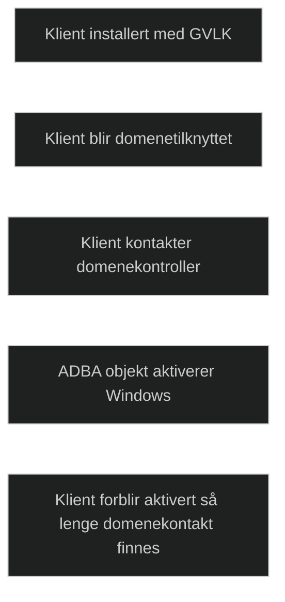

Active Directory based activation (_ADBA_) gjør det mulig å aktivere Windows ved hjelp av _domenet_ i stedet for en dedikert KMS server. Når en klient blir domenetilknyttet og har en _Generic Volume License Key (GVLK)_ installert, aktiveres Windows automatisk så lenge klienten kan kontakte en domenekontroller.

Dette erstatter behovet for en lokal KMS server og fjerner krav om aktiveringsterskel (som KMS krever). Aktiveringsobjektet lagres i Active Directory og replikeres til alle domenekontrollere, noe som gir høy tilgjengelighet og mindre administrasjon.

ADBA passer godt i miljøer der alle klienter er domenetilknyttet, og brukes ofte i moderne VDI miljøer for å unngå problemer dersom en KMS server er utilgjengelig. Klienter forblir aktiverte så lenge de kan kontakte domenet, og deaktiveres først etter 180 dager uten kontakt.

