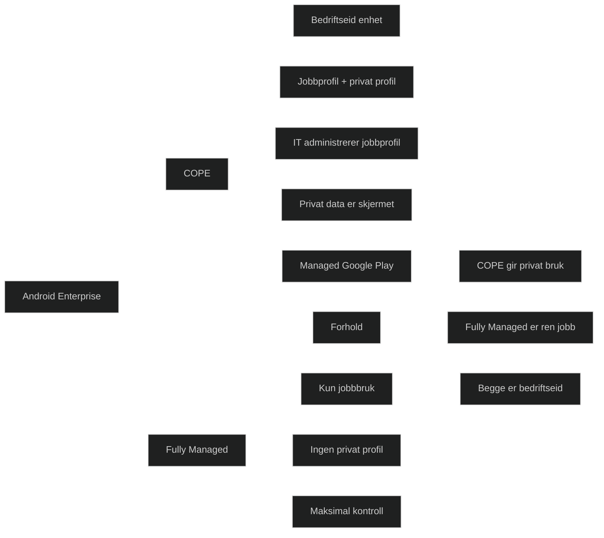

_Corporate Owned Personally Enabled (COPE)_ er Android Enterprise‑modellen som kombinerer _bedriftseid enhet_ med _mulighet for privat bruk_. Den gir IT full kontroll over jobbdata og jobbprofil, samtidig som brukeren får en privat profil som IT ikke har innsyn i.

COPE er derfor en _balansemodell_ mellom sikkerhet og fleksibilitet, og er svært relevant i MD 102 fordi den brukes i organisasjoner som vil gi ansatte en jobbtelefon som også kan brukes privat.

### Viktige egenskaper

- Enheten er eid av virksomheten
- To profiler på samme enhet: _jobbprofil_ og _privat profil_
- IT administrerer hele enheten, men _har ikke tilgang til privat data_
- Apper til jobbprofil distribueres via Managed Google Play
- IT kan håndheve sikkerhet på enheten (passord, kryptering, blokkering av funksjoner)
- Brukeren kan installere private apper i privat profil
- Jobbdata og privat data er fullstendig isolert

## Forskjellen mellom COPE og Fully Managed

Dette er et vanlig eksamenspunkt, så her er den tydelige forklaringen:

#### Fully Managed

- Hele enheten er administrert av IT
- Ingen privat profil
- Ingen privat bruk
- Maksimal kontroll

#### COPE

- Enheten er administrert av IT
- Privat profil er tillatt
- IT har ikke innsyn i privat data
- Balanse mellom kontroll og fleksibilitet

### Kort sagt

> Fully Managed = kun jobb 
> COPE = jobb + privat, men fortsatt bedriftseid og kontrollert

<a href="/certs/diagrams/deploy-intune-android-cope.html" target="_blank" rel="noopener">Stort diagram</a>