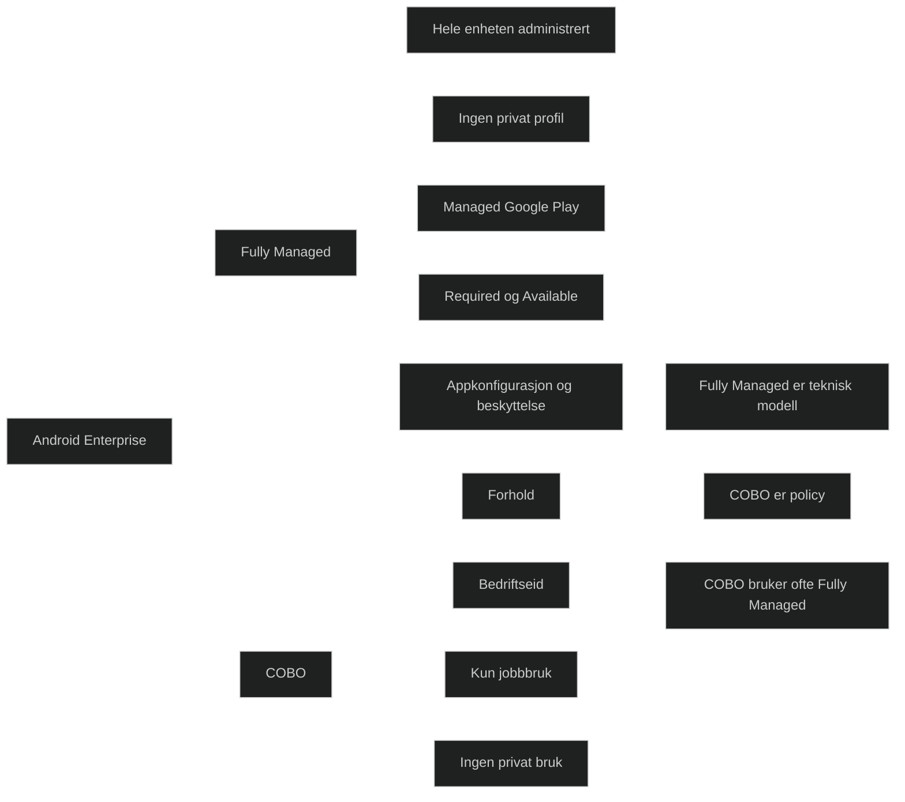

Android Enterprise Fully Managed er _den mest kontrollerte og låste Android‑modellen_ i Intune. Den brukes når enheten er eid av virksomheten og skal brukes _utelukkende til jobb_. Hele enheten administreres av Intune, og brukeren har ingen privat profil eller mulighet til å installere egne apper.

Dette er standarden for strengt styrte bedriftsenheter i MD‑102.

### Viktige egenskaper 

- Hele enheten er administrert av Intune
- Ingen personlig Google konto
- Ingen privat profil eller private apper
- Alle apper distribueres via Managed Google Play
- Støtter Required og Available
- Støtter appkonfigurasjon og appbeskyttelsespolicyer
- Støtter sikkerhetskrav som passord, kryptering og blokkering av funksjoner
- Passer for rene jobbtelefoner og jobbnettbrett

### Forskjellen mellom Fully Managed og COBO

Dette er et punkt som ofte skaper forvirring, så her er den eksamensrettede forklaringen:

#### Fully Managed

Dette er _den tekniske Android Enterprise‑modellen_. Den beskriver hvordan enheten faktisk er konfigurert og administrert.

#### COBO (Corporate Owned Business Only)

Dette er _et forretningsscenario_, ikke en teknisk modell. Det beskriver hvordan virksomheten ønsker at enheten skal brukes.

#### Forholdet mellom dem

- Fully Managed er teknologien
- COBO er bruksmodellen
- COBO enheter er nesten alltid Fully Managed
- Fully Managed kan brukes i andre scenarioer enn COBO

> Fully Managed er teknisk modell. COBO er policy. De brukes ofte sammen, men er ikke det samme.

<a href="/certs/diagrams/deploy-intune-android-fully.html" target="_blank" rel="noopener">Stort diagram</a>