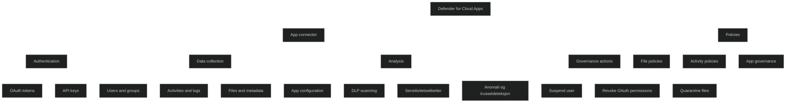

App connectors er API‑baserte integrasjoner som kobler Microsoft Defender for Cloud Apps til skyapplikasjoner for å gi _dyp synlighet_, _kontroll_ og _databeskyttelse_. De bruker app‑leverandørenes egne APIer for å hente informasjon om brukere, aktiviteter, filer, konfigurasjoner og sikkerhetsinnstillinger.

Når en app kobles til, kan Defender for Cloud Apps:

- hente brukerdata, grupper og privilegier
- overvåke aktiviteter og administrasjonshendelser
- skanne filer for DLP, sensitivitetsetiketter og skadevare
- analysere appens sikkerhetskonfigurasjon
- utføre governance handlinger som suspendering av brukere eller tilbakekalling av OAuth‑tillatelser

App connectors støtter både Microsoft og tredjepartsapper som Salesforce, Google Workspace, AWS, Box og mange flere. Løsningen håndterer API‑begrensninger som throttling og tidsvinduer ved å kjøre skanninger i intervaller.

App connectors er en av de viktigste teknologiene i Defender for Cloud Apps fordi de gir _kontinuerlig, detaljert innsikt_ som ikke er mulig med kun Cloud Discovery eller reverse proxy.

<a href="/certs/diagrams/defender-app-connectors.html" target="_blank" rel="noopener">Stort diagram</a>