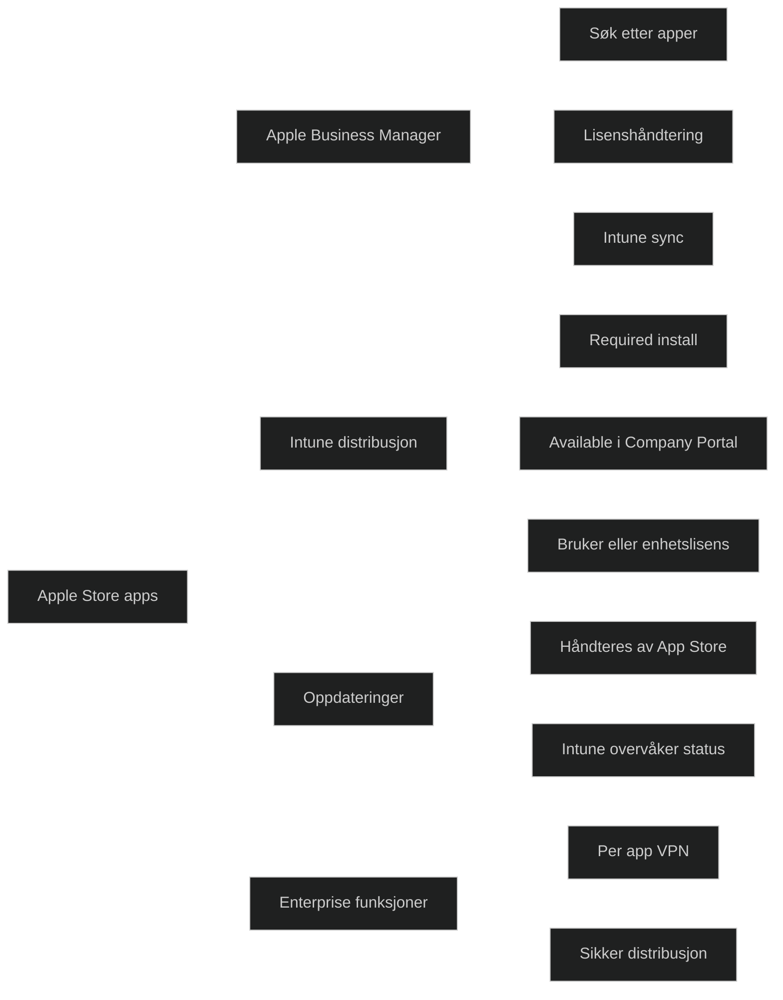

Apple Store‑apper er _offentlige iOS‑apper_ som distribueres via Intune ved hjelp av _Apple Business Manager (ABM)_ og _Managed App Store_. Dette er den anbefalte og moderne måten å distribuere iOS‑apper på i organisasjoner.

Intune integrerer med Apple Business Manager for å:

- søke etter apper i App Store
- tilordne lisenser automatisk
- distribuere apper til brukere eller enheter
- håndtere oppdateringer og installasjonsstatus

Dette er viktig i MD‑102 fordi iOS‑administrasjon krever riktig integrasjon mellom Intune og Apple‑økosystemet.

### Viktige egenskaper

- _Bruker Apple Business Manager_ ABM kobles til Intune for å hente App Store‑apper og administrere lisenser.
- _Støtter både bruker og enhetsbaserte lisenser_ Enhetsbasert lisens krever ikke Apple‑ID.
- _Automatisk lisenshåndtering_ Intune tildeler og frigjør lisenser automatisk basert på tilordning.
- _Støtter Required og Available_ Required installerer automatisk, Available gjør appen tilgjengelig i Company Portal.
- _Oppdateringer håndteres av App Store_ Intune overvåker status, men selve oppdateringen gjøres av iOS.
- _Kan kombineres med per app VPN_ Viktig for sikker tilgang til interne ressurser.

### Begrensninger

- Krever Apple Business Manager
- Krever MDM‑registrering for automatisk installasjon
- Ingen mulighet for å endre appens innhold eller funksjonalitet
- Oppdateringer kan ikke styres like detaljert som på Windows

<a href="/certs/diagrams/deploy-intune-app-store.html" target="_blank" rel="noopener">Stort diagram</a>