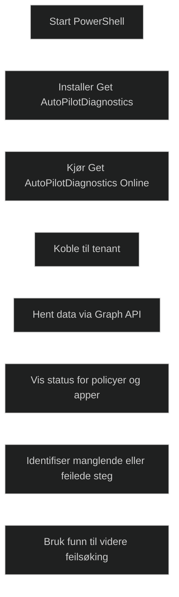

Autopilot Diagnostics er et PowerShell‑basert verktøy som samler feilsøkingsinformasjon for Windows Autopilot i et lettlest format. Det henter data direkte fra Intune via Graph API og viser status for policyer, apper, profiler og registreringsprosesser. Dette gjør det enklere å identifisere hvor i flyten en feil oppstår, spesielt når OOBE ikke oppfører seg som forventet.

Verktøyet brukes ved å installere og kjøre skriptet Get AutoPilotDiagnostics. Når det kjøres med en konto som har riktige rettigheter, viser det en oversikt over mottatte og manglende konfigurasjoner, samt eventuelle feil. Det fungerer som et supplement til Event Viewer, registry og ETW spor, og gir en raskere vei til å finne årsaken til problemer med Autopilot.

For MD 102 er det viktig å forstå at Autopilot Diagnostics:

- samler flere feilsøkingskilder i ett verktøy
- viser status for policyer, apper og registrering
- bruker Graph API for å hente informasjon
- er nyttig når OOBE ikke følger forventet flyt
- ikke erstatter Event Viewer, men gjør feilsøking raskere

