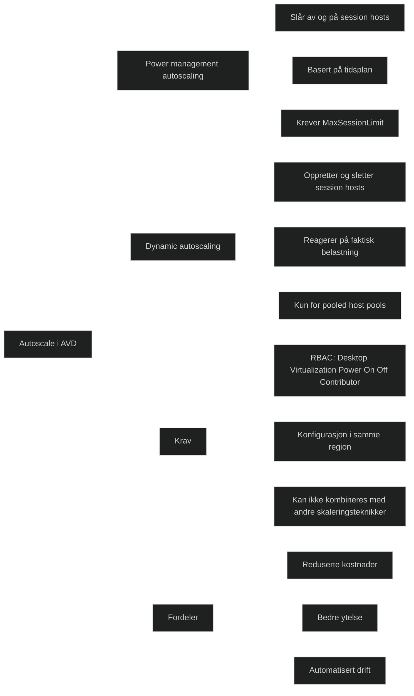

Autoscale i Azure Virtual Desktop gjør det mulig å styre kapasiteten i en host pool ved å slå av eller på virtuelle maskiner etter behov. Dette optimaliserer kostnader ved å redusere antall aktive maskiner utenfor arbeidstid, samtidig som brukere får tilstrekkelig kapasitet i perioder med høy belastning. Autoscale støtter to metoder:

- _Power management autoscaling_: Skrur session hosts av og på etter tidsplan. Passer for forutsigbare miljøer.
- _Dynamic autoscaling (preview)_: Kan både starte, stoppe, opprette og slette session hosts basert på faktisk etterspørsel. Passer for mer varierende bruksmønstre.

Autoscale krever at Azure Virtual Desktop får nødvendige RBAC‑rettigheter til å styre strømtilstanden på session hosts, og at host pool har satt en _MaxSessionLimit_, som brukes for å beregne kapasitet.

Formålet er å balansere kostnader og ytelse: unngå at maskiner står på uten bruk, men samtidig sikre at brukere ikke opplever treghet eller manglende kapasitet. Dette er spesielt viktig i pay‑as‑you‑go miljøer der compute‑kostnader løper per minutt.

[Create and assign an autoscale scaling plan for Azure Virtual Desktop - Azure Virtual Desktop | Microsoft Learn](https://learn.microsoft.com/en-us/azure/virtual-desktop/autoscale-create-assign-scaling-plan)
[AVD Auto-Scaling Guide](https://getnerdio.com/automation-to-manage-avd)
