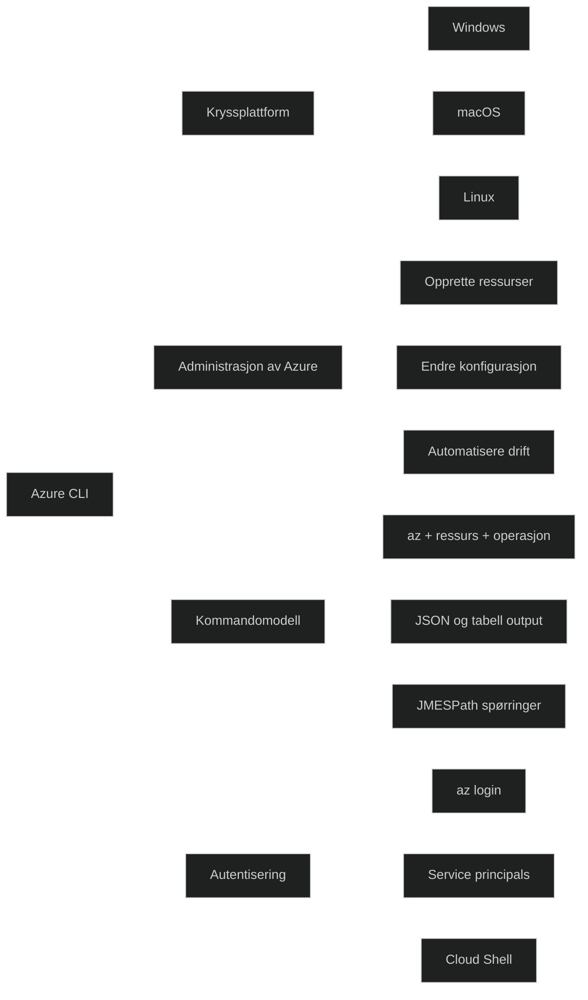

Azure CLI er et kryssplattform verktøy for å administrere Azure gjennom kommandolinjen. Det gir mulighet til å automatisere oppgaver, bruke skript, endre ressurskonfigurasjon og hente informasjon på en effektiv måte. Det støtter flere autentiseringsmetoder, inkludert interaktiv pålogging og service principals, og kan kjøres lokalt eller i Azure Cloud Shell.

CLIen bruker et konsistent kommandospråk der alle kommandoer starter med **az**, etterfulgt av ressurs og operasjon, for eksempel `az vm create`. Resultater kan formateres som JSON, tabell eller TSV, og kan filtreres med JMESPath spørringer via `--query`. Dette gjør verktøyet svært egnet for automatisering og integrasjon i DevOps prosesser.

[Azure Command-Line Interface (CLI) documentation | Microsoft Learn](https://learn.microsoft.com/en-us/cli/azure/?view=azure-cli-latest)
[What Is Azure CLI - Azure Lessons](https://azurelessons.com/what-is-azure-cli/)
