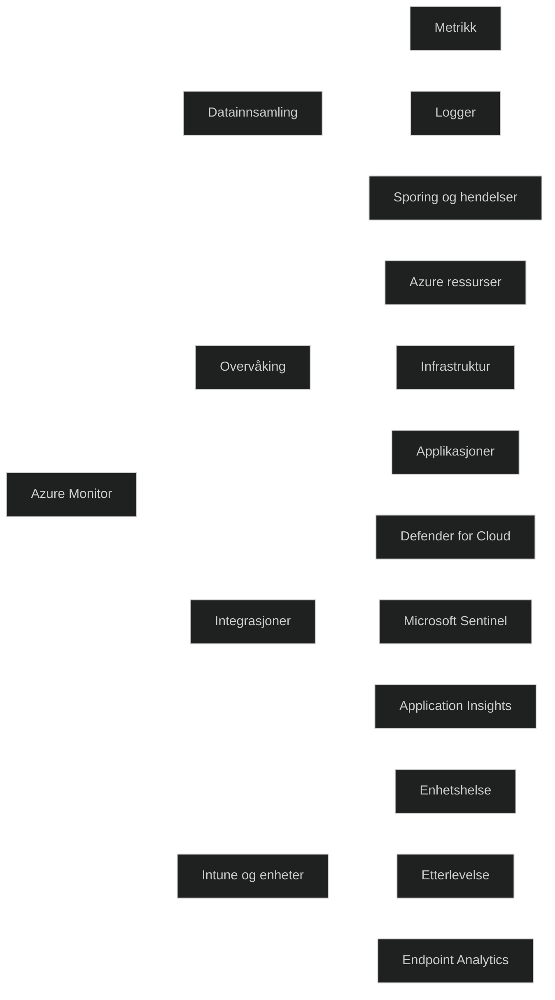

Azure Monitor er Microsofts enhetlige observasjonsplattform som samler inn og analyserer telemetri fra både sky og hybride miljøer. Den gir innsikt i ytelse, stabilitet og tilgjengelighet ved å kombinere _metrikk_, _logger_, _sporingsdata_ og _hendelser_ i en samlet løsning. Dette gjør det mulig å overvåke apper, virtuelle maskiner, nettverk og andre Azure ressurser på en helhetlig måte.

Azure Monitor integrerer også med tjenester som _Defender for Cloud_ og _Microsoft Sentinel_, slik at samme datagrunnlag kan brukes til sikkerhet, drift og feilsøking. Plattformen støtter både _Application Insights_ for applikasjonsovervåking og _Azure Monitor Insights_ for dyp innsikt i spesifikke tjenester som virtuelle maskiner og Kubernetes.

For MD 102 er det viktig å kjenne til at Azure Monitor brukes sammen med Intune for å overvåke enheter, helse, etterlevelse og brukeropplevelse. Dette inkluderer integrasjon med _Endpoint Analytics_, som gir innsikt i oppstartstid, applikasjonsytelse og brukeropplevelse.

[Azure Monitor overview - Azure Monitor | Microsoft Learn](https://learn.microsoft.com/en-us/azure/azure-monitor/fundamentals/overview)
[MD-102: Monitoring Devices with Intune & Azure Monitor - Microsoft Endpoint - INTERMEDIATE - Skillsoft](https://www.skillsoft.com/course/md-102-monitoring-devices-with-intune-azure-monitor-f60ad8c4-ffd5-41a0-b1e5-8e167f438ebc)
