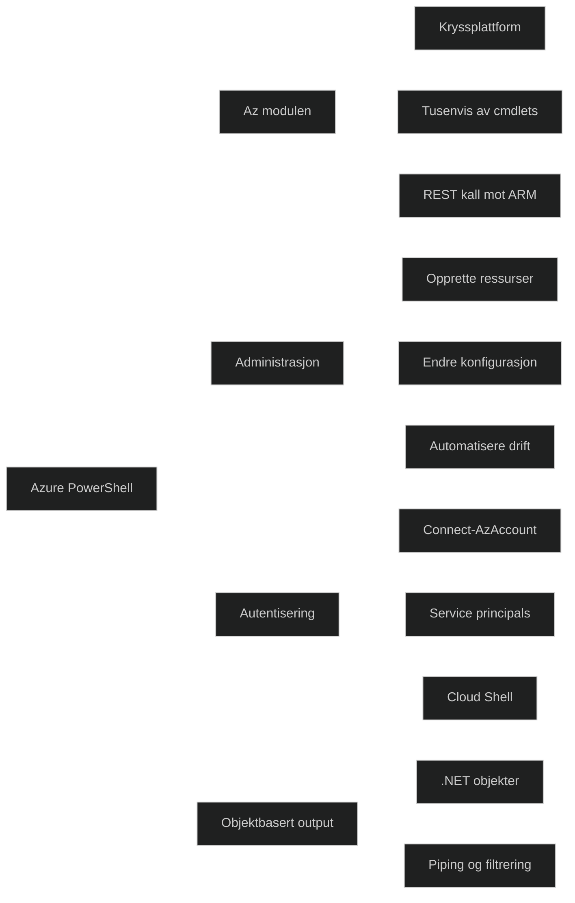

Azure PowerShell er en samling offisielle moduler som lar deg administrere Azure direkte fra PowerShell. Det anbefalte rammeverket er **Az‑modulen**, som fungerer på Windows, macOS og Linux, og kan brukes lokalt, i Azure Cloud Shell eller i Docker.

Cmdletene i Az‑modulen gjør REST kall mot Azure Resource Manager og produserer .NET objekter, noe som gjør det enkelt å filtrere, kombinere og automatisere oppgaver.

Modulen dekker nesten alle Azure tjenester gjennom egne delmoduler som **Az.Network**, **Az.Compute** og **Az.Aks**, og brukes til å opprette, endre og administrere ressurser på en konsistent måte.

Azure PowerShell støtter flere autentiseringsmetoder, inkludert interaktiv pålogging og service principals, og er spesielt nyttig når du trenger skripting, automatisering eller objektbasert behandling av data.

[What is Azure PowerShell | Microsoft Learn](https://learn.microsoft.com/en-us/powershell/azure/what-is-azure-powershell?view=azps-15.5.0)
