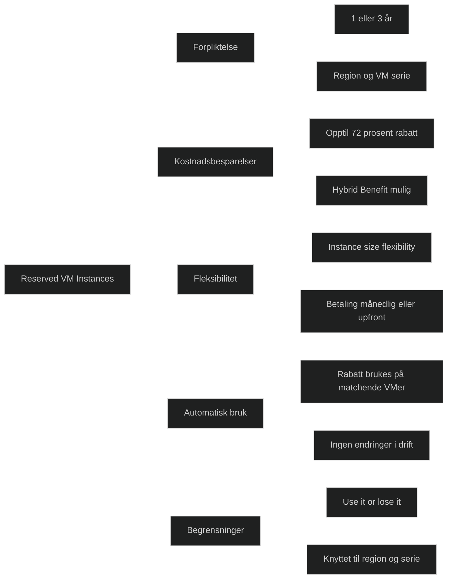

Azure Reserved Virtual Machine Instances er en kjøpsmodell der du reserverer en bestemt VM‑størrelse i en valgt region for ett eller tre år. Til gjengjeld får du betydelig lavere timepris enn ved vanlig forbruk. Rabatten gjelder automatisk for alle kjørende VM‑instanser som matcher reservasjonen, uten at du må endre konfigurasjon.

Reservasjoner gir _forutsigbare kostnader_, enten du betaler alt på forhånd eller månedlig, og passer best for arbeidsbelastninger som er stabile over tid. Du velger VM‑serie, størrelse, region, antall og varighet. Fleksibilitet finnes gjennom _instance size flexibility_, som gjør at rabatten kan brukes på andre VM‑størrelser i samme serie og region.

Reserved Instances kan gi _opptil 72 prosent besparelse_ sammenlignet med pay as you go, avhengig av VM‑type og varighet. De kan også kombineres med _Azure Hybrid Benefit_, som ytterligere reduserer kostnader ved Windows‑lisenser.

Reservasjoner er knyttet til region og VM‑familie, og rabatten er _use it or lose it_: ubrukt kapasitet gir ingen refusjon.

[Azure Reserved Virtual Machine Instances | Microsoft Azure](https://azure.microsoft.com/en-us/pricing/offers/reservations/vm-instances)
[Beginner's Guide to Microsoft Azure Reserved Virtual Machine Instances](https://www.vmware.com/docs/ebook-a-beginners-guide-to-microsoft-azure-reserved-virtual-machine-instances)
[Azure Reserved Instances: Basics, Benefits, and How They Work - ProsperOps](https://www.prosperops.com/blog/azure-reserved-instances)
