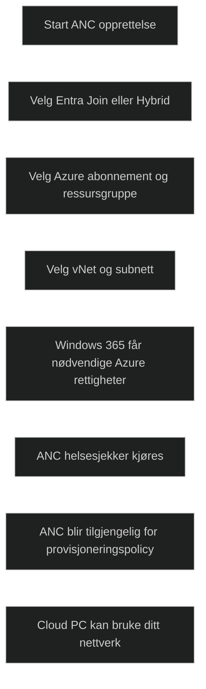

En _Azure Network Connection (ANC)_ brukes når Cloud PCer skal knyttes til et Azure virtuelt nettverk som du administrerer. Dette gjør at Cloud PCer kan:

- bli medlem av ditt domene (Hybrid eller Entra Join)
- bruke dine DNS og IP‑områder
- få tilgang til lokale ressurser via VPN eller ExpressRoute
- følge dine nettverkskrav og sikkerhetspolicyer

Når en ANC opprettes, får Windows 365 tjenesten nødvendige rettigheter i Azure, som _Reader_, _Network Interface Contributor_ og _Network User_ på vNet og ressursgruppe.

### Krav (MD‑102 relevant)

- Intune Administrator eller Windows 365 Administrator
- Azure Subscription Owner for første ANC, deretter Reader for flere
- AD konto med rettigheter til å joine domenet (ved Hybrid Join)
- Subnett med minst _50 prosent ledige IP adresser_ for Disaster Recovery reprovisioning
    

### Opprettelse av ANC

1. Gå til Intune admin center
2. Devices → Provision Cloud PCs → Azure network connection
3. Velg Entra Join eller Hybrid Entra Join
4. Velg abonnement, ressursgruppe, vNet og subnett
5. Fullfør og vent til alle helsesjekker er grønne

Når ANC er sunn, kan den brukes i provisjoneringspolicyer for Cloud PC.

[Create Azure network connections for Windows 365 | Microsoft Learn](https://learn.microsoft.com/en-us/windows-365/enterprise/create-azure-network-connection?utm_source=copilot.com)
