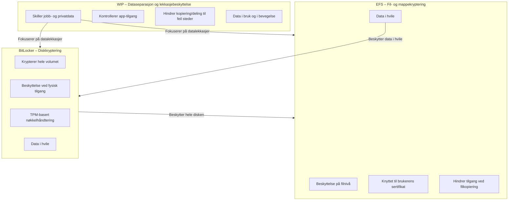

BitLocker er en innebygd Windows‑sikkerhetsfunksjon som beskytter data ved å **kryptere hele diskvolumer**. Målet er å hindre uautorisert tilgang dersom en enhet blir mistet, stjålet eller manipulert. Krypteringen gjør at data ikke kan leses uten riktig autentisering, selv om disken fjernes og kobles til et annet system.

BitLocker gir sterkest beskyttelse når det brukes sammen med en **Trusted Platform Module (TPM)**. TPM verifiserer at systemet ikke er endret i oppstartsfasen og lagrer nøkler på en sikker måte. På enheter uten TPM kan BitLocker fortsatt brukes, men krever da enten en oppstartsnøkkel på USB eller et passord, en løsning som gir lavere sikkerhet og mangler pre‑boot integritetssjekk.

For at BitLocker skal fungere, må systemet oppfylle visse krav: riktig partisjonsstruktur, støtte for TPM eller USB‑basert oppstartsnøkkel, og UEFI/BIOS‑funksjoner som etablerer en sikker oppstartskjede. BitLocker støttes i flere Windows‑utgaver, inkludert Pro, Enterprise og Education.

BitLocker skiller seg fra automatisk **device encryption**, som aktiveres på kvalifiserte enheter uten administratorinngrep. Device encryption bruker BitLocker i bakgrunnen, men med enklere forutsetninger og automatisk nøkkelbackup til Entra ID, AD DS eller Microsoft‑konto.

I en MD‑102‑kontekst er hovedpoenget å forstå BitLocker som en **kjernekomponent for databeskyttelse i hvile**. Det beskytter hele disken mot fysisk tilgang, sikrer oppstartsprosessen, og inngår i en bredere strategi for å hindre datatap og uautorisert eksponering av bedriftsinformasjon.

