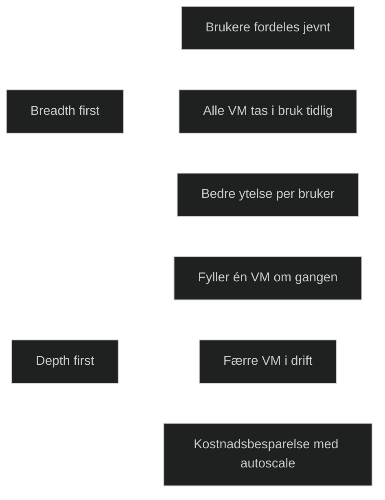

## Breadth first

Breadth first betyr at AVD fordeler brukere jevnt utover alle tilgjengelige virtuelle maskiner i en pooled host pool. Målet er å spre belastningen slik at alle maskiner får omtrent like mange aktive sesjoner.

Dette gir:

- jevn ressursbruk
- lavere belastning per maskin
- bedre ytelse for hver enkelt bruker

Breadth first brukes ofte når du vil sikre god brukeropplevelse og unngå at en enkelt VM blir tungt belastet.

## Depth first

Depth first betyr at AVD fyller opp én virtuell maskin om gangen før neste tas i bruk. Brukere sendes til samme VM til den når MaxSessionLimit, og først da tas neste maskin i bruk.

Dette gir:

- færre aktive maskiner
- lavere kostnader når autoscale brukes
- høyere belastning per maskin

Depth first brukes ofte når kostnadsoptimalisering er viktigere enn jevn ytelse.

