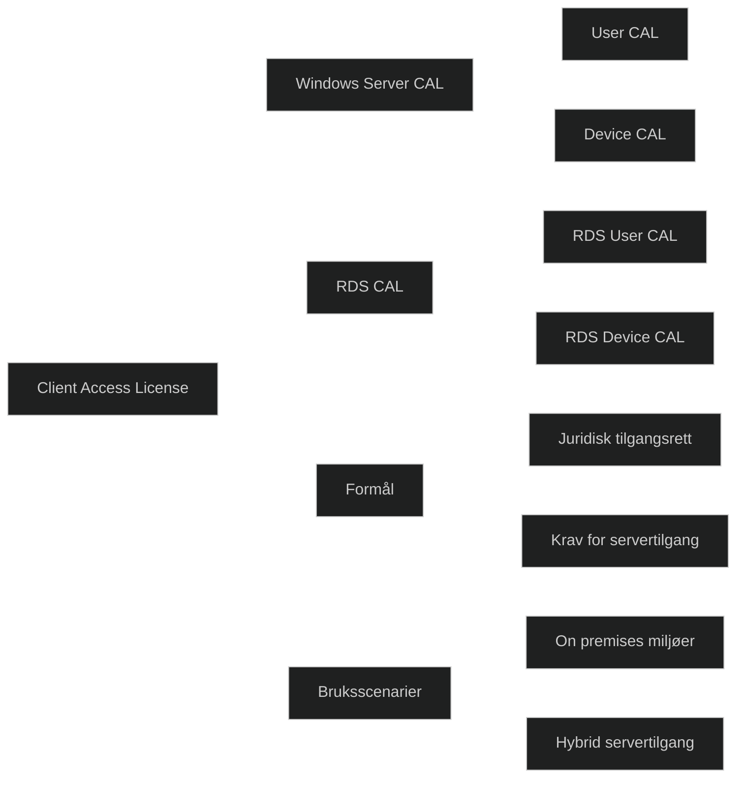

En Client Access License er en lisens som gir en bruker eller en enhet rett til å få tilgang til tjenester levert av Windows Server eller Remote Desktop Services. CAL er ikke en programvareinstallasjon, men en juridisk tilgangsrett som må være på plass for at brukere eller enheter skal kunne koble seg til serverbaserte ressurser.

Det finnes to hovedtyper: _User CAL_, som gir én navngitt bruker tilgang fra ubegrenset antall enheter, og _Device CAL_, som gir én enhet tilgang uavhengig av hvor mange brukere som benytter den. For Remote Desktop Services kreves egne _RDS CALer_ i tillegg til vanlige Windows Server CALer. Valg av CAL type avhenger av bruksmønster og antall brukere og enheter i miljøet.

CALer er sentrale i tradisjonelle on premises miljøer og i hybride løsninger der Windows Server eller RDS fortsatt brukes. De sikrer at organisasjonen følger lisenskravene og unngår brudd på lisensvilkår.

