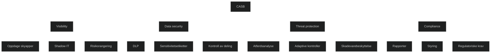

En Cloud Access Security Broker er et sikkerhetslag som ligger mellom brukere og skyressurser. Den gir oversikt over hvilke skyapper som brukes, vurderer risiko, beskytter data og oppdager trusler på tvers av SaaS, PaaS og IaaS. En CASB håndhever virksomhetens policyer uavhengig av hvor brukeren befinner seg eller hvilken enhet som brukes.

CASB løsninger oppdager Shadow IT ved å analysere trafikk og identifisere apper som ikke er godkjent. De vurderer apper etter sikkerhet, samsvar, driftssikkerhet og personvern. De overvåker brukeratferd og varsler ved unormal aktivitet som store datanedlastinger eller mistenkelige pålogginger.

CASB beskytter data gjennom tilgangskontroll, DLP, sensitivitetsetiketter og styring av deling. Den kan også sikre kommunikasjon mellom apper, spesielt OAuth apper som kan få tilgang til sensitive data.

I MD 102 sammenheng er CASB viktig fordi den gir innsikt i skybruk, styrker databeskyttelse og hjelper administratorer med å håndtere risiko i et miljø der skyapper ofte er en del av angrepsflaten.

<a href="/certs/diagrams/defender-casb.html" target="_blank" rel="noopener">Stort diagram</a>