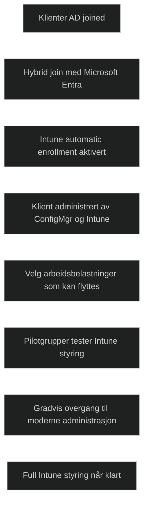

_Co management_ gjør det mulig å administrere Windows klienter med både Configuration Manager og Intune samtidig. Det brukes når en organisasjon ønsker å modernisere administrasjonen gradvis uten å måtte flytte alt til skyen på én gang.

For at co management skal fungere, må klientene være _Microsoft Entra hybrid joined_, Intune må være konfigurert for _automatic enrollment_, og klientene må kjøre _Windows 10 versjon 1709 eller nyere_.

Når klientene er registrert i begge systemer, kan arbeidsbelastninger flyttes trinnvis fra Configuration Manager til Intune. Dette gir fleksibilitet og gjør det mulig å teste moderne administrasjon på pilotgrupper før full utrulling.

Typiske arbeidsbelastninger som kan flyttes er:

- Device configuration
- Compliance policies
- Windows Update
- Endpoint Protection
- Resource access (Wi Fi, VPN, e post, sertifikater)
- Applikasjoner

Co management brukes ofte når organisasjoner har mange eksisterende ConfigMgr investeringer, komplekse applikasjoner eller behov for kontrollert overgang til moderne administrasjon.

