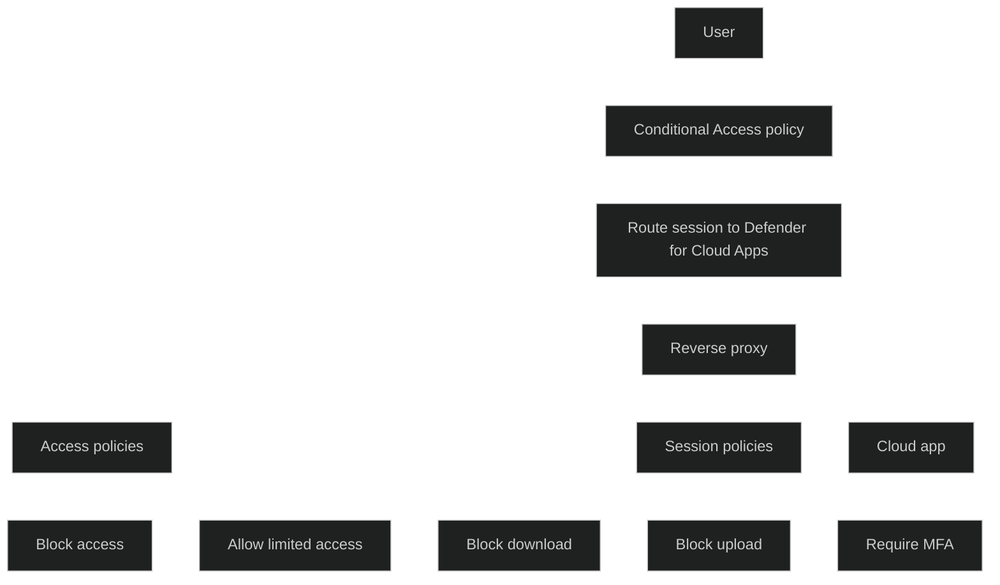

Conditional Access App Control er en funksjon i Microsoft Defender for Cloud Apps som gir _sanntidskontroll_ over brukeres tilgang og økter i skyapper. Den bygger på Microsoft Entra Conditional Access og bruker en _[reverse proxy](Reverse-proxy.md) arkitektur_ for å overvåke og styre aktivitet i nettleseren i det øyeblikket den skjer.

Løsningen gjør det mulig å:

- overvåke og kontrollere brukersesjoner i sanntid
- blokkere nedlasting, opplasting, utskrift, kopiering og deling av sensitive filer
- kreve ekstra autentisering når en sensitiv handling utføres
- hindre datalekkasjer fra unmanaged enheter
- blokkere native klienter og tvinge brukere over i nettleserbaserte økter
- identifisere og stoppe mistenkelig aktivitet umiddelbart

Conditional Access App Control fungerer med både Microsoft og tredjeparts skyapper. Microsoft Entra‑apper onboardes automatisk, mens apper fra andre identitetsleverandører må onboardes manuelt.

<a href="/certs/diagrams/defender-conditional-access-app-control.html" target="_blank" rel="noopener">Stort diagram</a>