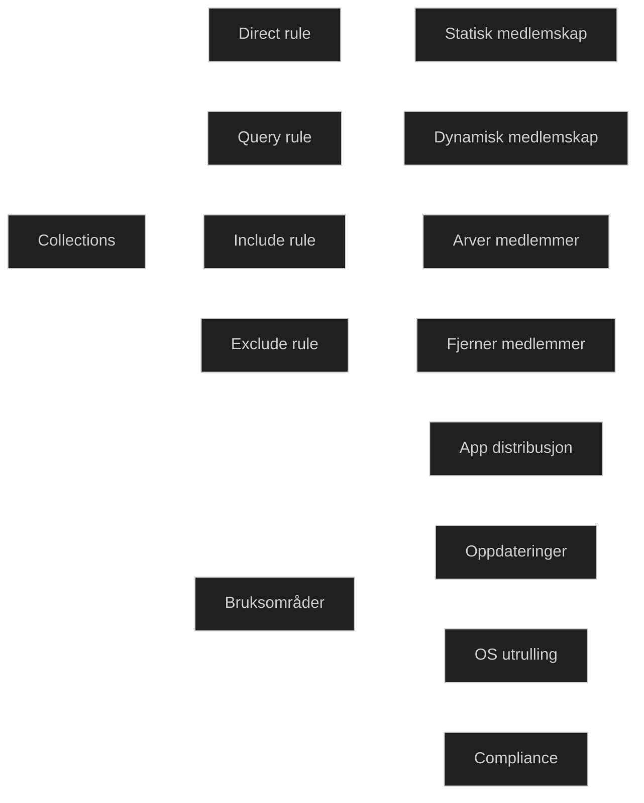

Collections er en grunnleggende mekanisme i Configuration Manager for å målrette administrasjon mot bestemte enheter eller brukere. En collection kan kun inneholde én type objekt, enten brukere eller enheter, ikke begge.

Collections brukes til oppgaver som:

- distribuere apper
- installere programvareoppdateringer
- kjøre skript
- håndheve compliance settings
- styre klientinnstillinger
- målrette OS‑utrulling

Dette gjør collections til et sentralt verktøy i all klientadministrasjon.

### Typer medlemskapsregler

Configuration Manager støtter fire hovedtyper regler for å bestemme hvem som blir medlem av en collection:

- _Direct rule_: manuell, statisk medlemskap. Krever at administrator legger til enheter eller brukere selv.
- _Query rule_: dynamisk medlemskap basert på en spørring som kjøres jevnlig. Mest brukt i praksis.
- _Include collection rule_: inkluderer medlemmer fra en annen collection.
- _Exclude collection rule_: ekskluderer medlemmer fra en annen collection.

Dette gir fleksibilitet til å bygge både brede og svært presise målgrupper.

### Limiting collection

Alle collections må ha en limiting collection, som setter rammen for hvilke objekter som kan bli medlemmer. Dette hindrer feilutrulling og gir bedre kontroll. (Basert på praksisbeskrivelse i fagkilde)

|Built-in collection name|Description|
|---|---|
|All User Groups|Contains the user groups that are discovered by using Active Directory Security Group Discovery.|
|All Users|Contains the users who are discovered by using Active Directory User Discovery.|
|All Users and User Groups|Contains the All Users and the All User Groups collections. This collection contains the largest scope of user and user group resources.|
|All Desktop and Server Clients|Contains the server and desktop devices that have the Configuration Manager client installed. Membership is maintained by Heartbeat Discovery.|
|All Mobile Devices|Contains the mobile devices that are managed by Configuration Manager. Membership is restricted to those mobile devices that are successfully assigned to a site or discovered by the Exchange Server connector.|
|All Systems|Contains the All Desktop and Server Clients, the All Mobile Devices, and the All Unknown Computers collections, and all mobile devices that are enrolled by Microsoft Intune. This collection contains the largest scope of device resources.|
|All Unknown Computers|Contains generic computer records for multiple computer platforms. You can use this collection to deploy an operating system by using a task sequence and PXE boot, bootable media, or prestaged media.|
|Co-management Eligible Devices|Contains devices that meet the client prerequisites and are eligible for co-management enrollment (added in version 2111).|

Most management tasks rely on or require using one or more collections. Although you can use the built-in collection of **All Systems**, using it for management tasks isn't a best practice. Instead, you should create custom collections to more specifically identify the devices or users for a task.

[Create collections - Configuration Manager | Microsoft Learn](https://learn.microsoft.com/en-us/intune/configmgr/core/clients/manage/collections/create-collections)
[Collections In Configuration Manager | Ultimate Guide](https://learnmesccm.com/cm/dc/collections-configuration-manager.html)