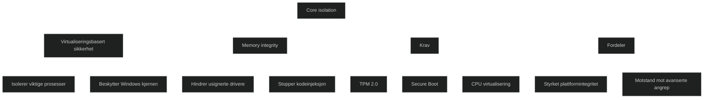

Core isolation er en sikkerhetsfunksjon i Windows som beskytter viktige systemprosesser ved å kjøre dem i et eget, virtualisert miljø. Dette gjør det svært vanskelig for skadevare å manipulere kjernen eller injisere kode i prosesser som har høy tilgang.

Kjernen i Core isolation er _memory integrity_, som sørger for at bare klarerte og signerte drivere får kjøre. Dette hindrer angrep som forsøker å misbruke lavnivådrivere for å ta kontroll over systemet.

Core isolation bygger på _virtualiseringsbasert sikkerhet (VBS)_ og krever maskinvare som støtter TPM 2.0, Secure Boot og CPU‑virtualisering.

# Hvorfor Core isolation er viktig

- Beskytter Windows kjernen mot manipulering
- Stopper ondsinnede drivere og kodeinjeksjon
- Gir et ekstra lag med forsvar mot avanserte angrep
- Er en del av Device security i Windows Security

Dette gjør Core isolation til en sentral del av moderne endepunktbeskyttelse.

# Memory integrity

Memory integrity (HVCI) er den mest synlige delen av Core isolation. Den:

- kjører kodeintegritet i et isolert miljø
- hindrer usignerte eller manipulerte drivere
- beskytter mot angrep som forsøker å få kjernenivåtilgang

# MD‑102 relevans

Du må kunne:

- forklare hva Core isolation og memory integrity gjør
- forstå at dette er VBS‑basert beskyttelse av kjernen
- kjenne til maskinvarekrav som TPM, Secure Boot og virtualisering
- vite hvor funksjonen aktiveres i Windows Security
- se hvordan Core isolation inngår i Zero Trust og plattformintegritet

<a href="/certs/diagrams/core-isolation.html" target="_blank" rel="noopener">Stort diagram</a>

[Device Security in the Windows Security App - Microsoft Support](https://support.microsoft.com/en-us/windows/device-security-in-the-windows-security-app-afa11526-de57-b1c5-599f-3a4c6a61c5e2)
https://www.xda-developers.com/coore-isolation-windows