En Data Recovery Agent brukes for å sikre at organisasjonsdata som er beskyttet av Windows Information Protection kan gjenopprettes dersom nøkler går tapt eller en bruker ikke lenger har tilgang. DRA er en sentral del av WIP fordi krypteringen knytter data til virksomhetens identitet, og uten en gjenopprettingsnøkkel kan filer bli permanent utilgjengelige.

Et DRA sertifikat må opprettes dersom organisasjonen ikke allerede har ett. Dette gjøres ved å bruke cipher verktøyet til å generere en sertifikatfil og en tilhørende privat nøkkel. Den private nøkkelen må beskyttes svært godt, siden den kan dekryptere alle WIP filer. Sertifikatet legges deretter inn i WIP policyen gjennom Intune eller Configuration Manager.

Når sertifikatet er distribuert, kan det brukes til å verifisere at gjenoppretting fungerer. Dette innebærer å opprette en WIP beskyttet fil, kontrollere at sertifikatet vises som en gjenopprettingsnøkkel, og teste dekryptering ved hjelp av DRA nøkkelen. Dette sikrer at organisasjonen kan hente ut data ved tap av nøkler eller ved feil i policyer.

DRA brukes også i situasjoner der en enhet er avregistrert og organisasjonsdata er tilbakekalt. Dersom en ansatt registrerer enheten på nytt med samme profil, kan tidligere tilbakekalte nøkler gjenopprettes automatisk. Det finnes også manuelle metoder for å hente ut nøkler fra systemområder dersom profilen ikke lenger eksisterer.

WIP har i tillegg en automatisk gjenopprettingsfunksjon som lagrer en nøkkel i Microsoft Entra ID. Dette gjør at ansatte kan få tilgang til filer igjen ved å koble enheten til sin arbeidskonto. Denne mekanismen fungerer som et ekstra lag med beskyttelse dersom lokale nøkler går tapt.

### MD 102 relevans

For MD 102 er det viktig å forstå at DRA er en kritisk del av WIP. Uten en gjenopprettingsnøkkel kan organisasjonsdata bli permanent utilgjengelige. Du må kunne:

- forklare hvorfor DRA er nødvendig
- opprette og distribuere et DRA sertifikat
- verifisere at gjenoppretting fungerer
- forstå hvordan DRA brukes ved avregistrering og nøkkeltap
- kjenne til automatisk gjenoppretting via Microsoft Entra ID

Dette er grunnleggende for å sikre at databeskyttelse ikke fører til datatap.

```mermaid

%%{init: {
  "theme": "dark",
  "themeVariables": {
    "primaryColor": "#1e1e1e",
    "primaryTextColor": "#ffffff",
    "lineColor": "#ffffff",
    "secondaryColor": "#333333"
  }
}}%%

flowchart TB

    A[Create and verify an EFS Data Recovery Agent DRA certificate]

    A --> B[Create a DRA certificate]
    B --> B1[Bruk cipher verktøyet til å generere sertifikat]
    B --> B2[Opprett privat nøkkel og sertifikatfil]
    B --> B3[Beskytt den private nøkkelen godt]

    A --> C[Add the DRA certificate to a WIP policy]
    C --> C1[Importer sertifikatet i Intune eller MDM]
    C --> C2[Distribuer sertifikatet til enheter]
    C --> C3[Sikrer at WIP kan dekryptere filer ved behov]

    A --> D[Verify the DRA certificate]
    D --> D1[Opprett en WIP beskyttet fil]
    D --> D2[Kontroller at DRA vises som gjenopprettingsnøkkel]
    D --> D3[Test dekryptering med DRA nøkkelen]

    A --> E[Recover encrypted files]
    E --> E1[Bruk DRA nøkkelen ved tap av brukerens nøkler]
    E --> E2[Hent ut data fra enheter som er avregistrert]
    E --> E3[Bruk manuelle metoder ved manglende profil]

    A --> F[Automatic recovery]
    F --> F1[WIP lagrer en nøkkel i Microsoft Entra ID]
    F --> F2[Brukeren kan gjenopprette tilgang ved å logge inn]
    F --> F3[Fungerer som ekstra sikkerhetslag]

```

 
<a href="/certs/diagrams/dra.html" target="_blank" rel="noopener">Stort diagram</a>

[Create an EFS Data Recovery Agent certificate - Windows 10](https://learn.microsoft.com/en-us/previous-versions/windows/it-pro/windows-10/security/information-protection/windows-information-protection/create-and-verify-an-efs-dra-certificate)

