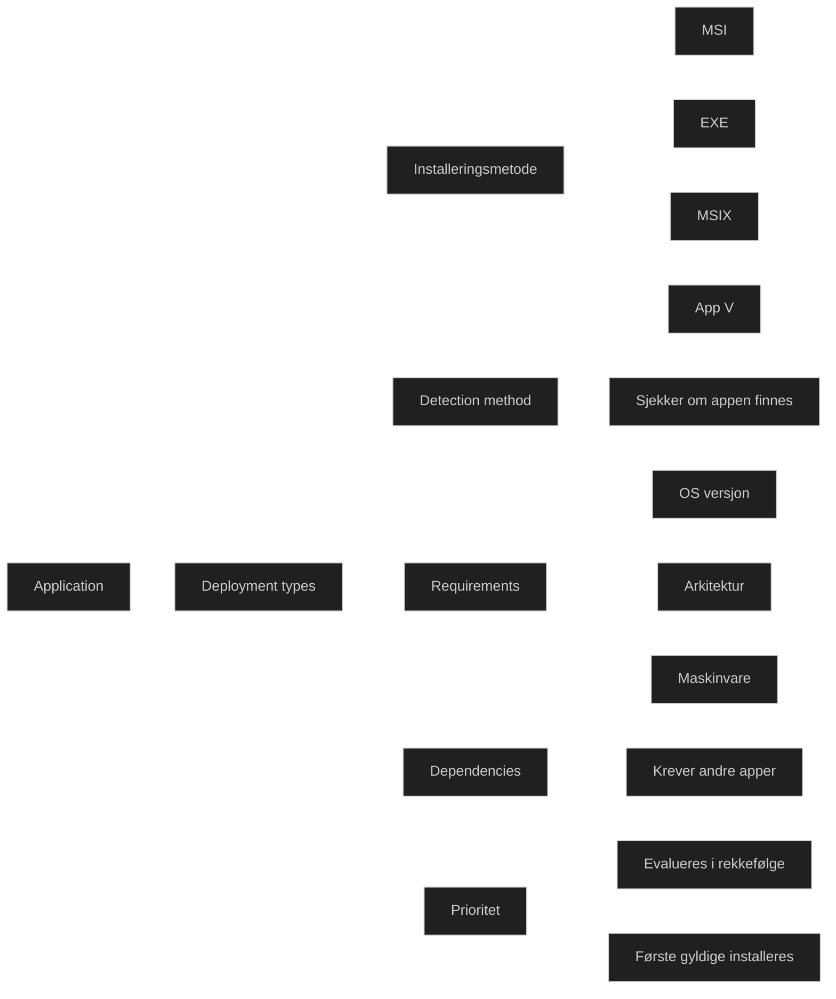

_Deployment types_ brukes i Configuration Manager for å definere _hvordan_ en applikasjon skal installeres. En applikasjon kan ha flere deployment types, og Configuration Manager velger automatisk riktig type basert på krav, operativsystem, maskinvare og tilgjengelighet.

Dette gjør deployment types til kjernen i appdistribusjon i Configuration Manager, og det er viktig i MD‑102 å forstå hvordan de fungerer og hvorfor de brukes.

### Hva en deployment type inneholder

Hver deployment type består av:

- _Installeringsmetode_ MSI, EXE, Script, AppX, MSIX, App V og flere.
- _Detection method_ Hvordan CM avgjør om appen allerede er installert.
- _Requirements_ For eksempel OS versjon, arkitektur, minne, diskplass.
- _Dependencies_ Andre apper som må installeres først.
- _Return codes_ Definerer hva som regnes som vellykket installasjon.
- _Content location_ Hvor installasjonsfilene ligger.

### Hvordan Configuration Manager velger deployment type

CM evaluerer deployment types i prioritert rekkefølge:

1. Sjekker _requirements_
2. Sjekker _dependencies_
3. Sjekker _detection method_
4. Installerer den første som oppfyller alle krav

Dette gjør det mulig å ha flere varianter av samme app, for eksempel:

- MSI for Windows 11
- EXE for Windows 10
- MSIX for moderne klienter
- App V for virtuelle miljøer

### Hvorfor deployment types er viktige i MD‑102

- De styrer _hvordan_ en app installeres
- De gjør det mulig å støtte flere plattformer og scenarier
- De gir kontroll over krav, avhengigheter og installasjonslogikk
- De brukes i både Required og Available deployments
- De er sentrale i feilsøking av appdistribusjon

<a href="/certs/diagrams/deploy-app-deploymenttypes.html" target="_blank" rel="noopener">Stort diagram</a>

