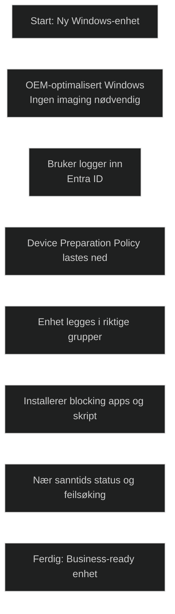

_Device Preparation (DDP)_ er den nye, moderniserte Autopilot‑opplevelsen i Windows 11. Den brukes til å _klargjøre og konfigurere nye enheter_ raskere og mer stabilt enn tidligere, og den erstatter store deler av Enrollment Status Page (ESP).

Microsoft beskriver DDP slik:

- Den _«set up and configure new devices, getting them ready for productive use»_
- Målet er å _«simplify device deployment by delivering consistent configurations, enhancing setup speed, and improving troubleshooting»_
- Den gir _«near real-time deployment status and monitoring»_

DDP bruker den OEM‑optimaliserte Windows‑installasjonen, slik at man _ikke trenger imaging eller vedlikehold av egne WIM‑filer_. I stedet transformeres enheten til en «business‑ready» tilstand ved å levere policyer, apper og skript direkte fra Intune.

## Viktige funksjoner

- _Raskere og mer stabil utrulling_ – ny arkitektur som forbedrer hastighet og suksessrate.
- _Enklere feilsøking_ – bedre innsikt og statusvisning i sanntid.
- _Blocking apps_ – enheten går ikke videre før kritiske apper og skript er installert.
- _Støtte for både fysiske enheter og Windows 365 Cloud PCs_.
- _Kun Entra join_ støttes i første versjon.

## Prosess (for fysiske enheter)

Basert på Microsoft Learn:

1. Enheten starter med OEM‑optimalisert Windows.
2. Brukeren logger inn med Entra ID.
3. DDP‑policy lastes ned og starter klargjøring.
4. Enheten legges i riktige sikkerhetsgrupper.
5. Tildelte apper og skript installeres.
6. Enheten blir klar til bruk når alle blocking‑elementer er fullført.

