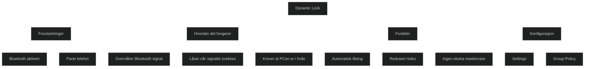

Dynamic Lock er en sikkerhetsfunksjon i Windows 10 og Windows 11 som _automatisk låser PCen når du går bort fra den_. Den bruker en _Bluetooth‑tilkoblet telefon_ for å vurdere om brukeren fortsatt er i nærheten. Når signalstyrken faller under et visst nivå, og PCen er i hvile, låses den automatisk. Dette reduserer risikoen for at noen får tilgang hvis du glemmer å låse manuelt.

Dynamic Lock er et _ekstra lag med sikkerhet_, ikke en erstatning for manuell låsing. Den låser ikke umiddelbart, og den låser ikke hvis PCen fortsatt er aktiv.

### Hvordan Dynamic Lock fungerer

- PCen må være paret med en telefon via Bluetooth
- Windows overvåker signalstyrken i bakgrunnen
- Når telefonen beveger seg ut av rekkevidde, antar Windows at brukeren har gått
- PCen låses automatisk etter en kort forsinkelse

### Hvorfor Dynamic Lock er nyttig

- Gir automatisk låsing i kontorlandskap og delte miljøer
- Hindrer uautorisert tilgang hvis du går fra PCen
- Krever ingen ekstra maskinvare

### Konfigurasjon

Dynamic Lock kan aktiveres via:

- _Windows Settings_ Accounts → Sign‑in options → Dynamic Lock
- _Group Policy_ Windows Hello for Business → Configure dynamic lock factors

### MD‑102 relevans

- forklare hva Dynamic Lock gjør og hvordan det fungerer
- kjenne til Bluetooth‑avhengigheten og begrensningene
- vite hvordan funksjonen aktiveres i Settings og via GPO
- forstå at dette er et tilleggslag i identitets og enhetssikkerhet

<a href="/certs/diagrams/dynamic-lock.html" target="_blank" rel="noopener">Stort diagram</a>