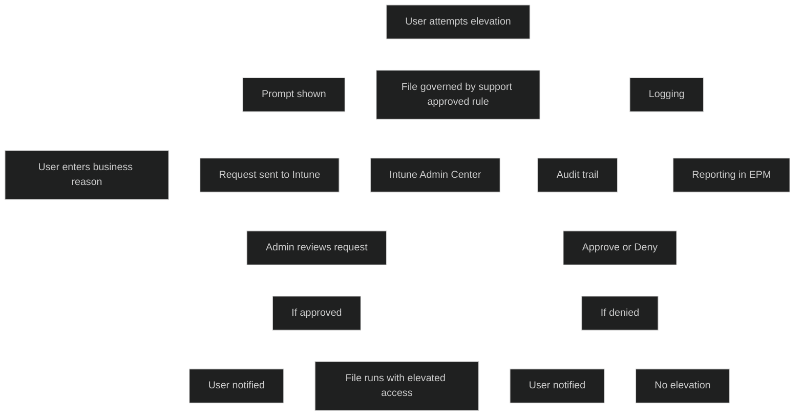

Elevation Requests er en del av _Endpoint Privilege Management (EPM)_ i Microsoft Intune. Funksjonen brukes når en bruker forsøker å kjøre en fil med høyere privilegier enn de har som standard. Hvis filen er konfigurert med _support approved elevation_, må brukeren sende en forespørsel som en Intune‑administrator må godkjenne før filen kan kjøres.

Ifølge Microsoft Learn:

- Når en bruker forsøker å kjøre en fil med _Run with elevated access_, og filen er styrt av en support approved‑regel, får brukeren en _prompt om å sende en elevation request_
- Elevation requests sendes til _Intune admin center_, der en administrator med riktige RBAC‑rettigheter kan _approve eller deny_ forespørselen
- Brukeren må oppgi en _business reason_, og forespørselen inkluderer _bruker, enhet og filnavn_
- Elevation requests kan sendes av _alle brukere på enheten_, ikke bare primærbrukeren

Dette er en del av Zero Trust‑modellen og støtter prinsippet om _least privilege_.

# Viktige egenskaper

- Brukeren får en prompt når en fil krever support approved elevation
- Brukeren sender en forespørsel med begrunnelse
- Intune admin vurderer og godkjenner eller avslår
- Filen kan kjøres med høyere privilegier etter godkjenning
- RBAC styrer hvem som kan godkjenne forespørsler
- Logging og sporbarhet i Intune admin center

# MD‑102

Elevation Requests viser hvordan Intune:

- implementerer _just‑in‑time elevation_
- reduserer behovet for lokale administratorer
- gir kontrollert og sporbar tilgang
- støtter Zero Trust og least privilege
- gir sikker drift uten å hindre produktivitet

<a href="/certs/diagrams/deploy-intune-suite-epm-elevation.html" target="_blank" rel="noopener">Stort diagram</a>

[Use EPM support approvals for file elevation requests with Intune - Microsoft Intune | Microsoft Learn](https://learn.microsoft.com/en-us/intune/epm/manage-support-approvals)