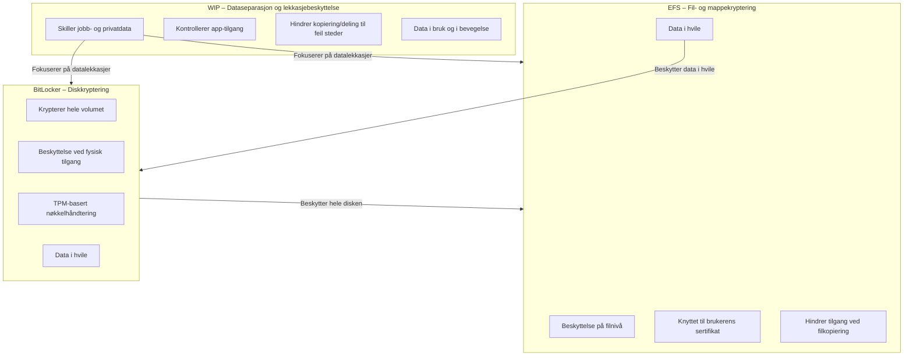

Encrypting File System er en innebygd Windows‑funksjon som beskytter data ved å kryptere filer og mapper på NTFS‑volumer. Krypteringen skjer transparent for brukeren og er knyttet til brukerens identitet, noe som gjør at kun autoriserte kontoer kan åpne innholdet. Dette gir et ekstra lag med beskyttelse dersom en angriper får fysisk tilgang til en maskin, kopierer disken eller forsøker å lese filer uten riktig legitimasjon.

EFS bruker en kombinasjon av symmetrisk og asymmetrisk kryptering: filene krypteres med en File Encryption Key (FEK), mens FEK igjen beskyttes av brukerens sertifikatbaserte nøkkelpar. Dette gjør løsningen både sikker og effektiv i praktisk bruk. Administrasjon kan gjøres lokalt eller via gruppepolicy, og sertifikater kan utstedes automatisk gjennom Active Directory Certificate Services.

I en MD‑102‑kontekst er hovedpoenget å forstå hvordan EFS inngår i helheten av databeskyttelse på Windows‑klienter. Løsningen beskytter data i hvile, men ikke nødvendigvis mot autoriserte brukere eller apper som allerede har tilgang. Derfor brukes EFS ofte sammen med andre teknologier som BitLocker og Windows Information Protection for å dekke ulike trusselmodeller. EFS er spesielt relevant i miljøer der individuelle filer må sikres uavhengig av hele diskvolumet.

