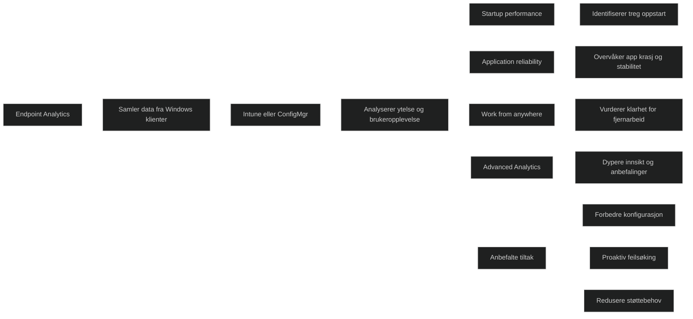

Endpoint Analytics er en del av Microsoft Intune og brukes til å analysere ytelse, stabilitet og brukeropplevelse på Windows klienter. Verktøyet gir innsikt i faktorer som påvirker produktivitet, som treg oppstart, ustabile apper og maskiner som ikke er klare for moderne arbeidsformer. Målet er å identifisere problemer før brukerne merker dem, og gi anbefalinger som forbedrer drift og reduserer støttebehov.

Det inneholder rapporter for oppstartstid, applikasjonspålitelighet, Work from anywhere og mer avanserte analyser for miljøer med Intune Suite. Endpoint Analytics kan brukes på Intune‑administrerte, co‑administrerte og Configuration Manager‑tilknyttede enheter.

<a href="/certs/diagrams/deploy-endpoint-analytics.html" target="_blank" rel="noopener">Stort diagram</a>

[Endpoint analytics overview - Microsoft Intune | Microsoft Learn](https://learn.microsoft.com/en-us/intune/endpoint-analytics/)
