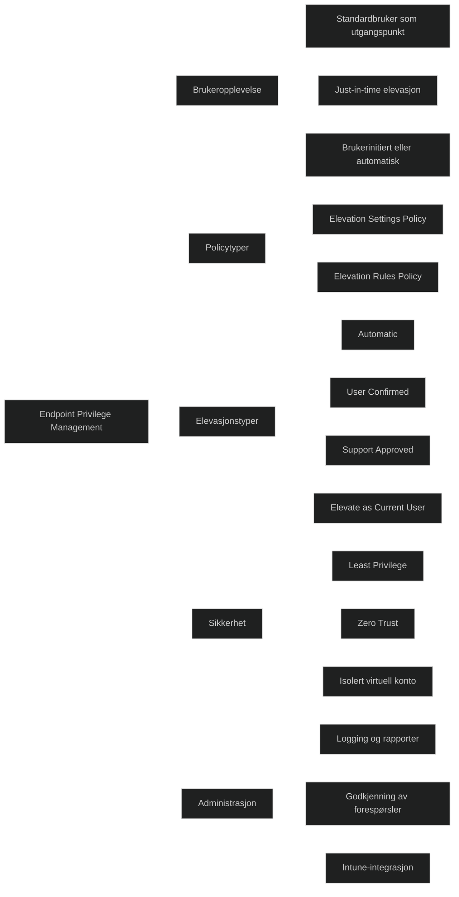

**Endpoint Privilege Management (EPM)** i Microsoft Intune lar brukere kjøre som **standardbrukere** uten lokale administratorrettigheter, men likevel utføre oppgaver som krever elevasjon – på en **kontrollert, sporbar og policy‑styrt måte**.

Ifølge Microsoft Learn:

- EPM gjør at brukere kan _«run as a standard user (without administrator rights) and complete tasks that require elevated privileges»_
- EPM støtter Zero Trust ved å _«enable least privilege access while still elevating selected tasks when necessary»_
- Elevasjon kan skje _automatisk_ eller _brukerinitiert_
- EPM styres av to policytyper: **Elevation settings policy** og **Elevation rules policy**
- Elevasjoner kjøres vanligvis i en **virtuell konto isolert fra brukerens konto**

Fagblogger bekrefter:

- EPM gir _«granular, auditable, just‑in‑time elevation»_ og fjerner behovet for permanente lokale administratorer
- EPM bruker fire elevation‑typer, inkludert _Automatic_, _User confirmed_ og _Support approved_

# Viktige funksjoner

### Least privilege som standard

Alle brukere kjører som standardbrukere uten lokale adminrettigheter.

### Just‑in‑time elevation

Brukere kan midlertidig kjøre godkjente apper med forhøyede rettigheter.

### Policybasert kontroll

- **Elevation settings policy** styrer EPM‑klienten, rapportering og standardoppførsel.
- **Elevation rules policy** definerer hvilke filer som kan elevateres og hvordan.

### Sporbarhet og logging

Alle elevasjoner logges med metadata (bruker, fil, tidspunkt).

### Zero Trust integrasjon

EPM reduserer angrepsflaten ved å minimere permanente privilegier.

# MD‑102

EPM er sentralt i moderne endpoint‑administrasjon fordi det:

- fjerner behovet for lokale administratorer
- gir kontrollert og sporbar elevasjon
- støtter Zero Trust og least privilege
- reduserer risiko for malware og feilkonfigurasjoner
- forbedrer produktivitet uten å svekke sikkerheten

[Learn about using Endpoint Privilege Management with Microsoft Intune - Microsoft Intune | Microsoft Learn](https://learn.microsoft.com/en-us/intune/epm/overview)
[Endpoint Privilege Management (EPM) in Intune: Complete Setup Guide 2026 | Nyxshima](https://www.nyxshima.com/endpoint-privilege-management-epm-in-intune-complete-setup-guide-2026/)
