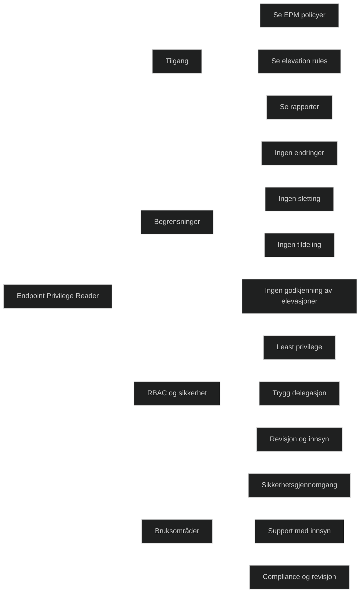

_Endpoint Privilege Reader_ er en innebygd RBAC‑rolle i Microsoft Intune som gir _lesetilgang til Endpoint Privilege Management (EPM)_. Rollen kan se alle EPM‑policyer og innstillinger, men _kan ikke opprette, endre eller tildele_ policyer.

Ifølge Microsoft Learn:

- «Endpoint Privilege Readers can view Endpoint Privilege Management policies in the Intune console.»

Dette gjør rollen ideell for:

- revisjon
- sikkerhetsgjennomgang
- supportpersonell som trenger innsyn i EPM‑policyer
- miljøer som følger prinsippet om least privilege

Rollen er en trygg måte å gi innsikt uten risiko for utilsiktede endringer.

# Hva rollen kan gjøre

Basert på Microsoft Learn:

- lese alle Endpoint Privilege Management‑policyer
- se elevasjonsregler og innstillinger
- se rapporter og status for EPM‑policyer
- se hvilke apper som har elevation rules

_(Disse punktene er direkte støttet av kilden som sier at rollen kan «view Endpoint Privilege Management policies».)_

# Hva rollen _ikke_ kan gjøre

- kan ikke opprette EPM‑policyer
- kan ikke endre eller slette policyer
- kan ikke tildele policyer
- kan ikke godkjenne eller avvise elevasjonsforespørsler
- kan ikke administrere andre deler av Intune

Dette følger prinsippet om _least privilege_.

# MD‑102

Endpoint Privilege Reader viser hvordan Intune:

- bruker RBAC for å skille mellom administrasjon og innsyn
- implementerer least privilege i sikkerhetsadministrasjon
- gir trygg delegasjon uten risiko
- støtter revisjon og sikkerhetskontroll

_Read‑Only Operator_: innsyn i hele Intune
_Endpoint Privilege Reader_: innsyn kun i Endpoint Privilege Management

| Rolle                                       | Hva den kan se                                                                 | Hva den ikke kan se | Typisk bruk                                     |
| ------------------------------------------- | ------------------------------------------------------------------------------ | ------------------- | ----------------------------------------------- |
| [Read-Only-Operator](Read-Only-Operator.md) | Alt i Intune: enheter, apper, policyer, konfigurasjoner, compliance, rapporter | Kan ikke endre noe  | Revisjon, ledelse, support som trenger oversikt |
| _Endpoint Privilege Reader_                 | Kun Endpoint Privilege Management: elevation rules, EPM‑policyer, rapporter    | Alt annet i Intune  | Sikkerhetsteam som kun skal inspisere EPM       |

[How to Assign a User an RBAC Role in Intune](https://help.devicie.com/kb/how-to-assign-a-user-an-rbac-role-in-intune)
