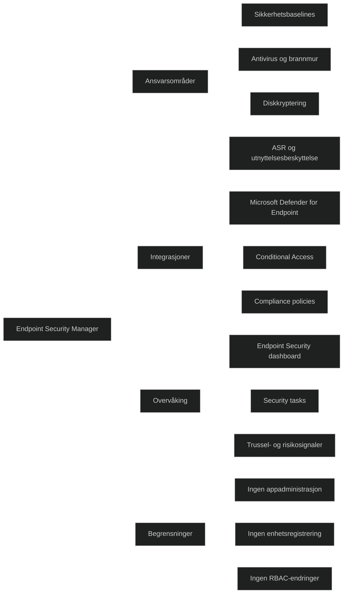

_Endpoint Security Manager_ er en innebygd RBAC‑rolle i Microsoft Intune som gir tilgang til å _administrere sikkerhets- og samsvarsfunksjoner_, inkludert:

- sikkerhetsbaselines
- antivirus og brannmur
- disk‑kryptering
- compliance policies
- Conditional Access integrasjon
- Microsoft Defender for Endpoint integrasjon

Ifølge Microsoft Learn kan rollen:

- «manage security and compliance features, such as security baselines, device compliance, conditional access, and Microsoft Defender for Endpoint»

Dette gjør rollen til en _sikkerhetsadministratorrolle_ med fokus på å beskytte enheter og data, uten full tilgang til hele Intune‑miljøet.

# Hva rollen kan gjøre

Basert på Microsoft Learn og Intune‑dokumentasjon:

- konfigurere og distribuere _security baselines_
- administrere _antivirus_, _brannmur_, _ASR‑regler_ og _disk‑kryptering_
- sette opp og overvåke _compliance policies_
- integrere og bruke signaler fra _Microsoft Defender for Endpoint_
- håndtere _security tasks_ og remediering
- overvåke sikkerhetsstatus via _Endpoint Security dashboard_

# Hva rollen _ikke_ kan gjøre

- kan ikke administrere apper
- kan ikke endre konfigurasjonsprofiler utenfor sikkerhetsområdet
- kan ikke administrere enhetsregistrering
- kan ikke endre RBAC‑roller
- har ikke full Intune‑administratorrettighet

Dette følger prinsippet om _least privilege_.

# MD‑102

Endpoint Security Manager er sentral i MD‑102 fordi rollen:

- viser hvordan Intune implementerer _Zero Trust_ i praksis
- skiller sikkerhetsadministrasjon fra generell enhetsadministrasjon
- gir et klart skille mellom drift og sikkerhet
- brukes i alle scenarioer som involverer Defender, compliance og baselines

[How to Assign a User an RBAC Role in Intune](https://help.devicie.com/kb/how-to-assign-a-user-an-rbac-role-in-intune)
[Endpoint security in Microsoft Intune - Microsoft Intune | Microsoft Learn](https://learn.microsoft.com/en-us/intune/device-security/endpoint-security-policies)