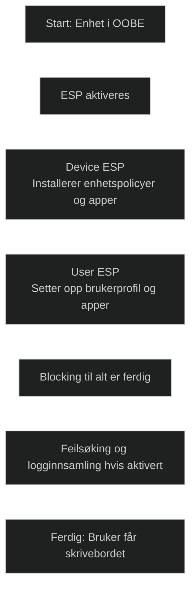

Enrollment Status Page (ESP) brukes under Windows‑enhetsoppsett for å **vise fremdrift og sikre at enheten er korrekt konfigurert før brukeren får tilgang til skrivebordet**. ESP sørger for at nødvendige apper, policyer, sertifikater og nettverkskonfigurasjoner er installert før enheten tas i bruk.

Microsoft Learn beskriver ESP slik:

- ESP _«displays the device's configuration progress»_ og _«makes sure the device is in the expected state before the user can access the desktop»_
- ESP kan _«block device use until all required policies and applications are installed»_
- ESP brukes både i Autopilot og i vanlig Entra join OOBE

ESP består av to faser:

- **Device ESP** – installerer enhetspolicyer og enhetsapper
- **User ESP** – setter opp brukerprofilen og installerer brukerpolicyer og brukerapper

## Viktige funksjoner

- Viser installasjonsfremdrift for apper og policyer
- Kan blokkere tilgang til skrivebordet til alt er ferdig
- Støtter feilsøking, inkludert mulighet for brukeren å hente ESP‑logger hvis aktivert
- Kan konfigureres med tidsgrenser, feilmeldinger og hvilke handlinger brukeren kan gjøre ved feil
- Kan brukes i alle Autopilot‑scenarier og i standard Entra join OOBE

## Hvorfor ESP er viktig i utrulling

- Sikrer at enheten er i riktig tilstand før brukeren starter
- Hindrer feil som oppstår når brukeren logger inn før apper og policyer er klare
- Gir forutsigbarhet og standardisering i utrullingsprosessen
- Kritisk for Autopilot‑scenarier som krever blocking apps

