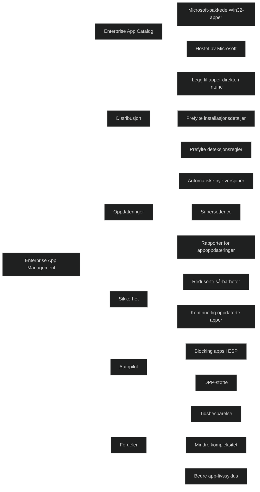

_Enterprise App Management_ er en Intune Suite‑funksjon som gjør det mulig å _finne, distribuere og holde apper oppdatert_ direkte fra _Enterprise App Catalog_. Appene i katalogen er _Win32‑applikasjoner som Microsoft selv har pakket, testet og hostet_, slik at IT slipper å lage installasjonspakker, deteksjonsregler og oppdateringsrutiner manuelt.

Ifølge Microsoft Learn:

- EAM gjør det mulig å _«easily discover and deploy applications and keep them up to date from the Enterprise App Catalog»_
- Appene er _«prepared as Win32 apps and hosted by Microsoft»_
- Når du legger til en app, fyller Intune automatisk inn _install/uninstall‑kommandoer, restart‑atferd, deteksjonsregler og krav_

Fagblogger bekrefter dette:

- Katalogen inneholder _«apps that are prepared by Microsoft… wrapped and hosted by Microsoft»_
- EAM _«drastically cuts down on the time it takes»_ å pakke og vedlikeholde apper manuelt

# Viktige funksjoner

### Strømlinjeformet appdistribusjon

- IT kan søke etter og legge til apper direkte fra Intune
- Ingen manuell pakking, testing eller deteksjonslogikk
- Intune fyller inn installasjonsdetaljer automatisk

### Automatiske oppdateringer

- Nye versjoner publiseres i katalogen
- Intune kan opprette nye appversjoner automatisk
- Oppdateringer kan styres via supersedence

### Forbedret sikkerhet og compliance

- Apper holdes oppdatert, noe som reduserer sårbarheter

### Windows Autopilot‑integrasjon

- Enterprise App Catalog‑apper kan brukes som blocking apps i ESP og DPP

### Forenklet livssyklusstyring

- Intune rapporterer installasjonsstatus, feil og app‑helse

# MD‑102

Enterprise App Management viser hvordan Intune:

- automatiserer appdistribusjon og oppdateringer
- reduserer feil og manuell pakking
- styrker sikkerhet gjennom kontinuerlige oppdateringer
- integreres med Autopilot og moderne administrasjon

[Microsoft Intune Enterprise Application Management - Microsoft Intune | Microsoft Learn](https://learn.microsoft.com/en-us/intune/app-management/deployment/enterprise-app-management)
[All about Microsoft Intune | Getting started with Enterprise App Management](https://petervanderwoude.nl/post/getting-started-with-enterprise-app-management)
