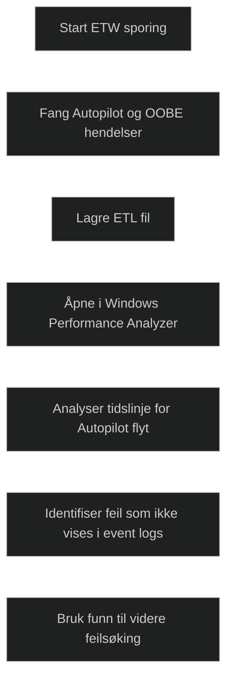

Event Tracing for Windows er en mekanisme i Windows som samler detaljerte sporingsdata fra systemkomponenter. I Autopilot brukes ETW for å hente dyptgående informasjon om hva som skjer under OOBE og i Autopilot prosessen. Dette gjør det mulig å se nøyaktig hvilke steg som ble utført, hvilke som feilet og hvilke komponenter som var involvert.

Når Autopilot ikke oppfører seg som forventet, kan ETW brukes til å fange opp hendelser som ikke vises i vanlige event logs. Resultatet lagres som en ETL fil som kan analyseres i Windows Performance Analyzer. Dette gir en tidslinjevisning av Autopilot flyten, inkludert TPM attestation, profilnedlasting, nettverkskall og policybehandling.

For MD 102 er det viktig å vite at ETW:

- gir den mest detaljerte feilsøkingen for Autopilot
- brukes når vanlige event logs ikke gir nok informasjon
- viser hele Autopilot flyten i tidsrekkefølge
- krever Windows Performance Analyzer for å lese filene
- er spesielt nyttig ved TPM problemer og profilnedlasting

Dette gjør ETW til et avansert, men svært nyttig verktøy når feilen ikke er åpenbar.

