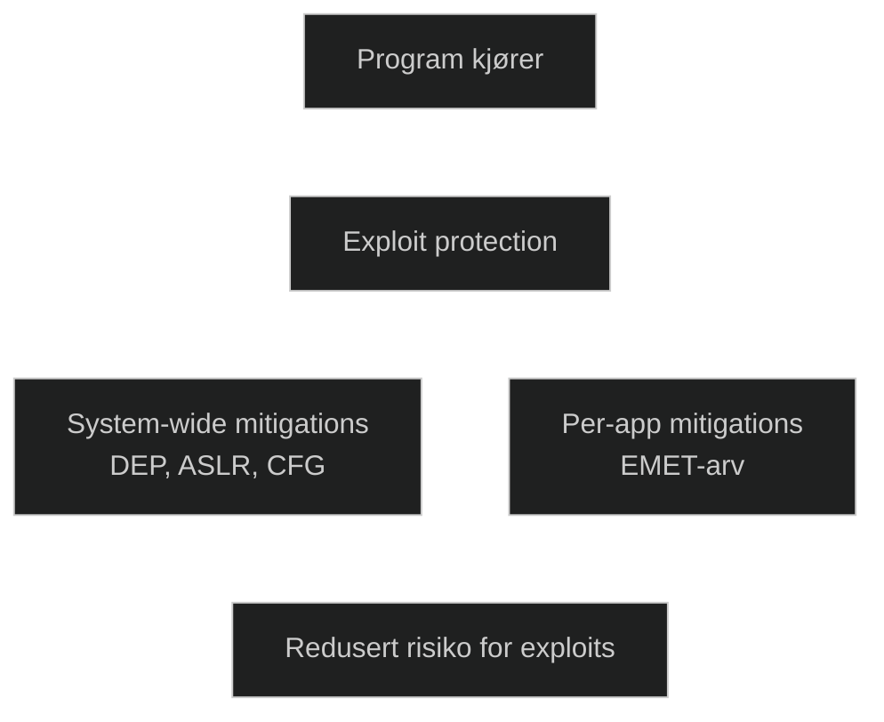

**Exploit protection** er et sett med minne‑ og prosess‑baserte sikkerhetsmitigasjoner som hindrer typiske angrepsteknikker som buffer overflow, ROP‑angrep, heap‑spraying og andre exploit‑metoder. Det bygger på EMET‑teknologi og kan konfigureres både globalt og per‑applikasjon for å redusere risikoen for at sårbarheter i programvare utnyttes.

