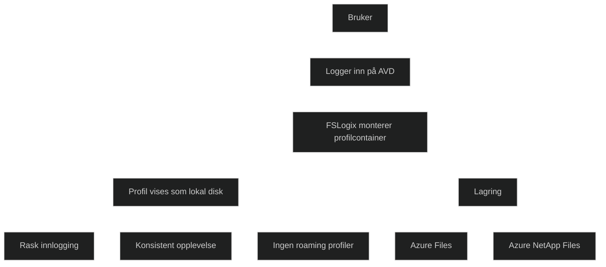

FSLogix er en profilteknologi som brukes i Azure Virtual Desktop for å gi brukere en rask og konsistent opplevelse hver gang de logger på. I stedet for at brukerprofilen lagres lokalt på hver virtuell maskin, lagres den som en containerfil på et delt lagringsområde. Når brukeren logger inn, monteres containeren som et lokalt diskvolum, og Windows oppfører seg som om profilen ligger lokalt.

Dette gir raskere innlogging, færre profilfeil og en mer stabil opplevelse i pooled host pools der brukere kan havne på ulike maskiner fra gang til gang. FSLogix støtter både full profilcontainer og Office container, som optimaliserer ytelsen for Outlook, OneDrive og Teams.

FSLogix krever et delt lagringsområde som Azure Files eller Azure NetApp Files, og brukes automatisk av AVD når det er konfigurert. Teknologien er en av hovedgrunnene til at AVD gir en bedre brukeropplevelse enn tradisjonelle roaming profiler.

