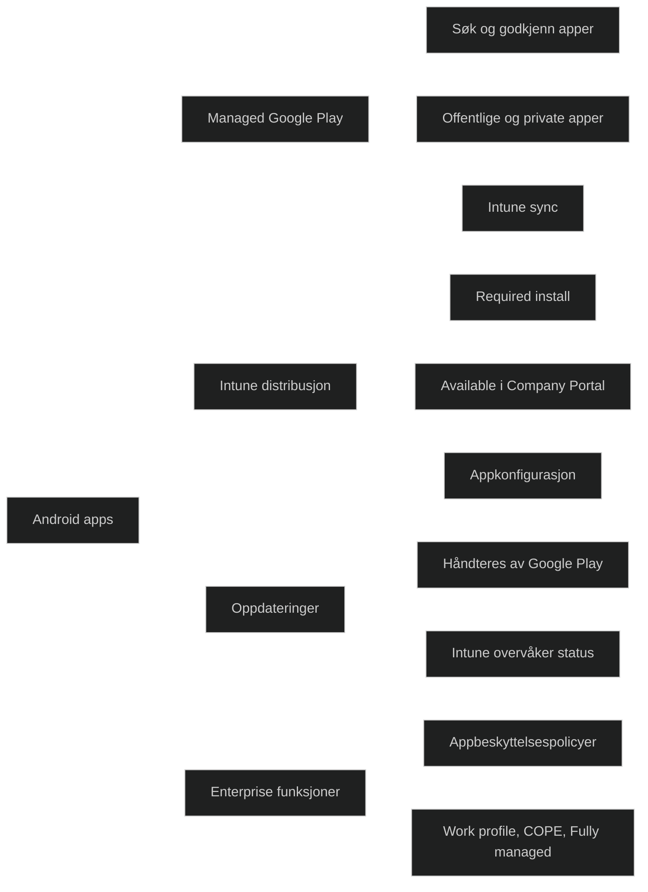

Android‑apper distribueres i Intune gjennom _Managed Google Play_, som er den moderne og anbefalte metoden for alle Android Enterprise‑enheter. Dette gjelder både:

- Fully managed 
- Corporate owned personally enabled (COPE)
- Work profile (BYOD)

Intune integrerer med Managed Google Play for å:

- søke etter apper
- godkjenne apper
- distribuere apper til brukere eller enheter
- håndtere oppdateringer
- overvåke installasjonsstatus

Dette er viktig i MD‑102 fordi Android Enterprise krever riktig integrasjon mellom Intune og Google Play for at appdistribusjon skal fungere.

### Viktige egenskaper 

- _Managed Google Play er obligatorisk_ Alle Android Enterprise‑enheter bruker dette som appkilde.
- _Godkjenning av apper_ Administrator må godkjenne apper før de kan distribueres.
- _Støtte for både offentlige og private apper_ Private apper lastes opp som Android App Bundle eller APK.
- _Støtte for Required og Available_ Required installerer automatisk, Available gjør appen tilgjengelig i Company Portal.
- _Automatiske oppdateringer_ Google Play håndterer oppdateringer, Intune overvåker status.
- _Støtte for appkonfigurasjon og appbeskyttelsespolicyer_ Viktig for sikkerhet og enterprise‑bruk.
    

### Begrensninger

- Krever Google Play‑konto for organisasjonen
- Krever Android Enterprise‑registrering
- APK‑filer kan ikke distribueres direkte uten Managed Google Play Private Apps
- Oppdateringer kan ikke styres like detaljert som på Windows

<a href="/certs/diagrams/deploy-intune-app-play.html" target="_blank" rel="noopener">Stort diagram</a>