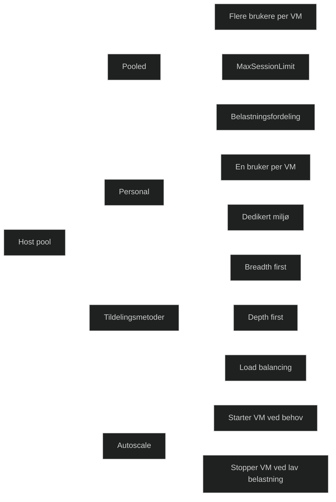

En host pool er en samling virtuelle maskiner som leverer skrivebord eller apper til brukere i Azure Virtual Desktop. Host poolen bestemmer hvordan brukere kobles til, hvordan belastning fordeles og om hver bruker får sin egen maskin eller deler kapasitet med andre.

Det finnes to hovedtyper host pools:

- **Pooled**: Flere brukere deler samme virtuelle maskin. Dette gir høy tetthet og lavere kostnader. Brukere tildeles en tilgjengelig sesjon basert på belastningsfordeling og MaxSessionLimit.
- **Personal**: Hver bruker får sin egen dedikerte virtuelle maskin. Dette gir en mer forutsigbar og personlig opplevelse, men krever mer kapasitet.
    

Host pools bruker en tildelingsmetode som styrer hvordan brukere kobles til maskiner, for eksempel breadth first eller depth first. Autoscale kan brukes for å starte og stoppe maskiner basert på belastning eller tidsplan.

Host pools er kjernen i AVD og avgjør både kostnader, ytelse og brukeropplevelse.

