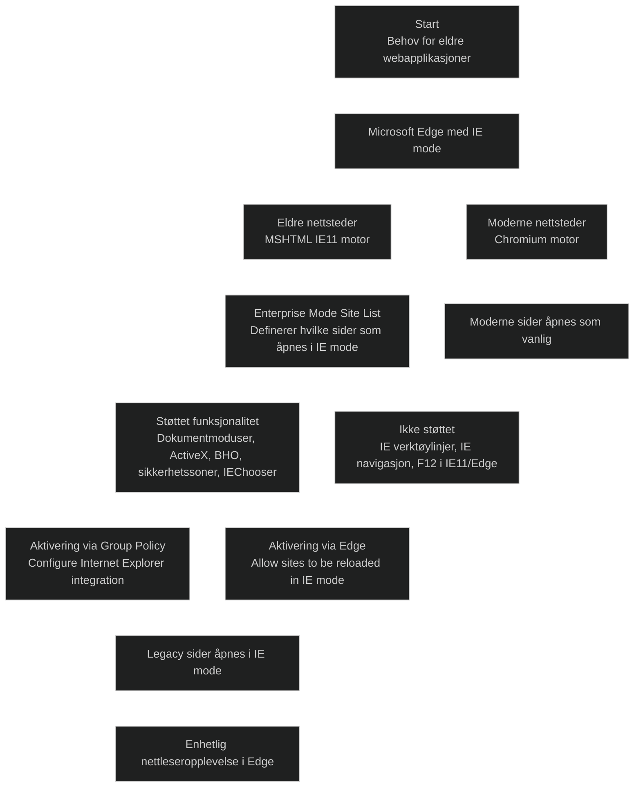

_Internet Explorer mode (IE mode)_ i Microsoft Edge gjør det mulig å kjøre eldre webapplikasjoner som krever Internet Explorer 11, samtidig som man bruker en moderne nettleser. Dette er viktig i virksomheter som fortsatt har intranettløsninger, ActiveX‑baserte apper eller portaler som ikke fungerer i moderne nettlesere.

IE mode bruker:

- _Chromium‑motoren_ for moderne nettsteder
- _MSHTML/Trident‑motoren_ fra Internet Explorer 11 for eldre nettsteder

Bare nettsteder som er definert i en _Enterprise Mode Site List_ åpnes i IE mode. Alle andre nettsteder rendres som moderne sider.

IE mode støtter blant annet:

- dokumentmoduser og enterprise moduser
- ActiveX
- Browser Helper Objects
- IE‑relaterte sikkerhetssoner
- F12‑verktøy for IE via IEChooser

IE mode støtter _ikke_:

- IE‑verktøylinjer
- IE‑navigasjonsinnstillinger
- F12‑verktøy for IE11 eller Edge

IE mode aktiveres via:

- Enterprise Mode Site List
- Group Policy
- Edge‑innstillinger (Allow sites to be reloaded in IE mode)

Dette gjør IE mode til en overgangsløsning for organisasjoner som må støtte eldre apper samtidig som de moderniserer nettleserplattformen.

