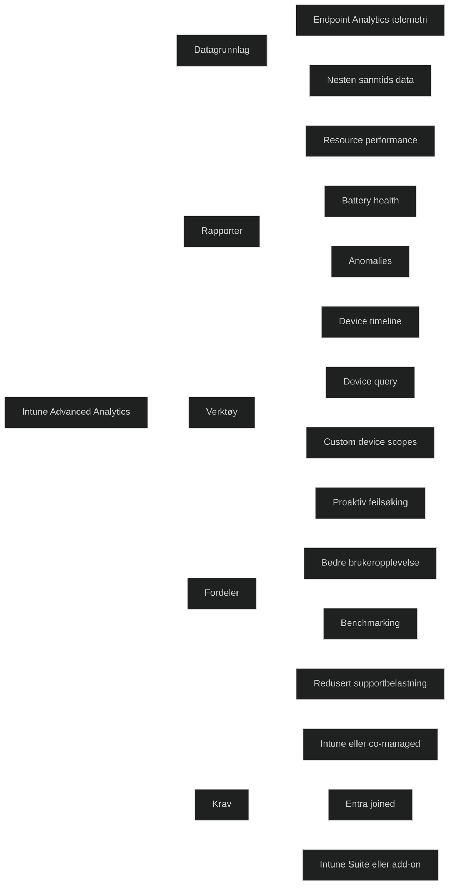

Intune Advanced Analytics er et tillegg i Intune Suite som gir **dypere innsikt i enheters ytelse, stabilitet og brukeropplevelse** enn det som finnes i standard Endpoint Analytics. Løsningen bygger på **telemetri fra Windows‑enheter** og gir IT mulighet til å jobbe mer proaktivt, redusere supportkostnader og forbedre brukeropplevelsen.

Advanced Analytics utvider Endpoint Analytics med:

- **Resource performance report** – viser CPU og RAM‑problemer per modell og produsent
- **Battery health report** – overvåker batterikvalitet og degradering over tid
- **Anomalies report** – oppdager regresjoner etter endringer i miljøet
- **Device timeline** – lav latens og flere hendelser for raskere feilsøking
- **Device query** – nesten sanntids spørringer mot enheter for konfigurasjon og status
- **Custom device scopes** – filtrering av rapporter basert på scope tags

Dette gjør det mulig å:

- identifisere ytelsesproblemer før brukerne merker dem
- oppdage trender og avvik etter policyendringer
- benchmarke organisasjonen mot andre miljøer
- prioritere utskifting av maskinvare basert på faktiske data

### Krav

- Windows‑enheter må være Intune‑administrert eller co‑managed
- Enhetene må være Entra‑joined eller hybrid joined
- Funksjonen krever Intune Suite eller egen Advanced Analytics‑lisens

### MD‑102

Advanced Analytics viser hvordan Intune:

- bruker data for å forbedre drift og brukeropplevelse
- støtter proaktiv feilsøking
- gir innsikt som styrker Zero Trust og samsvar
- reduserer behovet for manuell feilsøking

[Advanced Analytics Overview - Microsoft Intune | Microsoft Learn](https://learn.microsoft.com/en-us/intune/advanced-analytics/"Advanced Analytics Overview - Microsoft Intune | Microsoft Learn")
[Advanced Analytics | Intune Suite | Intune | michaelsendpoint.com](https://michaelsendpoint.com/intune/intune_suite/advanced_analytics.html)