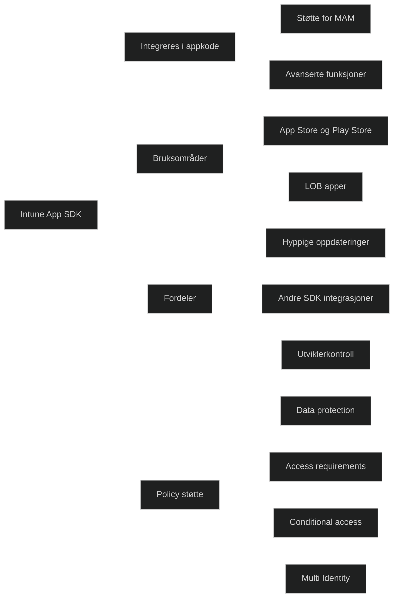

Intune App SDK er utviklet for apper som publiseres i Apple App Store eller Google Play, men kan også brukes for interne line of business apper. SDK integreres i appens kildekode og gir innebygget støtte for appbeskyttelsespolicyer. Dette gjør det mulig å bruke Intune til å beskytte data i apper som distribueres bredt, samtidig som utviklere får fleksibilitet til å bygge avansert funksjonalitet.

SDK passer for utviklere som har tilgang til kildekoden og som ønsker å støtte funksjoner som krever logikk i appen. Det er også egnet for apper som oppdateres ofte eller som allerede bruker andre SDK integrasjoner.

### Reasons to use the SDK

- Your app does not have built in data protection features
- Your app is deployed on a public app store such as Google Play or Apple App Store
- You are an app developer and have the technical background to use the SDK
- Your app has other SDK integrations
- Your app is frequently updated

SDK støtter også avanserte funksjoner som Targeted Application Configuration, Multi Identity, Conditional Access, minimum appversjon, minimum OS versjon og sikkerhetskrav som Android Play Integrity og Mobile Threat Defense.

