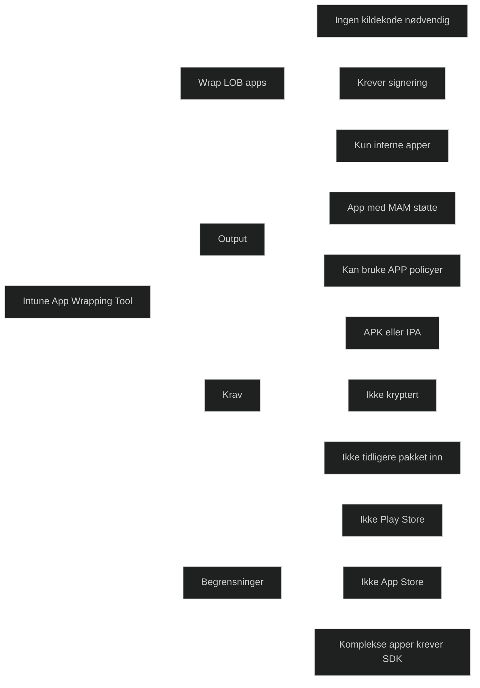

Intune App Wrapping Tool brukes til å gjøre interne Android og iOS line of business apper klare for appbeskyttelsespolicyer uten at kildekoden må endres. Verktøyet legger et administrasjonslag rundt appen slik at Intune kan håndheve MAM policyer som databeskyttelse, tilgangskrav og begrensninger på deling. Dette er relevant for MD 102 fordi mange virksomheter har egne apper som ikke ligger i offentlige appbutikker og derfor må klargjøres manuelt.

Verktøyet er et Windows kommandolinjeprogram som pakker inn en eksisterende appfil (APK eller IPA). Det støtter kun interne apper og kan ikke brukes på apper hentet fra Google Play eller Apple App Store. Appen må være signert, ikke kryptert, og ikke tidligere pakket inn. For komplekse apper kreves ofte Intune App SDK i tillegg.

[Wrap Android Apps With the Intune App Wrapping Tool - Microsoft Intune | Microsoft Learn](https://learn.microsoft.com/en-us/intune/developer/app-sdk/configure-wrapping-android)
[Prepare Apps for Mobile Application Management With Microsoft Intune - Microsoft Intune | Microsoft Learn](https://learn.microsoft.com/en-us/intune/developer/app-sdk/integration-methods)
