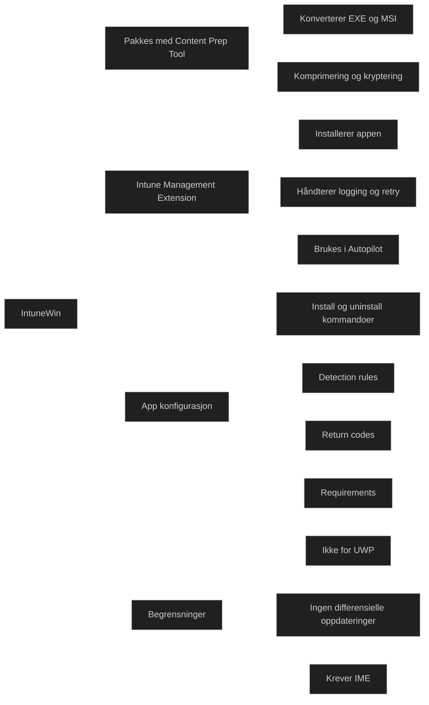

_IntuneWin_ er Microsofts pakkefilformat for distribusjon av Win32‑applikasjoner via Intune. Formatet brukes sammen med _Intune Management Extension (IME)_ og gjør det mulig å distribuere tradisjonelle Windows‑programmer som EXE, MSI, PowerShell‑baserte installasjoner og komplekse installasjonsskript.

IntuneWin er nødvendig fordi Intune ikke kan distribuere rå EXE‑filer direkte. I stedet pakkes installasjonsfilene inn i en IntuneWin‑container, som gir:

- komprimering
- kryptering
- støtte for avanserte installasjonsparametere
- kontrollert distribusjon via IME

Dette er svært viktig i MD‑102, siden Win32‑apper er en av de mest brukte app‑typene i moderne Windows‑miljøer.

### Viktige egenskaper

- _Pakkes med Microsoft Win32 Content Prep Tool_ Verktøyet konverterer installasjonsfiler til .intunewin‑format.
- _Distribueres via Intune Management Extension_ IME håndterer installasjon, logging, retry og statusrapportering.
- _Støtter EXE, MSI, PowerShell og komplekse installasjoner_ Dette gjør formatet fleksibelt for enterprise‑bruk.
- _Krever detection rules_ Intune må vite hvordan den skal avgjøre om appen er installert.
- _Støtter return codes_ Administrator kan definere hva som regnes som suksess, feil eller restart.
- _Støtter krav (requirements)_ For eksempel OS‑versjon, arkitektur, minne eller diskplass.
- _Kan brukes under Autopilot_ Men Microsoft anbefaler å bruke IME eksklusivt når både Win32 og LOB distribueres.

### Begrensninger

- Kan ikke brukes til UWP eller Microsoft Store‑apper
- Krever IME, som ikke finnes på eldre Windows‑versjoner
- Krever at administrator definerer detection rules manuelt
- Støtter ikke differensielle oppdateringer (hele pakken må lastes ned på nytt)

<a href="/certs/diagrams/deploy-app-intunewin.html" target="_blank" rel="noopener">Stort diagram</a>

