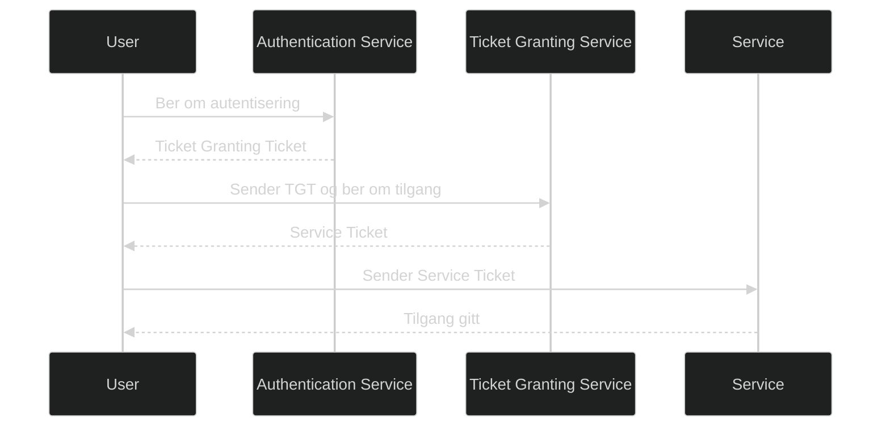

Kerberos er et autentiseringsprotokoll som brukes i Windows domener for å bekrefte identiteten til brukere og tjenester på en sikker måte. Protokollen bygger på et system med billetter i stedet for å sende passord over nettverket. Dette gir sterk beskyttelse mot avlytting, gjenbruk av meldinger og andre angrep som kan oppstå i usikre nettverk.

Kerberos er standard autentiseringsmetode i Active Directory og brukes automatisk når klient og tjeneste er i samme domene eller skog.

# Hvordan Kerberos fungerer

Kerberos bruker en tredjepart som kalles Key Distribution Center, som består av to deler:

- Authentication Service
- Ticket Granting Service

Når en bruker logger inn, får vedkommende en Ticket Granting Ticket. Denne brukes senere for å hente tjenestebilletter til ressursene brukeren trenger. På denne måten slipper brukeren å skrive inn passord flere ganger, og passordet sendes aldri over nettverket etter første autentisering.

# Nøkkelkomponenter

- **KDC**: Ligger på domenekontrolleren og håndterer alle billetter
- **TGT**: Brukes for å hente tjenestebilletter
- **Service Ticket**: Gir tilgang til en bestemt tjeneste
- **SPN og UPN**: Identifikatorer for tjenester og brukere
- **Symmetrisk kryptografi**: Beskytter alle meldinger og billetter

# Fordeler med Kerberos

- Støtter single sign on
- Sender ikke passord over nettverket
- Gir gjensidig autentisering mellom klient og tjeneste
- Integrert i Active Directory og Winlogon
- Støtter delegasjon for tjenester som må opptre på vegne av brukeren

# MD 102 relevans

- forklare hvordan Kerberos fungerer i et Windows domene
- forstå rollen til KDC, TGT og tjenestebilletter
- kjenne til hvorfor Kerberos er sikrere enn NTLM
- se hvordan Kerberos brukes i single sign on og delegasjon
- forstå hvordan Kerberos henger sammen med Credential Guard og andre sikkerhetsfunksjoner

