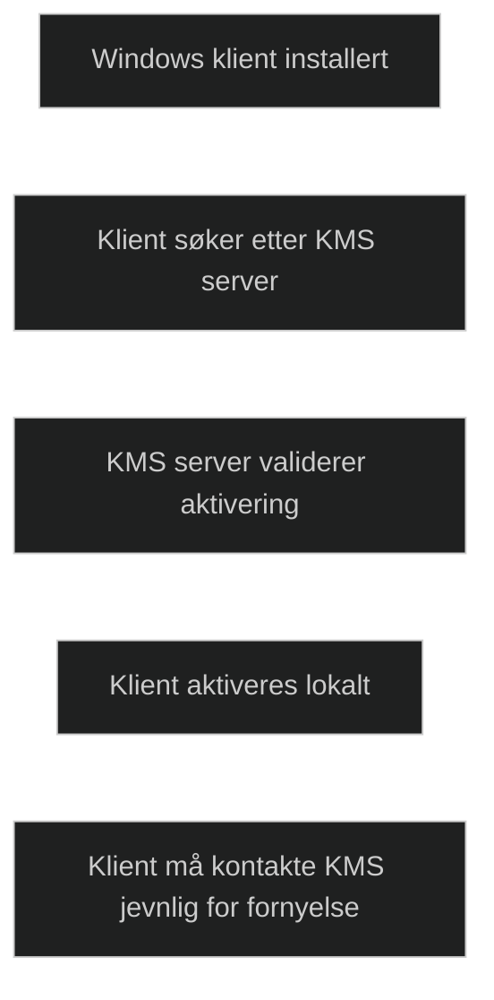
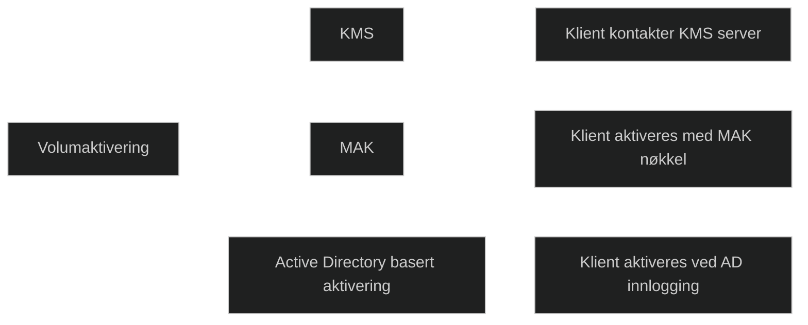

KMS, Key Management Service, er en metode for volumaktivering av Windows og Office i større organisasjoner. I stedet for at hver klient aktiveres direkte mot Microsoft, aktiveres de mot en intern KMS server. Klientene må kontakte KMS jevnlig for å beholde aktiveringen, noe som gjør løsningen egnet for miljøer der klientene er tilkoblet organisasjonens nettverk.

KMS krever at et minimum antall klienter er til stede før aktivering fungerer, kjent som activation threshold. Når dette kravet er oppfylt, kan alle kvalifiserte klienter aktiveres automatisk. KMS brukes ofte i tradisjonelle on premises miljøer og er en av de tre hovedmetodene for volumaktivering sammen med MAK og Active Directory basert aktivering.

KMS er relevant i MD 102 fordi det representerer en klassisk aktiveringsmodell som fortsatt brukes i mange organisasjoner, men som i økende grad suppleres eller erstattes av moderne metoder som Subscription Activation.

