Known Folder Move flytter eller omdirigerer brukerens standardmapper som Desktop, Documents og Pictures til OneDrive. Dette gjør at brukerne kan fortsette å lagre filer i de samme mappene som før, mens innholdet automatisk synkroniseres til skyen. Dette gir beskyttelse mot datatap, gjør filer tilgjengelige på tvers av enheter og forenkler migrering ved utrulling av nye maskiner.

KFM kan styres med Group Policy, Intune eller OneDrive‑innstillinger, og brukes ofte i større organisasjoner for å sikre at brukerdata ikke ligger lokalt. Ved store datamengder anbefales gradvis utrulling for å unngå høy nettverksbelastning.

```mermaid
%%{init: {
  "theme": "dark",
  "themeVariables": {
    "primaryColor": "#1e1e1e",
    "primaryTextColor": "#ffffff",
    "lineColor": "#ffffff",
    "secondaryColor": "#333333"
  }
}}%%

flowchart LR

    A[Start: Bruker har lokale kjente mapper] --> B[OneDrive KFM aktivert]
    B --> C[Mapper omdirigeres til OneDrive]
    C --> D[Desktop, Documents, Pictures flyttes]
    D --> E[Filer synkroniseres automatisk til skyen]
    E --> F[Bruker fortsetter å bruke samme mapper]
    F --> G[Data tilgjengelig på alle enheter]
    G --> H[Beskyttelse mot datatap]

```

[Redirect and move Windows known folders to OneDrive - SharePoint in Microsoft 365 | Microsoft Learn](https://learn.microsoft.com/en-us/sharepoint/redirect-known-folders)