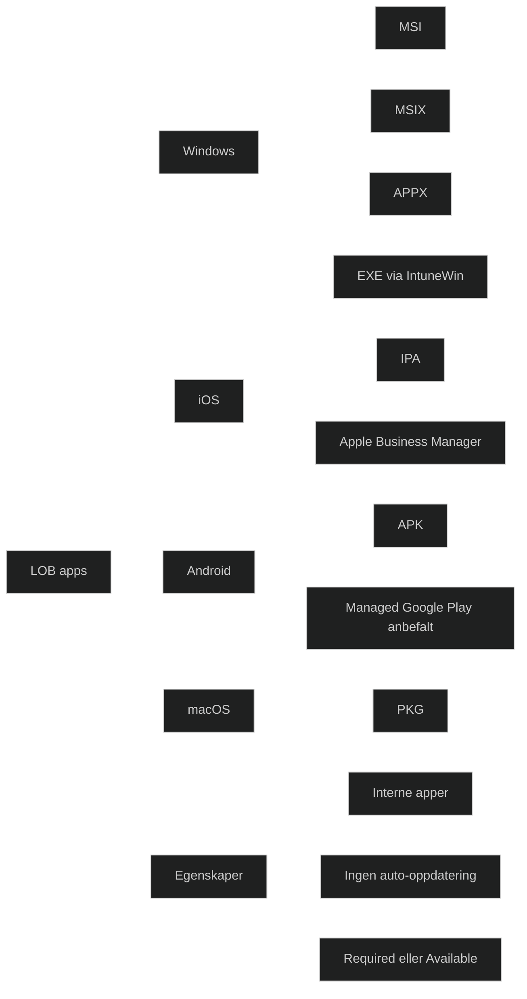

_LOB‑apper_ er interne apper som organisasjonen selv utvikler eller distribuerer utenfor offentlige appbutikker. De brukes når apper ikke finnes i Microsoft Store, Google Play eller Apple App Store, eller når apper inneholder intern funksjonalitet som ikke skal publiseres eksternt.

I Intune er LOB‑apper en egen appkategori som gjør det mulig å distribuere:

- interne Windows‑apper (MSI, MSIX, APPX)
- interne iOS‑apper (IPA via Apple Business Manager)
- interne Android‑apper (APK)
- interne macOS‑apper (PKG)

For MD‑102 er det viktig å forstå at LOB‑apper er _ikke‑offentlige apper_, og at distribusjonsmetoden varierer etter plattform.

### Viktige egenskaper

- _Brukes for interne apper_ Apper som ikke skal publiseres i offentlige butikker.
- _Windows LOB‑apper_ Støtter MSI, MSIX, APPX og APPXBUNDLE. EXE støttes ikke direkte og må pakkes som IntuneWin.
- _iOS LOB‑apper_ Krever Apple Business Manager og signert IPA.
- _Android LOB‑apper_ Distribueres som APK, men Android Enterprise anbefaler Managed Google Play.
- _macOS LOB‑apper_ Distribueres som PKG.
- _Kan tilordnes Required, Available eller Uninstall_ Samme logikk som andre Intune‑apper.
- _Ingen automatisk oppdatering_ Nye versjoner må lastes opp manuelt.

### Begrensninger

- EXE‑filer kan ikke distribueres som LOB (må pakkes som IntuneWin)
- Ingen differensielle oppdateringer
- Krever signering på iOS og MSIX
- Kan ikke brukes for offentlige apper

