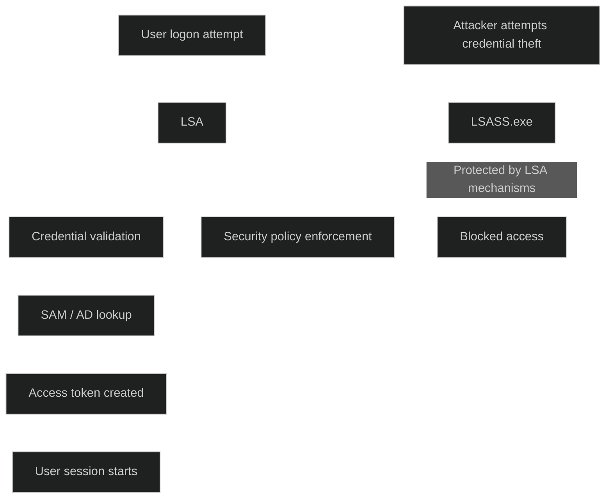

Local Security Authority er en sentral del av Windows sikkerhetsarkitektur og har ansvar for _autentisering, autorisasjon og håndheving av sikkerhetspolicyer_. LSA fungerer som systemets portvakt og kontrollerer alle interaktive pålogginger, validerer brukerlegitimasjon og oppretter tilgangstoken som bestemmer hvilke ressurser en bruker kan få tilgang til.

LSA består av flere komponenter, der _LSASS.exe_ er prosessen som utfører LSA funksjonene. LSASS kjører med høye privilegier og håndterer sensitive operasjoner som passordvalidering, token generering og kommunikasjon med Security Accounts Manager (SAM) for lokale kontoer.

I moderne Windows versjoner er LSA utvidet med støtte for avanserte autentiseringsprotokoller som Kerberos og integrasjon med Active Directory. LSA beskytter også legitimasjon ved å laste kun signert og klarert kode, noe som reduserer risikoen for credential theft.

LSA Protection kan aktiveres for å kjøre LSASS som en beskyttet prosess, slik at kun klarerte komponenter får tilgang. Dette gjør det betydelig vanskeligere for angripere å hente ut passordhash eller Kerberos billetter fra minnet.

[Local Security Authority (LSA) - NETWORK ENCYCLOPEDIA](https://networkencyclopedia.com/local-security-authority-lsa)
[What is Local Security Authority (LSA)? Technical Deep Dive - JumpCloud](https://jumpcloud.com/it-index/what-is-the-local-security-authority-lsa)
[Windows 11 security book - Advanced credential protection | Microsoft Learn](https://learn.microsoft.com/en-us/windows/security/book/identity-protection-advanced-credential-protection)
[Why You Should Enable LSA Protection](https://www.lepide.com/blog/why-you-should-enable-lsa-protection)
