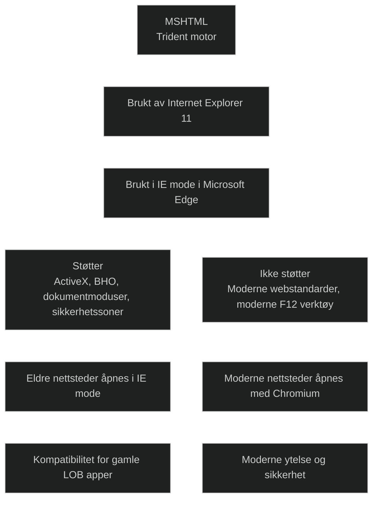

**MSHTML**, også kjent som **Trident**, er den gamle renderingsmotoren som ble brukt av Internet Explorer 11. Den er fortsatt inkludert i Windows av én grunn: **IE mode i Microsoft Edge**.

MSHTML brukes når:

- eldre webapplikasjoner krever Internet Explorer 11
- nettsteder trenger ActiveX, Browser Helper Objects eller gamle dokumentmoduser
- virksomheter har intranettløsninger som ikke fungerer i moderne nettlesere

MSHTML støtter:

- ActiveX
- Browser Helper Objects
- eldre dokumentmoduser (IE5–IE11)
- enterprise moduser
- IE sikkerhetssoner
- F12‑verktøy via IEChooser

MSHTML støtter **ikke**:

- moderne webstandarder som Chromium håndterer
- moderne JavaScript‑ytelse
- moderne sikkerhetsmodeller
- IE verktøylinjer i IE mode
- F12‑verktøy i Edge

I MD‑102 er MSHTML viktig fordi:

- IE mode bruker MSHTML for eldre nettsteder
- administrator må vite når MSHTML brukes og når Chromium brukes
- site lists styrer hvilke nettsteder som åpnes med MSHTML

