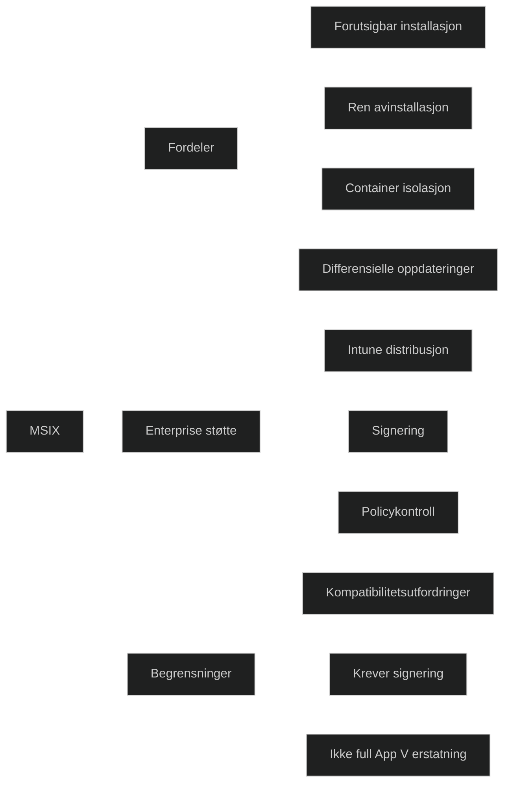

MSIX er Microsofts moderne pakkeformat for Windows apper. Det kombinerer fordelene fra MSI, AppX og App V, og gir en mer forutsigbar, sikker og ren installasjonsopplevelse. Formatet er designet for moderne administrasjon gjennom Intune og Configuration Manager, og sikrer at apper installeres i et kontrollert miljø uten å forurense systemet.

MSIX bruker containerteknologi som isolerer apper fra operativsystemet. Dette gjør installasjon og avinstallasjon mer stabilt, reduserer konflikter og gir automatisk opprydding. MSIX støtter differensielle oppdateringer, slik at kun endrede filer lastes ned, noe som reduserer båndbredde og installasjonstid.

For MD 102 er det viktig å forstå at MSIX er Microsofts anbefalte format for moderne Windows apper, spesielt i miljøer som bruker Intune.

### Viktige egenskaper

- _Forutsigbar installasjon_: ingen uventede endringer i systemet
- _Ren avinstallasjon_: alt fjernes automatisk
- _Containerbasert isolasjon_: mindre risiko for konflikter
- _Differensielle oppdateringer_: raskere og mer effektiv distribusjon
- _Støtte for enterprise funksjoner_: signering, policykontroll, distribusjon via Intune
- _Kompatibilitet_: kan pakke mange tradisjonelle Win32 apper

### Begrensninger

- Ikke alle avanserte Win32 apper fungerer uten tilpasning
- Apper som krever dype systemintegrasjoner kan være vanskelige å konvertere
- Virtualiseringsegenskaper fra App V er ikke fullt ut erstattet

